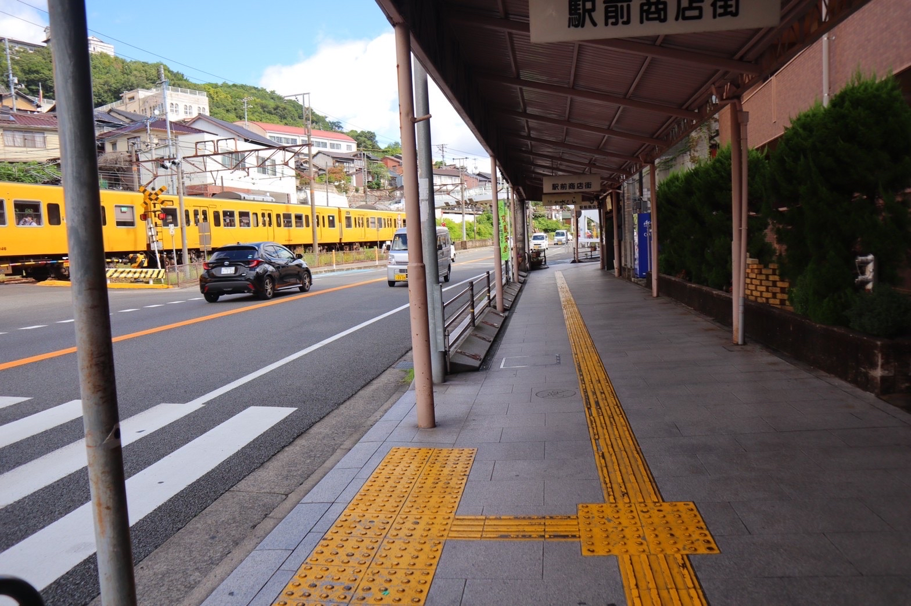
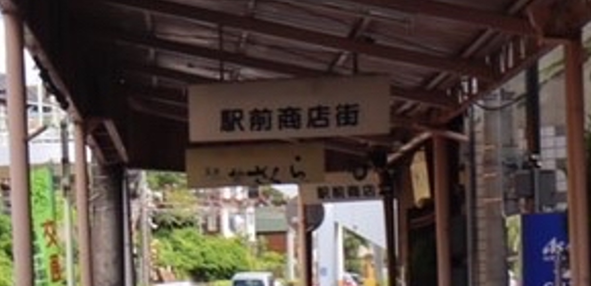
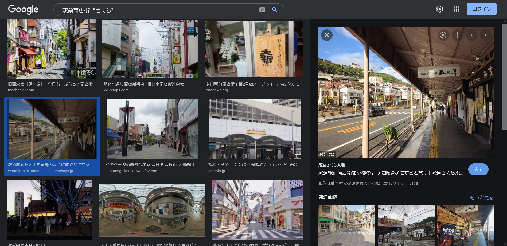

# nearest:Misc:221pts
写真の場所に行きたいので、最寄り駅を教えてください。  
[ヘボン式](https://www.ezairyu.mofa.go.jp/passport/hebon.html)  
ex) 東京駅 → FLAG{tokyoeki}，新大阪駅 → FLAG{shinosakaeki}  
[mis-nearest.zip](mis-nearest.zip)  

# Solution
OSINT問のようで写真が配布される。  
  
写真から取得できる文字列を調査すると検索しやすく、正解に近づく場合が多い。  
`駅前商店街`という文字列と、拡大すると`さくら`と書かれているのがわかる。  
  
これらで「"駅前商店街" "さくら"」とGoogle画像検索を行う。  
  
建物の屋根など、それっぽい場所が出てくる。  
尾道駅前のようなので、指定された形式にするとflagとなった。  

## FLAG{onomichieki}