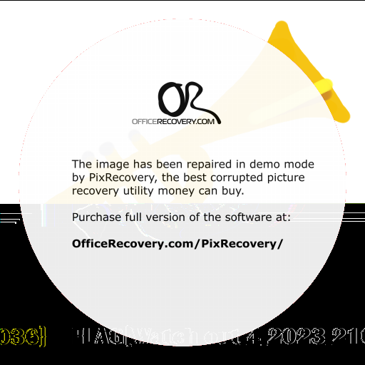

# Apocalypse:Forensics:185pts
ファイルが切り取られてしまったみたいです。  
※フラグ形式は`FLAG{[0-9a-zA-Z_]+}`です。  
It looks like the file has been cut off.  
*The flag format is `FLAG{[0-9a-zA-Z_]+}`.  

[for-Apocalypse.zip](for-Apocalypse.zip)  

# Solution
配布されたファイルを見ると、壊れたpngのようだ。  
  
おそらく下半分にフラグが書かれていると予想できる。  
「png recovery online」などでGoogle検索して出てきた[サイト](https://online.officerecovery.com/pixrecovery/)に投げてみる。  
以下の画像が返ってきた。  
  
Demo版なので中央の表示がとても邪魔だが、何とか読み解ける。  
`LAG{Watch out 4 2023 21036}`と読めるので、指定された形式にする。  
すべてをアンダースコアでつないだ`FLAG{Watch_out_4_2023_21036}`がflagであった。  

## FLAG{Watch_out_4_2023_21036}