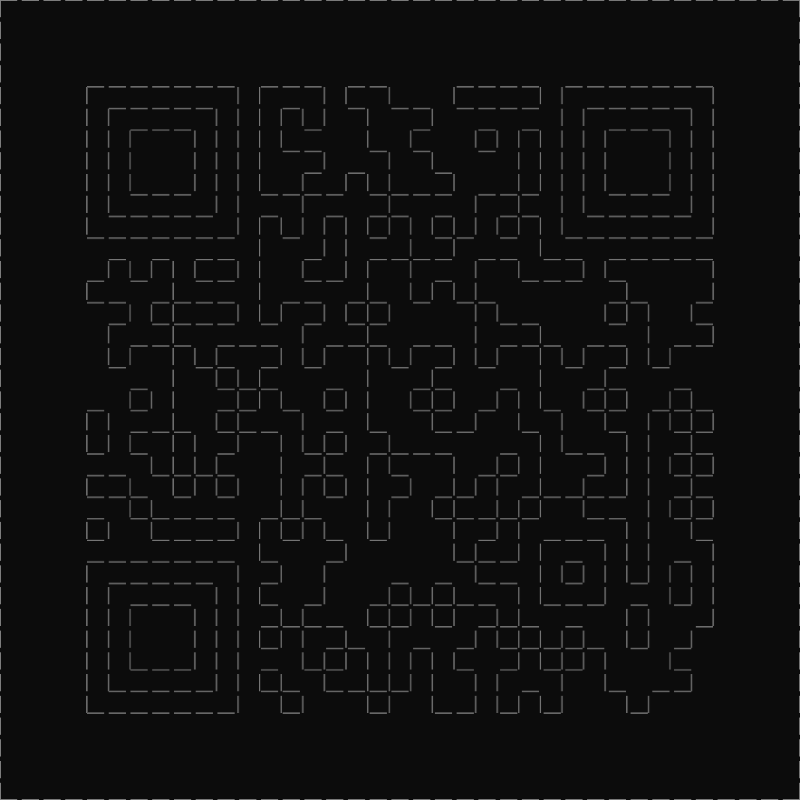

# A Block and a Hard Place:Misc:590pts
Are you the Far Lands because you're a Maze? Or are you a Maze because you're the Far Lands?  

`nc 13.201.224.182 31470`  

# Solution
接続先が渡される。  
```bash
$ nc 13.201.224.182 31470
Welcome to The Far Lands! You're free to explore.
You can move around using wasd (lowercase).
If you hit a wall, you can jump over them using WASD (uppercase).
You can't jump if there's no wall in front of you.
Lastly, you're placed in a random position in the maze.
Do your best to figure out it's secrets!

2000> w
Moved!
1999> a
Moved!
1998> s
Moved!
1997> d
Moved!
1996> w
Moved!
1995> w
Moved!
1994> w
You can't move there!
1993> W
Jumped over a wall!
1992> W
Jumped over a wall!
1991> W
You can't move there!
1990> w
Moved!
1989>
```
接続すると`wasd`で移動できる迷路のようだが、壁を`WASD`でジャンプできるようだ。  
ただし、移動方向に壁が存在しない場合はジャンプはできない。  
迷路のランダムな位置に初期配置され、自由に動けるが2000回しか移動できないようだ。  
自由に移動できると迷路を解くのは容易なので、チームメンバが迷路の壁がFLAGであると睨んでいた(再接続しても迷路の形も変わらない)。  
まずは`wW`、`aA`で左上に突き進み、`dD`で右端までの距離、`sS`で下までの距離を移動の可否により測る。  
すると、37×37マスであり、外枠の壁はジャンプできないことがわかる。  
応答で壁の有無がわかるので、それをもとに迷路の壁を再構築する。  
以下のwalk_dsas.pyでまずは横方向の壁を再構築する。  
```python
from ptrlib import *

sock = Socket("nc 13.201.224.182 31470")

# sock.debug = True

# Init(↑)
KEY = "w"
while True:
    sock.sendlineafter("> ", KEY)
    res = sock.recvuntil("\n")
    if b"You can't move there!" in res:  # Wall or Out of range
        sock.sendlineafter("> ", KEY.upper())
        res = sock.recvuntil("\n")
        if b"You can't move there!" in res:  # Out of range
            break

# Init(←)
KEY = "a"
while True:
    sock.sendlineafter("> ", KEY)
    res = sock.recvuntil("\n")
    if b"You can't move there!" in res:  # Wall or Out of range
        sock.sendlineafter("> ", KEY.upper())
        res = sock.recvuntil("\n")
        if b"You can't move there!" in res:  # Out of range
            break

print("Init Done!")

maze_data = ""

count = 0
while True:
    line = "｜"
    while True:
        KEY = "d"  # →
        if count % 2:
            KEY = "a"  # ←
        sock.sendlineafter("> ", KEY)
        res = sock.recvuntil("\n")
        now = "　"
        if b"You can't move there!" in res:  # Wall or Out of range
            sock.sendlineafter("> ", KEY.upper())
            res = sock.recvuntil("\n")
            now = "｜"
            if b"You can't move there!" in res:  # Out of range
                line += "｜"
                break
        line += now
    if count % 2:
        maze_data += f"{line[::-1]}\n"
    else:
        maze_data += f"{line}\n"
    KEY = "s"  # ↓
    sock.sendlineafter("> ", KEY)
    res = sock.recvuntil("\n")
    if b"You can't move there!" in res:  # Wall or Out of range
        sock.sendlineafter("> ", KEY.upper())
        res = sock.recvuntil("\n")
        if b"You can't move there!" in res:  # Out of range
            break
    count += 1

print(maze_data)
```
実行する。  
```bash
$ python walk_dsas.py
[+] __init__: Successfully connected to 13.201.224.182:31470
Init Done!
｜　　　　　　　　　　　　　　　　　　　　　　　　　　　　　　　　　　　　｜
｜　　　　　　　　　　　　　　　　　　　　　　　　　　　　　　　　　　　　｜
｜　　　　　　　　　　　　　　　　　　　　　　　　　　　　　　　　　　　　｜
｜　　　　　　　　　　　　　　　　　　　　　　　　　　　　　　　　　　　　｜
｜　　　｜　　　　　　｜｜　　｜｜　｜　　｜　　　｜｜　　　　　　｜　　　｜
｜　　　｜｜　　　　｜｜｜｜｜｜　｜　　｜　　　　　｜｜　　　　｜｜　　　｜
｜　　　｜｜｜　　｜｜｜｜｜　　　｜　｜　　｜｜｜｜｜｜｜　　｜｜｜　　　｜
｜　　　｜｜｜　　｜｜｜｜　　｜　　｜　｜　　　｜｜｜｜｜　　｜｜｜　　　｜
｜　　　｜｜｜　　｜｜｜｜　｜　｜｜｜　　｜　　｜｜｜｜｜　　｜｜｜　　　｜
｜　　　｜｜　　　　｜｜　　｜　　　｜　　　｜　｜　｜｜　　　　｜｜　　　｜
｜　　　｜　　　　　　｜｜｜｜｜｜｜｜｜｜｜｜｜｜｜｜　　　　　　｜　　　｜
｜　　　　　　　　　　　｜　　｜｜　　｜　｜　　　｜　　　　　　　　　　　｜
｜　　　　｜｜｜｜｜　｜｜　｜　｜｜　｜　　｜　｜　　｜｜　　　　｜　　　｜
｜　　　｜　　　｜　　　｜　　　　｜　｜｜｜｜　　　　　　｜　　　｜　　　｜
｜　　　　　｜｜｜　　｜｜｜　｜｜｜｜　　　｜｜　　　　｜｜｜　｜　　　　｜
｜　　　　｜　　｜　　　　　｜　　｜　　　　｜　　｜　　　　｜　　｜　　　｜
｜　　　　｜｜　｜｜｜　　｜｜｜　｜｜｜　｜｜｜　｜｜｜　｜｜｜　　　　　｜
｜　　　　　　　｜　｜｜｜　　　　｜　　｜　　　　｜　　｜　　　　　　　　｜
｜　　　　　｜｜｜　　｜｜｜　｜｜｜　｜｜｜　｜｜｜　｜｜｜　｜｜　　　　｜
｜　　　｜｜　　｜　｜｜　　｜　　｜　　｜　｜　｜　｜　｜　｜｜｜｜　　　｜
｜　　　｜｜｜　｜｜　｜　｜｜｜｜　｜　　　　　　｜｜　　｜｜　｜　　　　｜
｜　　　　　　｜｜｜｜　　｜　｜　｜｜　　｜　｜｜｜　　｜｜｜｜｜｜　　　｜
｜　　　｜　｜　｜｜｜｜　｜｜｜｜｜　｜　｜｜｜　｜　｜　｜｜　｜　　　　｜
｜　　　　　｜｜　　　　　｜｜　　｜｜　｜｜　｜｜｜　｜　　｜｜｜｜　　　｜
｜　　　｜｜　｜　　　｜｜｜｜｜　｜｜　　｜　｜｜　　　　｜｜　｜　　　　｜
｜　　　　　　　　　　　｜　　　｜　　　　｜｜　｜｜　　｜｜｜　　｜　　　｜
｜　　　｜　　　　　　｜　｜　｜　　　　　　｜　　｜｜｜｜｜｜｜｜｜　　　｜
｜　　　｜｜　　　　｜｜｜　　｜　　｜｜｜｜　　｜｜　　｜　　｜｜｜　　　｜
｜　　　｜｜｜　　｜｜｜　｜｜　　｜｜｜｜｜　｜｜　　　　｜｜　　｜　　　｜
｜　　　｜｜｜　　｜｜｜｜｜｜　｜　｜　　　｜｜｜｜｜｜　｜｜　｜　　　　｜
｜　　　｜｜｜　　｜｜｜　　｜｜｜｜｜｜｜｜　　｜｜｜｜｜　　｜　　　　　｜
｜　　　｜｜　　　　｜｜｜｜　｜　｜｜｜｜　｜｜　　｜　｜　　　｜　　　　｜
｜　　　｜　　　　　　｜　｜｜　　｜｜　｜　｜｜｜｜｜　　｜｜　　　　　　｜
｜　　　　　　　　　　　　　　　　　　　　　　　　　　　　　　　　　　　　｜
｜　　　　　　　　　　　　　　　　　　　　　　　　　　　　　　　　　　　　｜
｜　　　　　　　　　　　　　　　　　　　　　　　　　　　　　　　　　　　　｜
｜　　　　　　　　　　　　　　　　　　　　　　　　　　　　　　　　　　　　｜

[+] close: Connection to 13.201.224.182:31470 closed
```
再構築できている。  
次にwalk_sdwd.pyで縦方向の壁を再構築する(コードは省略する)。  
注意点として横方向のスクリプトを修正して用いているため、転置したものが実際の縦の壁になる。  
実行する。  
```bash
$ python walk_sdwd.py
[+] __init__: Successfully connected to 13.201.224.182:31470
Init Done!
｜　　　　　　　　　　　　　　　　　　　　　　　　　　　　　　　　　　　　｜
｜　　　　　　　　　　　　　　　　　　　　　　　　　　　　　　　　　　　　｜
｜　　　　　　　　　　　　　　　　　　　　　　　　　　　　　　　　　　　　｜
｜　　　　　　　　　　　　　　　　　　　　　　　　　　　　　　　　　　　　｜
｜　　　｜　　　　　　｜　｜｜　　　　｜　｜｜｜｜｜｜　　　　　　｜　　　｜
｜　　　｜｜　　　　｜｜｜　｜｜　｜　　　　｜｜　　｜｜　　　　｜｜　　　｜
｜　　　｜｜｜　　｜｜｜　｜　　｜　｜｜｜｜　｜｜　｜｜｜　　｜｜｜　　　｜
｜　　　｜｜｜　　｜｜｜｜　｜｜｜　　　｜　｜　｜｜｜｜｜　　｜｜｜　　　｜
｜　　　｜｜｜　　｜｜｜　　｜｜｜　　　｜　｜｜｜｜｜｜｜　　｜｜｜　　　｜
｜　　　｜｜　　　　｜｜｜｜｜｜　｜　　　　｜　｜｜｜｜　　　　｜｜　　　｜
｜　　　｜　　　　　　｜｜｜｜｜｜｜｜｜｜｜｜｜｜｜｜　　　　　　｜　　　｜
｜　　　　　　　　　　　　　　　｜　｜｜｜　　　　　　　　　　　　　　　　｜
｜　　　｜　　　　｜｜　　　　｜｜｜｜　｜　　　｜　｜｜｜｜｜｜｜　　　　｜
｜　　　｜｜　｜　｜　｜　　｜　　　　｜　　　　｜｜　　　｜　　｜｜　　　｜
｜　　　｜　｜｜｜｜　　｜｜｜｜　｜　　　｜｜　｜　　　｜｜　｜　　　　　｜
｜　　　　　　　　｜｜　　｜　　｜　｜｜｜｜｜｜　｜｜　　｜｜｜｜　　　　｜
｜　　　｜｜　　｜　　　　　｜｜｜　　　　　　　　　　　　　｜　｜　　　　｜
｜　　　｜　　｜　｜｜｜｜　｜｜｜　　　｜｜　　　｜　　｜｜　　｜｜　　　｜
｜　　　　｜　　　｜｜　｜　　　　｜　　　｜｜｜　　　｜｜｜　　｜　　　　｜
｜　　　　｜｜｜　｜　　｜　｜　｜　｜｜　｜　　　　　　｜　｜　　　　　　｜
｜　　　　　　　｜｜｜｜｜｜　　｜｜｜｜｜｜　｜｜　　｜｜｜　　　｜　　　｜
｜　　　｜｜　　　　　｜　　｜　　　　　｜　　｜｜　｜　｜　｜｜　｜　　　｜
｜　　　｜｜｜｜　｜　　｜　｜　　｜　｜　　｜　｜｜｜｜｜｜　　　　　　　｜
｜　　　｜｜　　　｜｜｜｜　　｜｜　｜　　｜｜　｜　｜｜　｜｜｜　｜　　　｜
｜　　　｜｜｜　　｜｜　　｜　｜｜　　　｜　　｜｜　　　　｜｜　｜　　　　｜
｜　　　　　　　　　　　｜｜　　｜　　｜　　　｜　｜　　｜　｜｜　｜　　　｜
｜　　　｜　　　　　　｜｜｜　　　｜　　　｜　｜　｜｜｜｜｜｜｜　　　　　｜
｜　　　｜｜　　　　｜｜　　　　｜　｜｜　｜｜｜｜｜　　｜　｜　　　　　　｜
｜　　　｜｜｜　　｜｜｜｜｜｜｜｜｜｜｜｜　　｜｜　　　　　　　｜　　　　｜
｜　　　｜｜｜　　｜｜｜｜　｜　　　　　　　　　　　　｜｜　｜　　｜　　　｜
｜　　　｜｜｜　　｜｜｜｜　　　　｜　｜　　　　　　　　　　　　｜　　　　｜
｜　　　｜｜　　　　｜｜｜　　　｜　｜｜｜｜｜｜｜　｜　｜　｜｜｜　　　　｜
｜　　　｜　　　　　　｜｜　｜｜｜　　｜｜｜｜｜｜｜　　　｜　　　　　　　｜
｜　　　　　　　　　　　　　　　　　　　　　　　　　　　　　　　　　　　　｜
｜　　　　　　　　　　　　　　　　　　　　　　　　　　　　　　　　　　　　｜
｜　　　　　　　　　　　　　　　　　　　　　　　　　　　　　　　　　　　　｜
｜　　　　　　　　　　　　　　　　　　　　　　　　　　　　　　　　　　　　｜

[+] close: Connection to 13.201.224.182:31470 closed
```
これら二つの出力を正方形にし、重ね合わせると以下のようになる。  
  
どうやらQRコードのようだ。  
作成した画像を塗りつぶして、QRコードとして読み取ってやればよい。  
手動で行ってもよいが、以下のqr.pyでwalk_dsas.pyの結果から画像を作り、読み取る。  
```python
import numpy as np
from PIL import Image
from pyzbar.pyzbar import decode


dsas = """\
｜　　　　　　　　　　　　　　　　　　　　　　　　　　　　　　　　　　　　｜
｜　　　　　　　　　　　　　　　　　　　　　　　　　　　　　　　　　　　　｜
｜　　　　　　　　　　　　　　　　　　　　　　　　　　　　　　　　　　　　｜
｜　　　　　　　　　　　　　　　　　　　　　　　　　　　　　　　　　　　　｜
｜　　　｜　　　　　　｜｜　　｜｜　｜　　｜　　　｜｜　　　　　　｜　　　｜
｜　　　｜｜　　　　｜｜｜｜｜｜　｜　　｜　　　　　｜｜　　　　｜｜　　　｜
｜　　　｜｜｜　　｜｜｜｜｜　　　｜　｜　　｜｜｜｜｜｜｜　　｜｜｜　　　｜
｜　　　｜｜｜　　｜｜｜｜　　｜　　｜　｜　　　｜｜｜｜｜　　｜｜｜　　　｜
｜　　　｜｜｜　　｜｜｜｜　｜　｜｜｜　　｜　　｜｜｜｜｜　　｜｜｜　　　｜
｜　　　｜｜　　　　｜｜　　｜　　　｜　　　｜　｜　｜｜　　　　｜｜　　　｜
｜　　　｜　　　　　　｜｜｜｜｜｜｜｜｜｜｜｜｜｜｜｜　　　　　　｜　　　｜
｜　　　　　　　　　　　｜　　｜｜　　｜　｜　　　｜　　　　　　　　　　　｜
｜　　　　｜｜｜｜｜　｜｜　｜　｜｜　｜　　｜　｜　　｜｜　　　　｜　　　｜
｜　　　｜　　　｜　　　｜　　　　｜　｜｜｜｜　　　　　　｜　　　｜　　　｜
｜　　　　　｜｜｜　　｜｜｜　｜｜｜｜　　　｜｜　　　　｜｜｜　｜　　　　｜
｜　　　　｜　　｜　　　　　｜　　｜　　　　｜　　｜　　　　｜　　｜　　　｜
｜　　　　｜｜　｜｜｜　　｜｜｜　｜｜｜　｜｜｜　｜｜｜　｜｜｜　　　　　｜
｜　　　　　　　｜　｜｜｜　　　　｜　　｜　　　　｜　　｜　　　　　　　　｜
｜　　　　　｜｜｜　　｜｜｜　｜｜｜　｜｜｜　｜｜｜　｜｜｜　｜｜　　　　｜
｜　　　｜｜　　｜　｜｜　　｜　　｜　　｜　｜　｜　｜　｜　｜｜｜｜　　　｜
｜　　　｜｜｜　｜｜　｜　｜｜｜｜　｜　　　　　　｜｜　　｜｜　｜　　　　｜
｜　　　　　　｜｜｜｜　　｜　｜　｜｜　　｜　｜｜｜　　｜｜｜｜｜｜　　　｜
｜　　　｜　｜　｜｜｜｜　｜｜｜｜｜　｜　｜｜｜　｜　｜　｜｜　｜　　　　｜
｜　　　　　｜｜　　　　　｜｜　　｜｜　｜｜　｜｜｜　｜　　｜｜｜｜　　　｜
｜　　　｜｜　｜　　　｜｜｜｜｜　｜｜　　｜　｜｜　　　　｜｜　｜　　　　｜
｜　　　　　　　　　　　｜　　　｜　　　　｜｜　｜｜　　｜｜｜　　｜　　　｜
｜　　　｜　　　　　　｜　｜　｜　　　　　　｜　　｜｜｜｜｜｜｜｜｜　　　｜
｜　　　｜｜　　　　｜｜｜　　｜　　｜｜｜｜　　｜｜　　｜　　｜｜｜　　　｜
｜　　　｜｜｜　　｜｜｜　｜｜　　｜｜｜｜｜　｜｜　　　　｜｜　　｜　　　｜
｜　　　｜｜｜　　｜｜｜｜｜｜　｜　｜　　　｜｜｜｜｜｜　｜｜　｜　　　　｜
｜　　　｜｜｜　　｜｜｜　　｜｜｜｜｜｜｜｜　　｜｜｜｜｜　　｜　　　　　｜
｜　　　｜｜　　　　｜｜｜｜　｜　｜｜｜｜　｜｜　　｜　｜　　　｜　　　　｜
｜　　　｜　　　　　　｜　｜｜　　｜｜　｜　｜｜｜｜｜　　｜｜　　　　　　｜
｜　　　　　　　　　　　　　　　　　　　　　　　　　　　　　　　　　　　　｜
｜　　　　　　　　　　　　　　　　　　　　　　　　　　　　　　　　　　　　｜
｜　　　　　　　　　　　　　　　　　　　　　　　　　　　　　　　　　　　　｜
｜　　　　　　　　　　　　　　　　　　　　　　　　　　　　　　　　　　　　｜\
""".split(
    "\n"
)

qr = []
for line in dsas:
    new_line = []
    now = 0
    for c in line:
        if c == "｜":
            now ^= 255
        new_line.append(now)
    qr.append(new_line[:-1])


qr_array = np.array(qr)
qr_image = Image.fromarray(np.uint8(qr_array))
upscaled_qr_image = qr_image.resize(
    (qr_array.shape[1] * 16, qr_array.shape[0] * 16), Image.Resampling.NEAREST
)

upscaled_qr_image.save("qr.png")

flag = decode(upscaled_qr_image)[0].data.decode("utf-8")
print(flag)
```
実行する。  
```bash
$ python qr.py
bi0sctf{Dx3+hUObl3Ha1RAgNIN42g==}
```
flagが隠されていた。  

## bi0sctf{Dx3+hUObl3Ha1RAgNIN42g==}