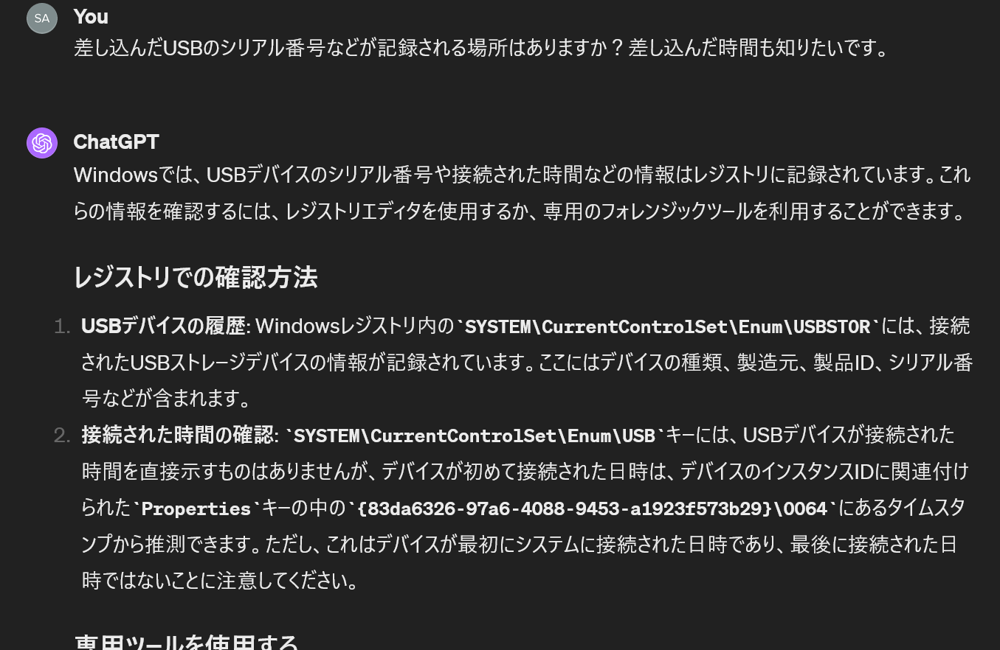
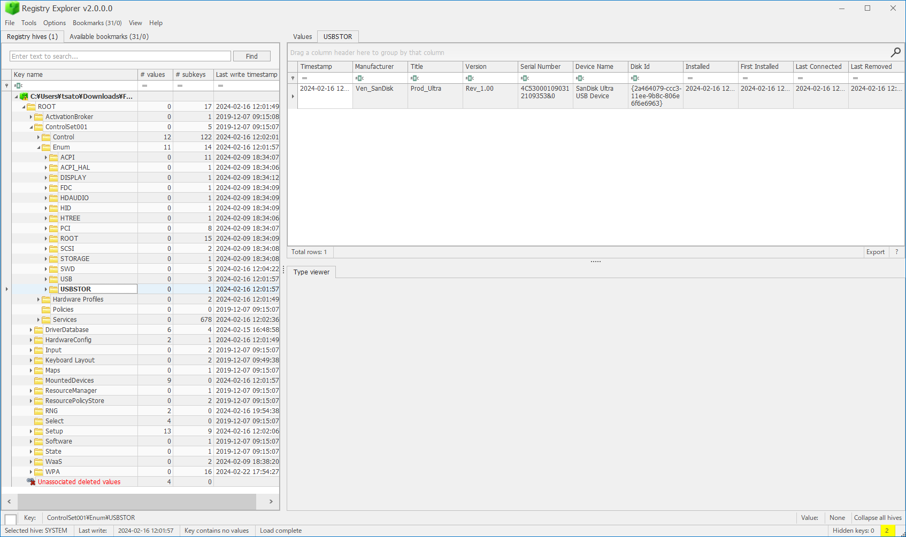
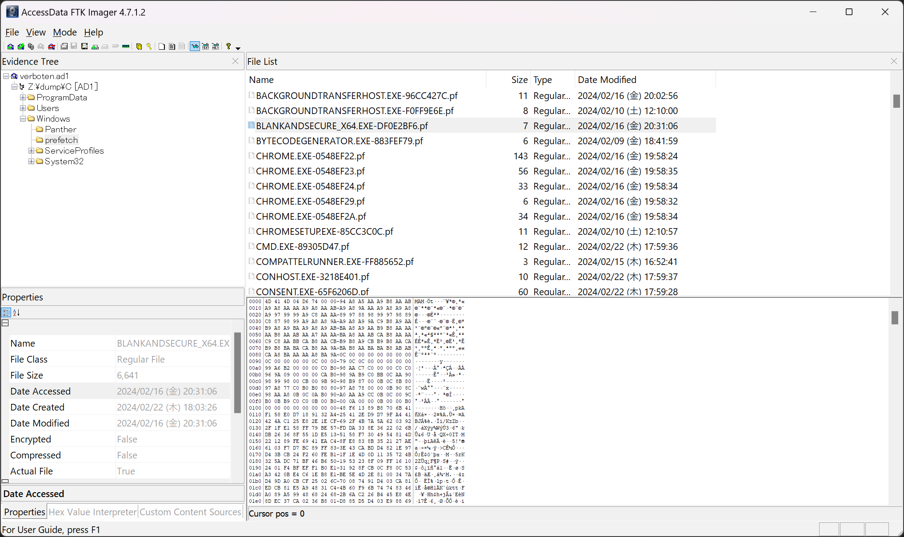
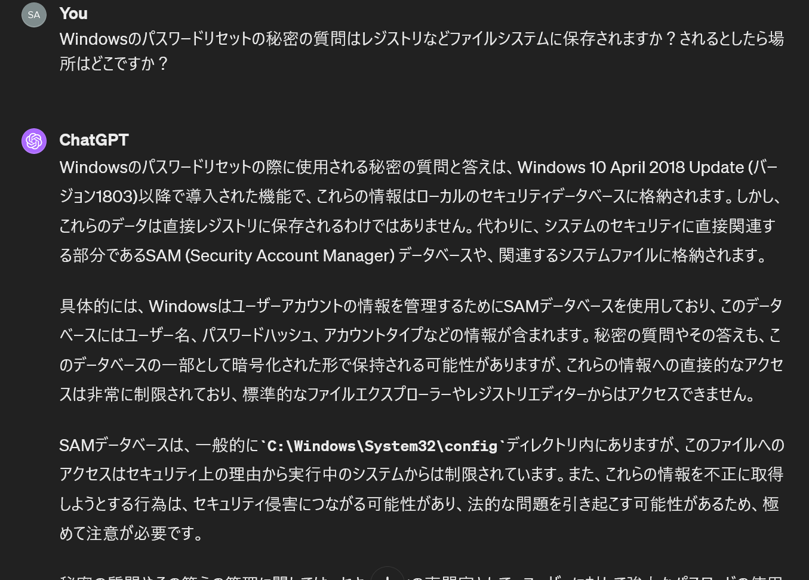
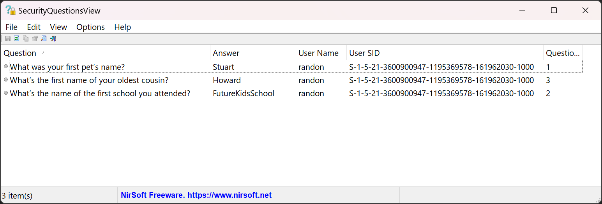
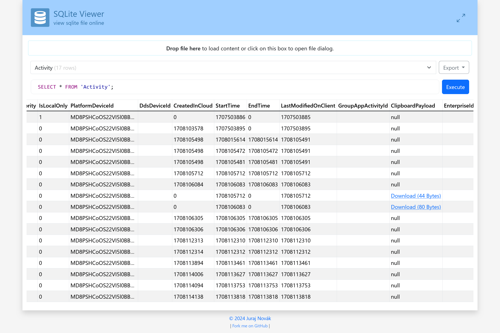

# verboten:Forensics:559pts
Randon, an IT employee finds a USB on his desk after recess. Unable to contain his curiosity he decides to plug it in. Suddenly the computer goes haywire and before he knows it, some windows pops open and closes on its own. With no clue of what just happened, he tries seeking help from a colleague. Even after Richard's effort to remove the malware, Randon noticed that the malware persisted after his system restarted.  
**Note**  
For Q7: 12HR time format  
All epoch times should be converted to IST (UTC + 5:30).  
All other timestamps are to be taken as it is from artifacts.  

---

- [Primary Link](https://drive.google.com/drive/folders/1nPeDwniE4gHdXz_x70_oC433f3cXLvbe?usp=sharing)  
- [Mirror Link](https://mega.nz/file/MvkzWBTA#SNdR2q4_8EhqHFUI-1_1Ae0k1wI5ZwVJLsgyBrYV05o)  

**Note**: Kindly refrain from executing any of the challenge files, as they may potentially harbor malicious software. Players assume full liability for any damages caused.  

`nc 13.201.224.182 30008`  

# Solution
verboten.ad1がダウンロードできる。  
※ファイルサイズの問題でverboten.ad1を分割している(`cat verboten.ad1-?? > verboten.ad1`で戻せる)。  
```
169c1f6f76075003074a3e6fab32100c4d62c11c  verboten.ad1
48c51bce98f4095a9c9efa7412530cb05719c5b7  verboten.ad1-00
1c1980c8c3c018495b46eccc5f050990a389e8b9  verboten.ad1-01
439f6f822694c40c66ca0fd165dfe76b0f80152c  verboten.ad1-02
91a1bd110400b7b8098828fb11189e49adabd082  verboten.ad1-03
0be1581610225dbf12d1daa6ee77079f26586e3b  verboten.ad1-04
```
ad1ファイルを解析するようだ。  
問題文より、USB経由でのマルウェア感染シナリオと読み取れる。  
フォレンジックなのに接続先が与えられている。  
```bash
$ nc 13.201.224.182 30008
922231^x mod 13066599629066242837866432762953247484957727495367990531898423457215621371972536879396943780920715025663601432044420507847680185816504728360166754093930541 == 4552086744417608235816152102486628685080096947298732981854724847424954686692868436626284058827795163849301629312370526902971102449466899261710916748204555
x:
```
PoWがあるようだ。  
チームメンバがPoWを解く関数を実装していたので、以下のように送信スクリプトに組み込む。  
```python
from ptrlib import *
from time import time

logger.level = 0


# by kanon @_k4non
def solve_pow(s, debug=False):
    start = time()
    g = int(s.split("^")[0])
    p = int(s.split("mod ")[1].split(" == ")[0])
    target = int(s.split(" == ")[1])
    i = 0
    while True:
        if pow(g, i, p) == target:
            if debug:
                print(f"Time taken: {time()-start}")
            return i
        i += 1


sock = Socket("nc 13.201.224.182 30008")

PoW = sock.recvuntil("\n")
sock.sendlineafter("x: ", solve_pow(PoW.decode()))

# Write your code here

sock.sh()
```
実行すると以下を問われた。  
一問ずつ回答していくとフラグが得られるらしい。  
```

██╗   ██╗███████╗██████╗ ██████╗  ██████╗ ████████╗███████╗███╗   ██╗
██║   ██║██╔════╝██╔══██╗██╔══██╗██╔═══██╗╚══██╔══╝██╔════╝████╗  ██║
██║   ██║█████╗  ██████╔╝██████╔╝██║   ██║   ██║   █████╗  ██╔██╗ ██║
╚██╗ ██╔╝██╔══╝  ██╔══██╗██╔══██╗██║   ██║   ██║   ██╔══╝  ██║╚██╗██║
 ╚████╔╝ ███████╗██║  ██║██████╔╝╚██████╔╝   ██║   ███████╗██║ ╚████║
  ╚═══╝  ╚══════╝╚═╝  ╚═╝╚═════╝  ╚═════╝    ╚═╝   ╚══════╝╚═╝  ╚═══╝


Q1) What is the serial number of the sandisk usb that he plugged into the system? And when did he plug it into the system?
Format: verboten{serial_number:YYYY-MM-DD-HH-MM-SS}

Answer:
```
USBのシリアル番号と差し込んだ時刻を聞かれている。  
ひとまずChatGPT-4に聞く。  
  
レジストリの`SYSTEM\CurrentControlSet\Enum\USBSTOR`にあるようだ。  
マルウェア感染しているので褒められ行為ではないが、ad1ファイルをFTK Imagerで開き、すべてのファイルをローカルにエクスポートしてやる。  
その後、`\Windows\System32\config\SYSTEM`にあるレジストリデータを[Registry Explorer](https://f001.backblazeb2.com/file/EricZimmermanTools/net6/RegistryExplorer.zip)で開いてやる。  
  
Serial Numberは`4C530001090312109353&0`で、Last Connectedは`2024-02-16 12:01:57`と書かれていたので、指定された形式でサーバに送信する。  
```python
# Q1
print(sock.recvuntil("}\n\n").decode())
sock.sendlineafter("Answer: ", "verboten{4C530001090312109353&0:2024-02-16-12-01-57}")
```
`Correct!`と表示されたので正解のようだ。  
次の質問が現れた。  
```
Q2) What is the hash of the url from which the executable in the usb downloaded the malware from?
Format: verboten{md5(url)}

Answer:
```
マルウェアがDLされたURLのmd5を答えればよいようだ。  
問題文より、再起動後もマルウェアがまだ残っているらしい。  
スタートアップフォルダやレジストリを探していると、`\Users\randon\AppData\Roaming\Microsoft\Windows\Start Menu\Programs\Startup`に明らかに怪しい`mal.exe`が存在した。  
ダウンロードコマンドなどでファイル名に`mal.exe`を指定していると予測し、すべてのファイルにstringsとgrepをかけてやる。  
```bash
$ strings */*/*/*/*/*/*/* | grep mal
~~~
$ strings */*/*/*/*/*/*/*/* | grep mal
~~~
$ strings */*/*/*/*/*/*/*/*/* | grep mal
https://filebin.net/qde72esvln1cor0t/mal
https://filebin.net/qde72esvln1cor0t/mal
https://filebin.net/qde72esvln1cor0t/mal
https://filebin.net/qde72esvln1cor0t/mal
~~~
```
すると怪しい`https://filebin.net/qde72esvln1cor0t/mal`なるURLがヒットした。  
試しにこのURLのmd5である`11ecc1766b893aa2835f5e185147d1d2`を投げてみる。  
```python
# Q2
print(sock.recvuntil("}\n\n").decode())
sock.sendlineafter("Answer: ", "verboten{11ecc1766b893aa2835f5e185147d1d2}")
```
正解だったようで、次の問題が現れた。  
```
Q3) What is the hash of the malware that the executable in the usb downloaded which persisted even after the efforts to remove the malware?
Format: verboten{md5{malware_executable)}

Answer:
```
マルウェアのmd5を聞かれている。  
先ほど見つけた`mal.exe`のハッシュ`169cbd05b7095f4dc9530f35a6980a79`を答えればよい。  
```python
# Q3
print(sock.recvuntil("}\n\n").decode())
sock.sendlineafter("Answer: ", "verboten{169cbd05b7095f4dc9530f35a6980a79}")
```
次の問題が現れた。  
```
Q4) What is the hash of the zip file and the invite address of the remote desktop that was sent through slack?
Format: verboten{md5(zip_file):invite_address}

Answer:
```
Slackでzipとリモートデスクトップの招待アドレスが送信されているらしい。  
`\Users\randon\AppData\Roaming`以下には`Slack`と`AnyDesk`が存在するため、内部をgrepで調査する。  
```bash
$ grep -r 'zip'
grep: Slack/Cache/Cache_Data/data_1: binary file matches
grep: Slack/Cache/Cache_Data/data_3: binary file matches
grep: Slack/Cache/Cache_Data/f_00000a: binary file matches
grep: Slack/Cache/Cache_Data/f_00003d: binary file matches
grep: Slack/Cache/Cache_Data/f_000045: binary file matches
grep: Slack/Cache/Cache_Data/f_0000ad: binary file matches
grep: Slack/Cache/Cache_Data/f_0000b9: binary file matches
grep: Slack/Cache/Cache_Data/f_0000cc: binary file matches
grep: Slack/Cache/Cache_Data/f_0000d2: binary file matches
grep: Slack/Cache/Cache_Data/f_0000ed: binary file matches
grep: Slack/IndexedDB/https_app.slack.com_0.indexeddb.blob/1/00/a: binary file matches
Slack/storage/root-state.json:{"appTeams":{"selectedTeamId":null,"teamsByIndex":[],"teamsToSignOut":[]},"bookmarks":[],"downloads":{"T06JY4V3FE1":{"F06KY79M0JU":{"id":"F06KY79M0JU","teamId":"T06JY4V3FE1","url":"https://files.slack.com/files-pri/T06JY4V3FE1-F06KY79M0JU/download/file_shredders.zip?origin_team=T06JY4V3FE1","userId":"U06JLFCMUK1","appVersion":"4.36.140","downloadState":"completed","startTime":1708113399732,"progress":1,"downloadPath":"C:\\Users\\randon\\Downloads\\file_shredders.zip","endTime":1708113447681}}},
~~~
```
grepすると`file_shredders.zip`をDLしているようだ。  
ファイルの実体が欲しいが、ヒットしたURLから入手はできない。  
キャッシュとして残っていると考え、`\Users\randon\AppData\Roaming\Slack\Cache\Cache_Data`の中からzipを検索する。  
```bash
$ file * | grep Zip
f_0000ad: Zip archive data, at least v2.0 to extract, compression method=deflate
$ unzip -l f_0000ad
Archive:  f_0000ad
  Length      Date    Time    Name
---------  ---------- -----   ----
 20164334  2023-12-28 20:06   shredders.rar
---------                     -------
 20164334                     1 file
$ md5sum f_0000ad
b092eb225b07e17ba8a70b755ba97050  f_0000ad
```
中にパスワードがかかった`shredders.rar`が含まれているので間違いなさそうだ。  
md5は`b092eb225b07e17ba8a70b755ba97050`となる。  
次に、リモートデスクトップの招待アドレスだが、AnyDeskなるものがそれに該当するらしい。  
Slackで送信されているので、Sleckディレクトリの中でgrepする。  
```bash
$ cd Slack/
$ grep -r anydesk
grep: IndexedDB/https_app.slack.com_0.indexeddb.blob/1/00/a: binary file matches
$ strings IndexedDB/https_app.slack.com_0.indexeddb.blob/1/00/a | grep anydesk
text"+here is the address for anydesk: 1541069606{
text"+here is the address for anydesk: 1541069606{
text"+here is the address for anydesk: 1541069606"
```
バイナリがヒットし、中にそれらしきアドレスが含まれている。  
これらを`:`でつなげて以下のように送信する。  
```python
# Q4
print(sock.recvuntil("}\n\n").decode())
sock.sendlineafter("Answer: ", "verboten{b092eb225b07e17ba8a70b755ba97050:1541069606}")
```
次の問題が現れた。  
```
Q5) What is the hash of all the files that were synced to Google Drive before it was shredded?
Format: verboten{md5 of each file separated by ':'}

Answer:
```
shreddedされる前にGoogle Driveにあったファイルのmd5のリストが欲しいらしい。  
`file_shredders.zip`中身はRichardが送ったマルウェア削除プログラムなのだろうか。  
なんにせよGoogle Driveのキャッシュやバクアップを探す。  
`\Users\randon\AppData\Local\Google\DriveFS`に`110922692857671422467\content_cache`なる怪しいフォルダがある。  
```bash
$ tree
.
├── chunks.db
├── chunks.db-shm
├── chunks.db-wal
├── d1
│   └── d51
│       └── 202
├── d3
│   └── d53
│       └── 204
├── d5
│   └── d55
│       └── 206
├── d7
│   └── d57
│       └── 208
└── d9
    └── d59
        └── 210

10 directories, 8 files
$ file */*/*
d1/d51/202: Microsoft Word 2007+
d3/d53/204: Microsoft Word 2007+
d5/d55/206: Microsoft Word 2007+
d7/d57/208: JPEG image data, JFIF standard 1.01, aspect ratio, density 1x1, segment length 16, baseline, precision 8, 276x183, components 3
d9/d59/210: JPEG image data, JFIF standard 1.01, aspect ratio, density 1x1, segment length 16, baseline, precision 8, 318x159, components 3
$ md5sum */*/*
ae679ca994f131ea139d42b507ecf457  d1/d51/202
4a47ee64b8d91be37a279aa370753ec9  d3/d53/204
870643eec523b3f33f6f4b4758b3d14c  d5/d55/206
c143b7a7b67d488c9f9945d98c934ac6  d7/d57/208
e6e6a0a39a4b298c2034fde4b3df302a  d9/d59/210
```
中はGitのように個別のディレクトリになっており、様々なファイルが残っていた。  
これらのmd5をつなげて以下のように送信する。  
```python
# Q5
print(sock.recvuntil("}\n\n").decode())
sock.sendlineafter(
    "Answer: ",
    "verboten{ae679ca994f131ea139d42b507ecf457:4a47ee64b8d91be37a279aa370753ec9:870643eec523b3f33f6f4b4758b3d14c:c143b7a7b67d488c9f9945d98c934ac6:e6e6a0a39a4b298c2034fde4b3df302a}",
)
```
正解のようで、次の問題が現れた。  
```
Q6) What is time of the incoming connection on AnyDesk? And what is the ID of user from which the connection is requested?
Format: verboten{YYYY-MM-DD-HH-MM-SS:user_id}

Answer:
```
AnyDeskに接続があった時刻とそのリクエスト元ユーザのIDを聞かれている。  
初めに`\Users\randon\AppData\Roaming`以下の`AnyDesk`を調査する。  
`ad.trace`にコネクションなどのログが入っているようだが、めぼしいものは見つからない。  
その他の場所を探すと、`\ProgramData\AnyDesk`に`connection_trace.txt`なるものがあり以下の通りであった。  
```
Incoming    2024-02-16, 20:29    User                              221436813    221436813
```
IDが`221436813`であり、接続時刻は`2024-02-16, 20:29`らしい。  
秒数まで知りたいので探しているとチームメンバが`\Users\randon\AppData\Roaming\AnyDesk`でもIDの`221436813`がヒットすることを見つけていた。
```bash
$ grep -r 221436813
ad.trace:   info 2024-02-16 20:29:04.298       back   4668   6440                   app.backend_session - Incoming session request: Richard Beard (221436813)
user.conf:ad.security.permission_profiles.address_to_profile=221436813:000000085f64656661756c74000000440100000001000000000000000100000001000000010000000100000001000000010000000000000001000000000000000100000001000000010000000100000000000000000000110000000000000000000000000000000001000000440100000001000000010000000100000001000000010000000100000001000000010000000100000001000000010000000100000001000000010000000100000001000000000000010000000100000001000000010000000000000000
```
時刻は`2024-02-16 20:29:04.298`のようで`Richard Beard (221436813)`とある。  
以下のようにサーバに送信する。  
```python
# Q6
print(sock.recvuntil("}\n\n").decode())
sock.sendlineafter("Answer: ", "verboten{2024-02-16-20-29-04:221436813}")
```
次の問題が現れた。  
```
Q7) When was the shredder executed?
Format: verboten{YYYY-MM-DD-HH-MM-SS}

Answer:
```
shredderが実行された時刻を調べるようだ。  
まずは全体でgrepしてみる。  
```bash
$ grep -r 'shredders'
grep: Users/randon/AppData/Local/ConnectedDevicesPlatform/dd683d380e7fa229/ActivitiesCache.db-wal: binary file matches
grep: Users/randon/AppData/Roaming/Slack/Cache/Cache_Data/data_1: binary file matches
grep: Users/randon/AppData/Roaming/Slack/Cache/Cache_Data/data_3: binary file matches
grep: Users/randon/AppData/Roaming/Slack/Cache/Cache_Data/f_0000ad: binary file matches
grep: Users/randon/AppData/Roaming/Slack/IndexedDB/https_app.slack.com_0.indexeddb.blob/1/00/a: binary file matches
~~~
grep: Users/randon/NTUSER.DAT: binary file matches
grep: Users/randon/ntuser.dat.LOG1: binary file matches
grep: Users/randon/ntuser.dat.LOG2: binary file matches
grep: Windows/System32/config/SYSTEM: binary file matches
grep: Windows/System32/config/SYSTEM.LOG2: binary file matches
```
キャッシュのほかにもいくつかバイナリにヒットするのでstringsで見てやる。  
```bash
$ strings Users/randon/NTUSER.DAT | grep 'shredders'
C:\Users\randon\Downloads\file_shredders\shredders\shredders\BlankAndSecure_x64\BlankAndSecure_x64.exe
file_shredders.lnk
```
Q4ではrarの中身はわからなかったが、`BlankAndSecure_x64.exe`がshredder本体のようだ。  
実行時刻なのでPrefetchファイルの時刻を見てやればよい。  
`\Windows\prefetch`に`BLANKANDSECURE_X64.EXE-DF0E2BF6.pf`がある。  
  
`Date Accessed`は`2024-02-16-20-31-06`のようだ。  
問題文に`For Q7: 12HR time format`とあったので、注意して以下のようにサーバに送る。  
```python
# Q7
print(sock.recvuntil("}\n\n").decode())
sock.sendlineafter("Answer: ", "verboten{2024-02-16-08-31-06}")
```
次の問題が現れた。  
```
Q8) What are the answers of the backup questions for resetting the windows password?
Format: verboten{answer_1:answer_2:answer_3}

Answer:
```
パスワードリセットの秘密の質問の答えを答えればよいらしい。  
ChatGPT-4に聞いてみる。  
  
`\Windows\System32\config`の中の`SAM`にあるらしい。  
場所や取得方法を調べているとチームメンバが[SecurityQuestionsView](https://www.nirsoft.net/utils/securityquestionsview.zip)なるソフトを見つけていた。  
`config`のパスを指定してやると、以下のように質問の答えが表示された。  
  
順番に注意して、以下のようにサーバに送信する。  
```python
# Q8
print(sock.recvuntil("}\n\n").decode())
sock.sendlineafter("Answer: ", "verboten{Stuart:FutureKidsSchool:Howard}")
```
次の質問が現れた。  
```
Q9) What is the single use code that he copied into the clipboard and when did he copy it?
Format: verboten{single_use_code:YYYY-MM-DD-HH-MM-SS}

Answer:
```
クリップボードの`single use code`とそれをコピーした時刻を答えさせるようだ。  
「windows clipboard history forensics」などでGoogle検索すると`ActivitiesCache.db`にあることがわかる(チームメンバが既に知っていたが)。  
目的のファイルは`\Users\randon\AppData\Local\ConnectedDevicesPlatform\dd683d380e7fa229`にあった。  
SQLiteのDBファイルなので[SQLite Viewer](https://inloop.github.io/sqlite-viewer/)で調査する。  
`Activity`テーブルに二件の`ClipboardPayload`が見つかる。  
  
それぞれ以下のようであった。  
44 Btyes  
```
[{"content":"ODMwMDMw","formatName":"Text"}]
```
80 Btyes  
```
[{"content":"WW91ciBzaW5nbGUtdXNlIGNvZGUgaXM6IDgzMDAzMA0K","formatName":"Text"}]
```
base64されているので、デコードする。  
```bash
$ echo -n 'ODMwMDMw' | base64 -d
830030
$ echo -n 'WW91ciBzaW5nbGUtdXNlIGNvZGUgaXM6IDgzMDAzMA0K' | base64 -d
Your single-use code is: 830030
```
これらより、`single use code`が`830030`であるとわかる。  
あとはコピーした時刻なので最も古い44 Bytesの`StartTime`や`LastModifiedTime`の`1708105712`を答えればよい(はず)。  
ここで問題文に`All epoch times should be converted to IST (UTC + 5:30).`とあるのでISTにしなければならない点に注意する。  
ところが何故か通らない。  
試行錯誤すると80 Btyesのほうの`StartTime`や`LastModifiedTime`の`1708106083`が通った。  
80 Bytesのほうで`single use code`であることが明確になったとはいえ、通常は最も古い時刻を答えると思われる。  
いちいちISTへの変換が必要なので、なぜこんな作りにしたのか理解に苦しむ。  
`1708106083`はUTCでは`2024-02-16 17:54:43`なので`+ 5:30`して`2024-02-16-23-24-43`になる  
以下のように送信する。  
```python
# Q9
print(sock.recvuntil("}\n\n").decode())
sock.sendlineafter("Answer: ", "verboten{830030:2024-02-16-23-24-43}")
```
一連の流れを実行するとflagが得られた。  
```bash
$ python solver.py

██╗   ██╗███████╗██████╗ ██████╗  ██████╗ ████████╗███████╗███╗   ██╗
██║   ██║██╔════╝██╔══██╗██╔══██╗██╔═══██╗╚══██╔══╝██╔════╝████╗  ██║
██║   ██║█████╗  ██████╔╝██████╔╝██║   ██║   ██║   █████╗  ██╔██╗ ██║
╚██╗ ██╔╝██╔══╝  ██╔══██╗██╔══██╗██║   ██║   ██║   ██╔══╝  ██║╚██╗██║
 ╚████╔╝ ███████╗██║  ██║██████╔╝╚██████╔╝   ██║   ███████╗██║ ╚████║
  ╚═══╝  ╚══════╝╚═╝  ╚═╝╚═════╝  ╚═════╝    ╚═╝   ╚══════╝╚═╝  ╚═══╝

~~~

bi0sctf{w3ll_th4t_w4s_4_v3ry_34sy_chall_b9s0w7}
```

## bi0sctf{w3ll_th4t_w4s_4_v3ry_34sy_chall_b9s0w7}