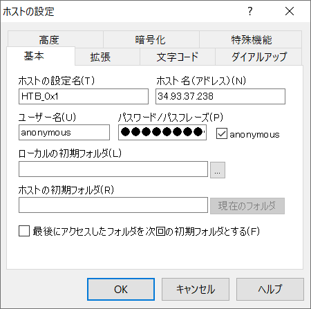
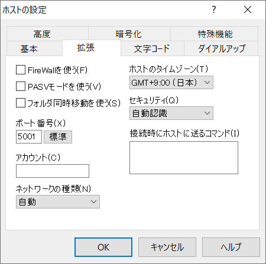
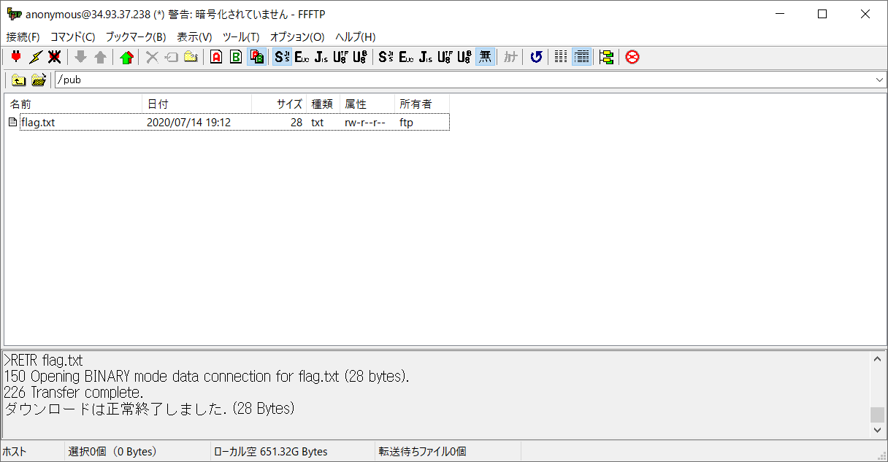

# HTB 0x1:Linux:XXXpts<!--XXX-->
I forgot my 'flag.txt' file on the server...  
Server is at 34.93.37.238.  

# Solution
34.93.37.238をHackしろとのことらしい。  
とりあえずポートスキャンを行う。  
```bash
$ nmap -Pn 34.93.37.238
~~~
PORT     STATE SERVICE
22/tcp   open  ssh
5001/tcp open  commplex-link

Nmap done: 1 IP address (1 host up) scanned in 23.14 seconds
```
22と5001が開いているようだ。  
sshとtelnetを試みる。  
```bash
$ ssh root@34.93.37.238
root@34.93.37.238: Permission denied (publickey).
$ telnet 34.93.37.238 5001
Trying 34.93.37.238...
Connected to 34.93.37.238.
Escape character is '^]'.
220 (vsFTPd 3.0.3)
^]
$ ftp 34.93.37.238 5001
Connected to 34.93.37.238.
220 (vsFTPd 3.0.3)
Name (34.93.37.238:satoki): root
530 This FTP server is anonymous only.
Login failed.
```
5001はFTPなようだ。  
自身のポート管理などコマンドが面倒なのでFFFTPを使用する。  
以下のように設定した。  
  
接続するとpubの中のflag.txtにflagが書かれていた。  
  
```text:flag.txt
csictf{4n0nym0u5_ftp_l0g1n}
```

## csictf{4n0nym0u5_ftp_l0g1n}