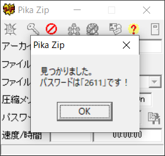

# Panda:Forensics:XXXpts
I wanted to send this file to AJ1479 but I did not want anyone else to see what's inside it, so I protected it with a pin.  
[panda.zip](panda.zip)  

# Solution
panda.zipが渡されるがパスワードがかかっている。  
pinとのことなので数字で総当たりを行う。  
[Pika Zip](pz117.zip)を使用した。  
  
すると数秒でパスワードが`2611`とわかる。  
解凍すると二つのパンダの画像が出てきた。  
  
  
diffをとってみる。  
```bash
$ ls
panda.jpg  panda1.jpg
$ diff <(xxd panda.jpg) <(xxd panda1.jpg)
17c17
< 00000100: 42b1 c115 52d1 f024 3362 7282 090a 1617  B...R..$3br.....
---
> 00000100: 42b1 c115 52d1 f024 6373 6982 090a 1617  B...R..$csi.....
491c491
< 00001ea0: 96ee 9953 dbcc 43db 3819 5ec4 1f5a 7fc0  ...S..C.8.^..Z..
---
> 00001ea0: 96ee 9963 7466 7bdb 3819 5ec4 1f5a 7fc0  ...ctf{.8.^..Z..
1386c1386
< 00005690: 7f0a afbc 4364 b169 a897 1a94 cdf2 c12d  ....Cd.i.......-
---
> 00005690: 7f0a afbc 4364 b169 a897 1a94 6b75 6e2d  ....Cd.i....kun-
1610c1610
< 00006490: c8fe c1ab 7da6 1768 d2e8 9217 18d8 c3a1  ....}..h........
---
> 00006490: c8fe c1ab 7da6 675f d2e8 9217 18d8 c3a1  ....}.g_........
2626c2626
< 0000a410: 0f5c 4979 34ad 0bd9 ceaa 9744 67ed 6a77  .\Iy4......Dg.jw
---
> 0000a410: 0f5c 4979 34ad 0bd9 ceaa 9744 6675 5f77  .\Iy4......Dfu_w
2881c2881
< 0000b400: e338 ce69 2462 49ec d9ed 4d66 21b1 9e54  .8.i$bI...Mf!..T
---
> 0000b400: e338 ce70 346e 6434 7ded 4d66 21b1 9e54  .8.p4nd4}.Mf!..T
$ diff <(xxd panda.jpg) <(xxd panda1.jpg) | grep "[<|>]"
< 00000100: 42b1 c115 52d1 f024 3362 7282 090a 1617  B...R..$3br.....
> 00000100: 42b1 c115 52d1 f024 6373 6982 090a 1617  B...R..$csi.....
< 00001ea0: 96ee 9953 dbcc 43db 3819 5ec4 1f5a 7fc0  ...S..C.8.^..Z..
> 00001ea0: 96ee 9963 7466 7bdb 3819 5ec4 1f5a 7fc0  ...ctf{.8.^..Z..
< 00005690: 7f0a afbc 4364 b169 a897 1a94 cdf2 c12d  ....Cd.i.......-
> 00005690: 7f0a afbc 4364 b169 a897 1a94 6b75 6e2d  ....Cd.i....kun-
< 00006490: c8fe c1ab 7da6 1768 d2e8 9217 18d8 c3a1  ....}..h........
> 00006490: c8fe c1ab 7da6 675f d2e8 9217 18d8 c3a1  ....}.g_........
< 0000a410: 0f5c 4979 34ad 0bd9 ceaa 9744 67ed 6a77  .\Iy4......Dg.jw
> 0000a410: 0f5c 4979 34ad 0bd9 ceaa 9744 6675 5f77  .\Iy4......Dfu_w
< 0000b400: e338 ce69 2462 49ec d9ed 4d66 21b1 9e54  .8.i$bI...Mf!..T
> 0000b400: e338 ce70 346e 6434 7ded 4d66 21b1 9e54  .8.p4nd4}.Mf!..T
```
異なるhexを集めると`6373696374667b6b756e675f66755f70346e64347d`となる。  
```bash
$ python2
~~~
Type "help", "copyright", "credits" or "license" for more information.
>>> "6373696374667b6b756e675f66755f70346e64347d".decode("hex")
'csictf{kung_fu_p4nd4}'
```
hexからASCIIに変換するとflagが得られる。  

## csictf{kung_fu_p4nd4}