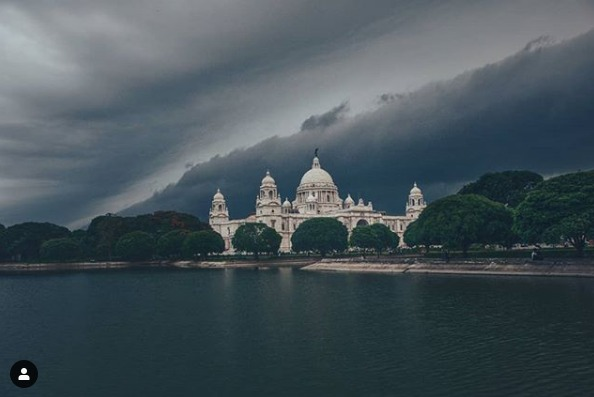
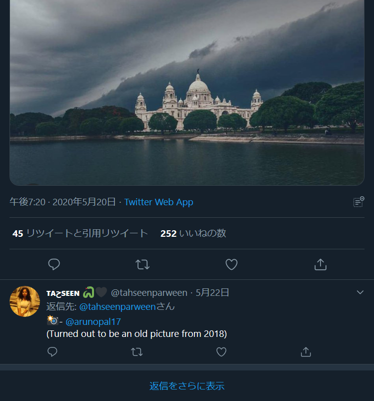
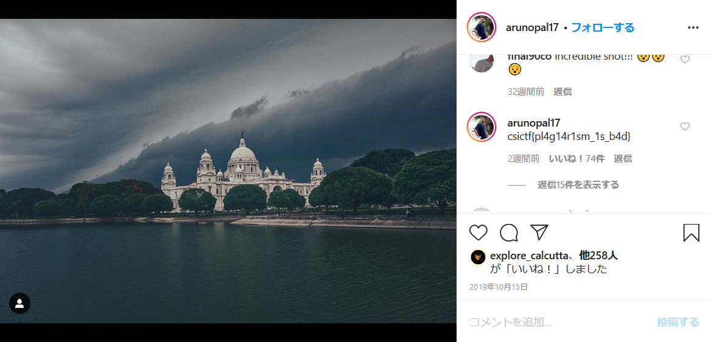

# Pirates of the Memorial:OSINT:332pts
The original photographer of this picture commented the flag on his post. Find the flag.  
[storm.jpeg](storm.jpeg)  

# Solution
画像が与えられる。  
  
問題文にある通り写真家を見つければ良さそうだ。  
Googleで画像検索すると大量の検索結果が表示されるが、順に見ていくと三ページ目で以下のサイトを発見した。  
Viral Bake  
[osint1.png](images/osint1.png)  
"📸- unknown"となっているがこのツイートのリプライを見ると、作者がArunopal Banerjeeと書かれていた。  
  
この人らしい。  
[Arunopal Banerjee](https://twitter.com/arunopal17)  
FacebookとInstagramをやっているようだ。  
Facebookでは何も見つからないが、Instagramの写真のコメントにflagが書かれていた。  
  

## csictf{pl4g14r1sm_1s_b4d}