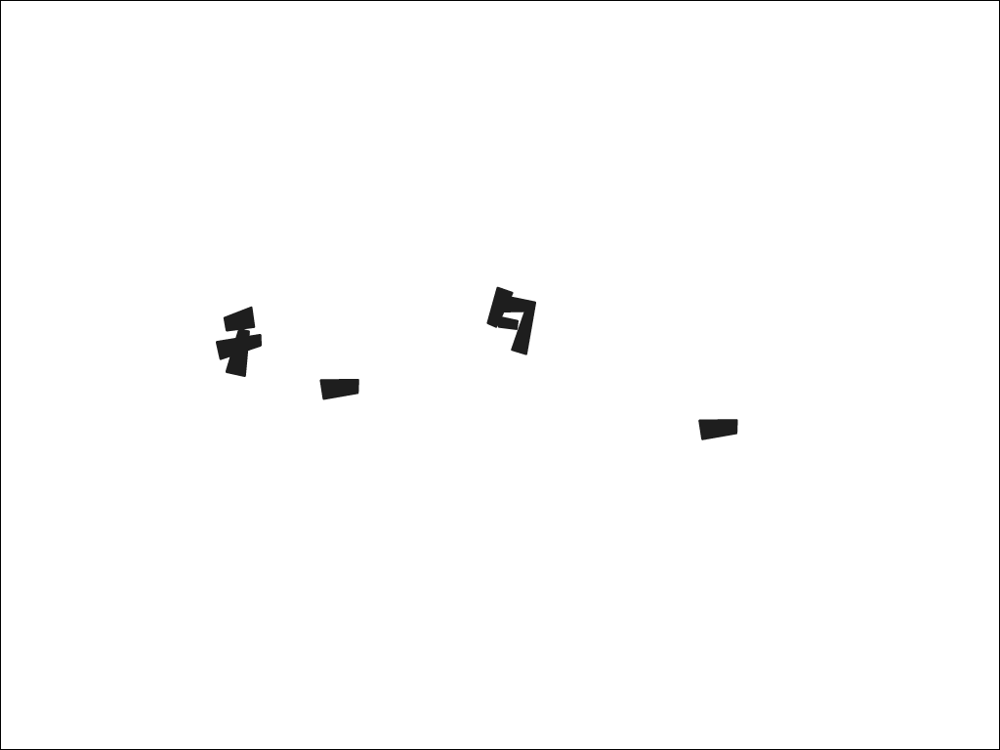

# しし座:Riddle - Fire elements:21pts
ルールを守れ  
  
[leo.png](leo.png)  

Hint  
[ルール](https://ctf.nazotoki.tech/regulation)を**最後まで**よく読んでね  
Hint  
大切なルールに書かれていることを実行してみよう  
- 「モエルゴミ」は捨ててください  
- 「ペットボ」とる  

# Solution
画像が与えられているので、何らかの文字を削除すると予想できる。  
プロローグを見てもそれらしきものはないのでルールを見る。  
意味不明な以下のルールがみられる。  
```
大切なルール
・燃えるゴミは捨ててください
・ペットボトル
```
これらを削除すればよいと考え画像から`モエルゴミ`と`ペットボトル`の文字を取り除く。  
  
`チーター`となりこれがflagだった。

## チーター