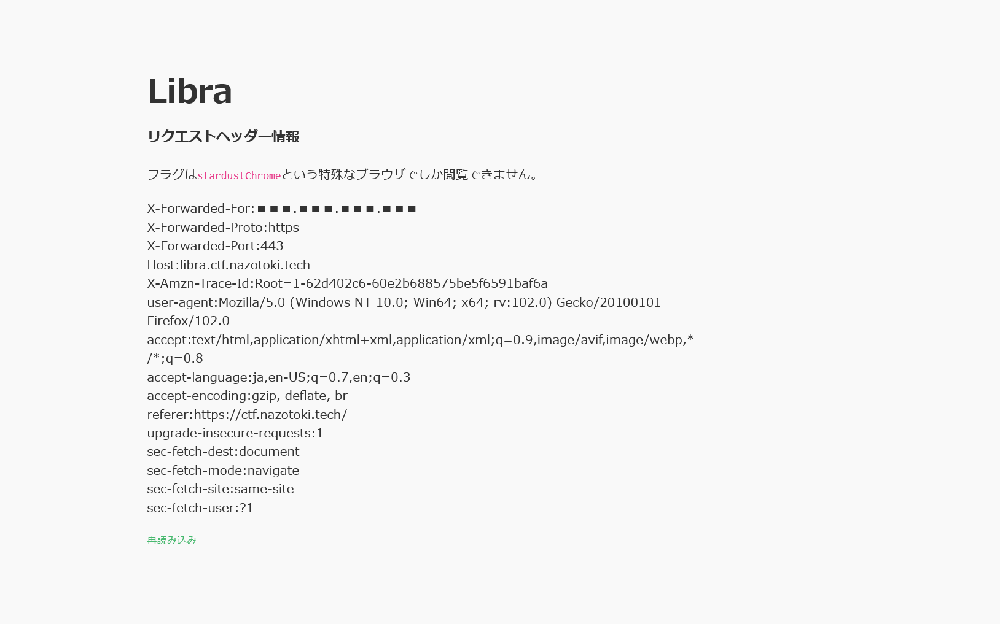
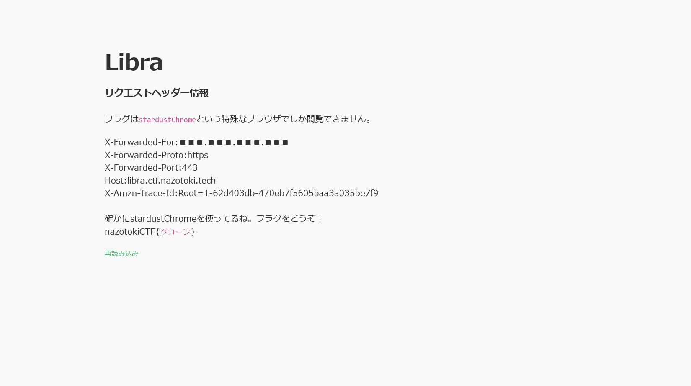

# てんびん座:Web - Air elemtnts:23pts
Webサイトにアクセスしフラグを探せ  
[https://libra.ctf.nazotoki.tech](https://libra.ctf.nazotoki.tech/)  

Hint  
stardustChromeという特殊なブラウザで閲覧する必要がありそうです。でもそんなものは持っていないですよね。 使っているブラウザを偽装することはできないでしょうか？  
Hint  
使っているブラウザを示すヘッダー情報は`user-agent`の中にあります。ここの情報をstardustChromeに変更できれば良さそうです。  
やり方は「User-Agent　偽装」とかでググるといいかもしれません。  

# Solution
URLが渡されるので、アクセスするとアクセス元の情報が表示された。  
Libra  
  
特殊なブラウザでしか閲覧できないようなので、UAを`stardustChrome`に変えればよい。  
再度アクセスする。  
flag  

flagである`クローン`が得られた。  

## クローン