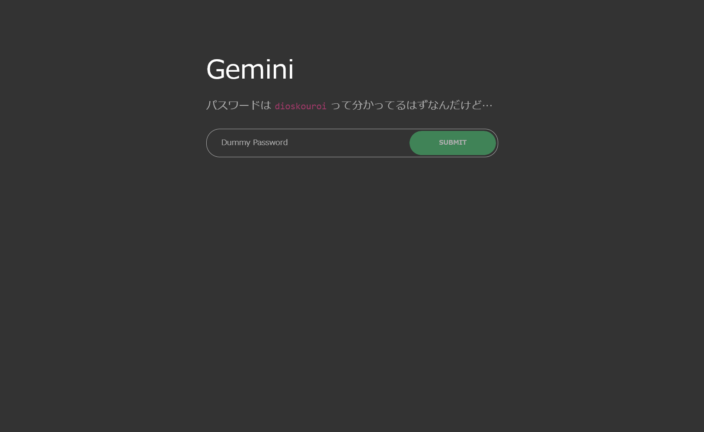
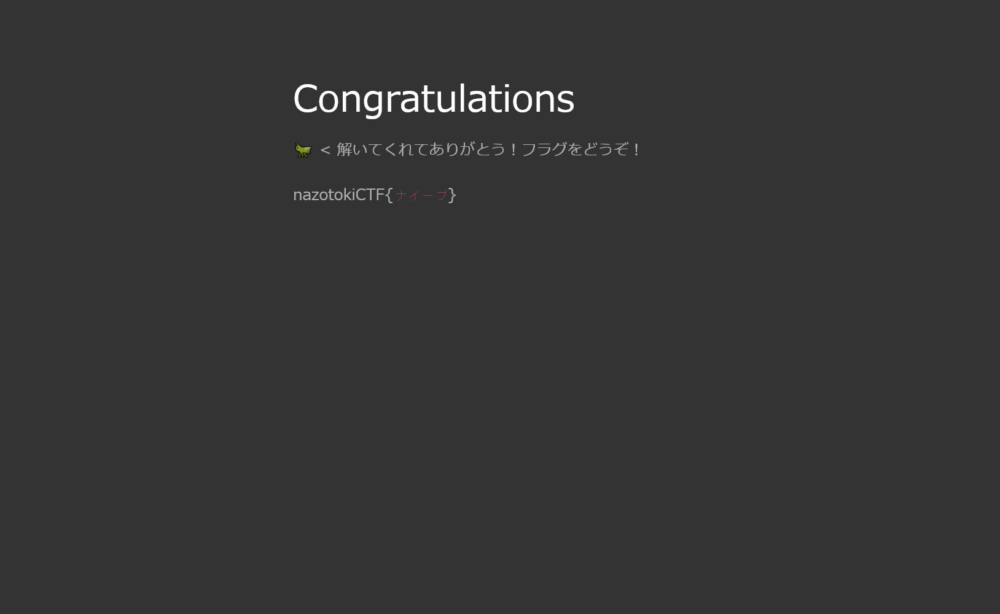

# ふたご座:Web - Air elemtnts:13pts
Webサイトにアクセスしフラグを探せ  
[https://gemini.ctf.nazotoki.tech](https://gemini.ctf.nazotoki.tech/)  

Hint  
パスワードは嘘じゃないみたいです。WEBページのソースを見てみましょう。  
Hint  
35行目の `<input type="hidden" name="realPassword" value="dummyPassword">`  
で`dummyPassword`という文字列が強制的に入力されているようです。これを`dioskouroi`に書き換えることができれば良さそうです。  
やりかたがわからなければ「開発者ツール html 書き換え」とかでぐぐるといいかもしれません。  

# Solution
URLが渡されるのでアクセスするとログインフォームのようだ。  
Gemini  
  
`Dummy Password`とあるので怪しいと考え、ソースを見ると以下のようであった。  
```bash
$ curl https://gemini.ctf.nazotoki.tech/
~~
                  <div style="padding-bottom: 2rem;">パスワードは <code>dioskouroi</code> って分かってるはずなんだけど…</div>
                  <form action="check.php" method="get">
                    <div class="input-group">
                      <input class="form-control" type="input" name="dummyPassword" placeholder="Dummy Password" />
                      <input type="hidden" name="realPassword" value="dummyPassword">
                      <span class="input-group-btn"><input class="btn btn--primary btn--rounded" type="submit" value="SUBMIT" /></span>
                    </div>
                  </form>
~~~
```
`realPassword`が`hidden`でGETなので`https://gemini.ctf.nazotoki.tech/check.php?realPassword=dioskouroi`にアクセスする。  
`https://gemini.ctf.nazotoki.tech/f7ec2a7c73cec964443bfac97db5ea80.html`にリダイレクトされた。  
flag  

flagである`ナイーブ`が得られた。  

## ナイーブ