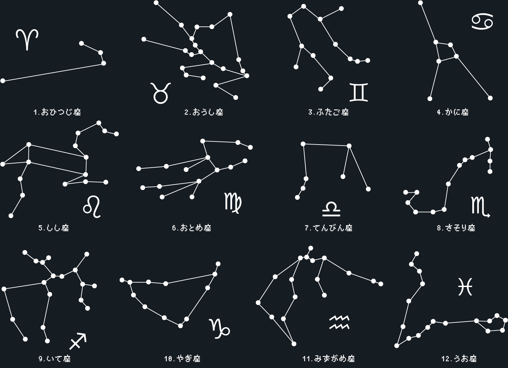

# へびつかい座:2nd Challenge:100pts
最終問題に進むためのフラグを導く魔法の解答用紙をご用意しました（謎解きによくあるやつ）  
※使い方のヒント  
- PDF版とPNG版を用意してますが内容は一緒です  
- 印刷できる環境がある方は印刷するといいかも  
- PDF版は文字入力ができるようになってます  
    - お使いのIMEによるかもしれませんがカタカナ入力よりひらがな入力のほうがやりやすいかも（どっちでも大丈夫です）  
    - tabキーで次の入力欄に移動できるようになってます  
- あとで提出が必要になったりするとかではないので最悪使わなくても大丈夫です  
    - ただし、用紙の様式はよくみておいたほうが良さそうです  

[answersheet.pdf](answersheet.pdf)　[answersheet.png](answersheet.png)  

Hint  
まずは12星座の問題を解いて獲得したフラグの文字列で解答用紙を埋めていきましょう。 並び順にピンとこなければ[プロローグ](https://ctf.nazotoki.tech/prologue)がヒントになりそうです。  
Hint  
た  
て  
よ  
み  
Hint  
「はてな　いちおくかい　たたけ」  
と読めましたかね？  
もしかしてハテナの意味がわからないですか？意外と目の前にあると気づかないものですよね。  
Hint  
左上に…  
Hint  
ごめん…本当に1億回クリックしようとは思ってないですよね？さすがに無理ですよね。 回数を数えてるやつがどこかにいるはずなのでそいつを欺けばよさそうです。  
てんびん座の問題がヒントになるかもしれません。  
Hint  
てんびん座の問題をみると、開いているブラウザのCookieにはnazotokiって値が追加されていることがわかります。  
この値がハテナをクリックした回数のようです。値を改ざんしてみましょう。（やりかたがわからない人は「Cookie　編集　やり方」とかでググってね）  

# Solution
どう考えても今までのフラグを並べるシートが配られる。  
12星座の順に並べ、色が変わっている部分を縦読みすればよい。  
  
以下の通りとなる。  
```
ハンドル
テントウ
ナイーブ
イイワケ
チーター
オワスプ
クローン
カクダイ
イースト
タイスウ
タカハシ
ケッパク
```
`ハテナイチオクカイタタケ`なのではてな(ロゴ)を一億回クリックすればよいようだ。  
そんな作業は面倒なので、ソースを見ると`/themes/core/static/js/hatena.js`なるものがある。  
取得してみる。  
```bash
$ curl https://ctf.nazotoki.tech/themes/core/static/js/hatena.js
function hatenaClick(){
    var $count = getCookie( 'nazotoki' );
    if( $count >= 99999999 ){
        alert("nazotokiCTF{ポラリス}");
    }
    if( !$count ){
        setCookie( 'nazotoki', 1, 1 );
    }else{
        setCookie( 'nazotoki', ++$count, 1 );
    }
}

function setCookie( $cookieName, $cookieValue, $days ){
    var $dateObject = new Date();
    var $days = 2;
    $dateObject.setTime( $dateObject.getTime() + ( $days*24*60*60*1000 ) );
    var $expires = "expires=" + $dateObject.toGMTString();
    document.cookie = $cookieName + "=" + $cookieValue + "; " + $expires + "; domain=.ctf.nazotoki.tech";
}
function getCookie( $cookieName ){
    var $cookies = document.cookie.split(';');
    for( var $i=0; $i < $cookies.length; $i++ ){
        var $cookie = $cookies[$i].trim().split( '=' );
        if( $cookie[0] == $cookieName ){
            return $cookie[1];
        }
    }
    return "";
}
```
`ポラリス`なるflagが手に入った(回数はcookieに入っていたようだ)。  

## ポラリス