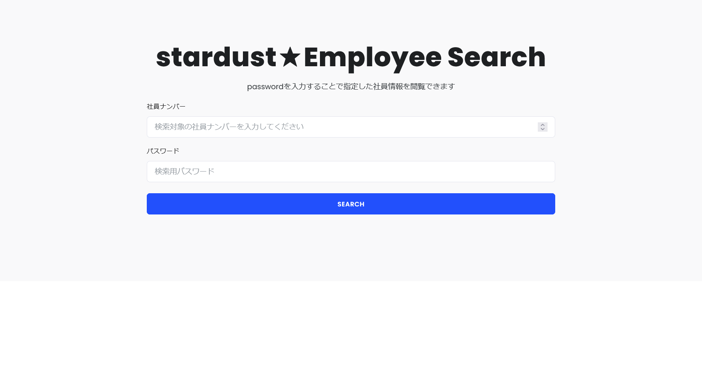
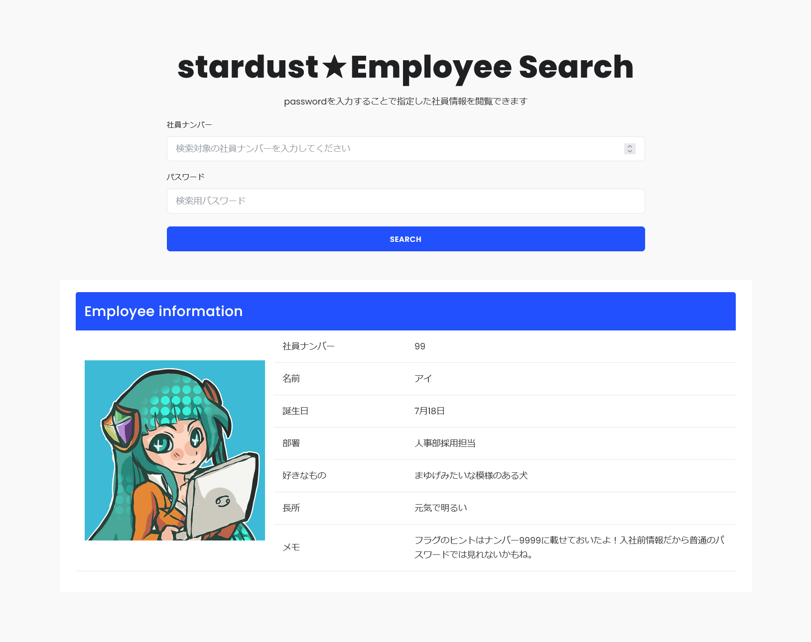
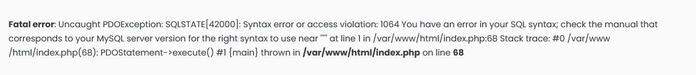
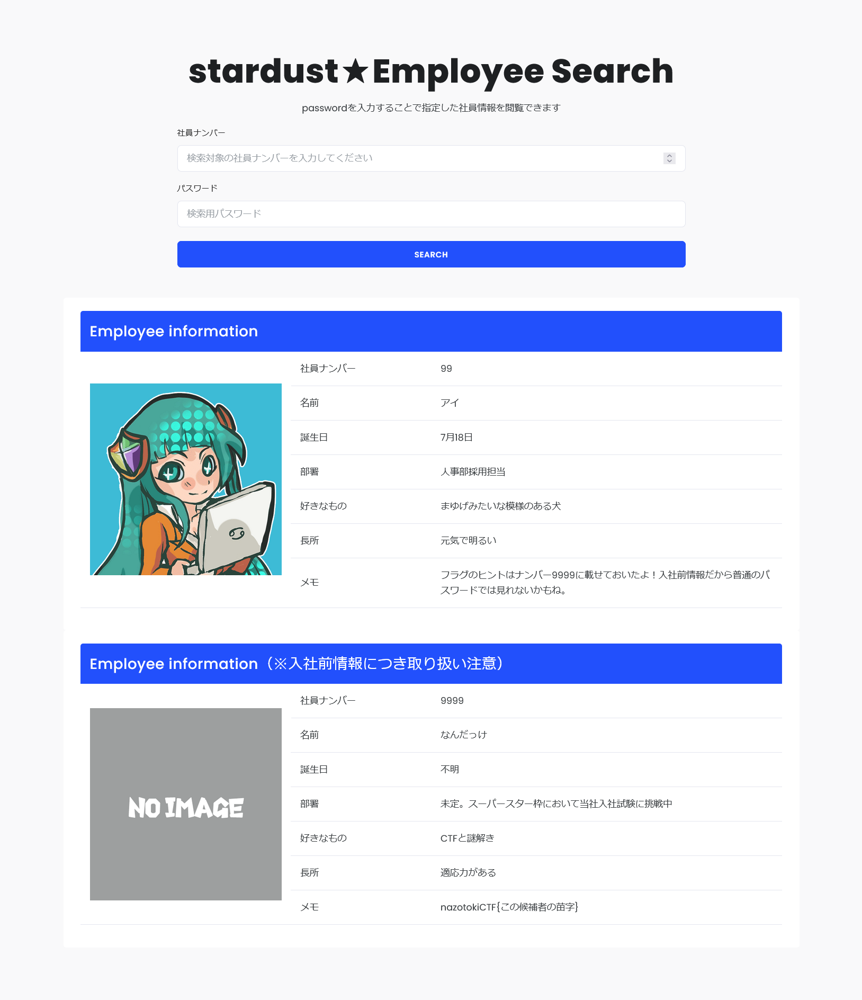

# みずがめ座:Web - Air elemtnts:33pts
Webサイトにアクセスしフラグを探せ  
[https://aquarius.ctf.nazotoki.tech](https://aquarius.ctf.nazotoki.tech/)  

Hint  
`password`を入力することで指定した社員情報を閲覧できます  
と書かれています。 スターダストセキュリティの社員の中で、一人だけ社員ナンバーを知っている人がいませんか？ その人の社員ナンバーを使って、「password」と入力すれば検索ができそうです。  
Hint  
アイちゃんの情報は検索できましたか？ メモ欄にフラグのヒントが載っていますね。  
検索すべき社員ナンバーがわかりましたが、普通のパスワードでは検索できないようです。 どうやらパスワード入力欄に脆弱性がありそうですが…  
Hint  
パスワード入力フォームにSQLインジェクションの脆弱性があります  
社員ナンバー：`9999` か `99`  
パスワード：`' or 1=1 ;`  
と入力してみてください。この人は誰でしょうか？名前がわからなかったら[プロローグ](https://ctf.nazotoki.tech/prologue)に戻るといいかもしれません。  

# Solution
URLが渡されるのでアクセスすると、社員検索システムのようだ。  
スターダストセキュリティ社員検索システム  
  
真っ先にSQLiを試すが、何も起こらない。  
社員ナンバーをどこかで見た記憶があり、以下の画像を思い出す。  
  
社員ナンバーは`99`のようだ。  
`passwordを入力することで指定した社員情報を閲覧できます`とあるので`password`を試す。  
すると以下のようにEmployee informationがヒットする。  
  
フラグのヒントは社員ナンバー9999にあるようなので`9999`で、パスワードに`'`を入力する。  
すると以下のエラーが発生した。  
  
SQLiが刺さるようなので`' OR 's' = 's' -- satoki`をパスワードとする。  
  
入社前情報が表示され、メモに`nazotokiCTF{この候補者の苗字}`とある。  
[プロローグ](https://ctf.nazotoki.tech/prologue)に`ぼくの名前は「高橋 ピヨ彦（タカハシ ピヨヒコ）」。`とあるので苗字の`タカハシ`がflagとなった。  

## タカハシ