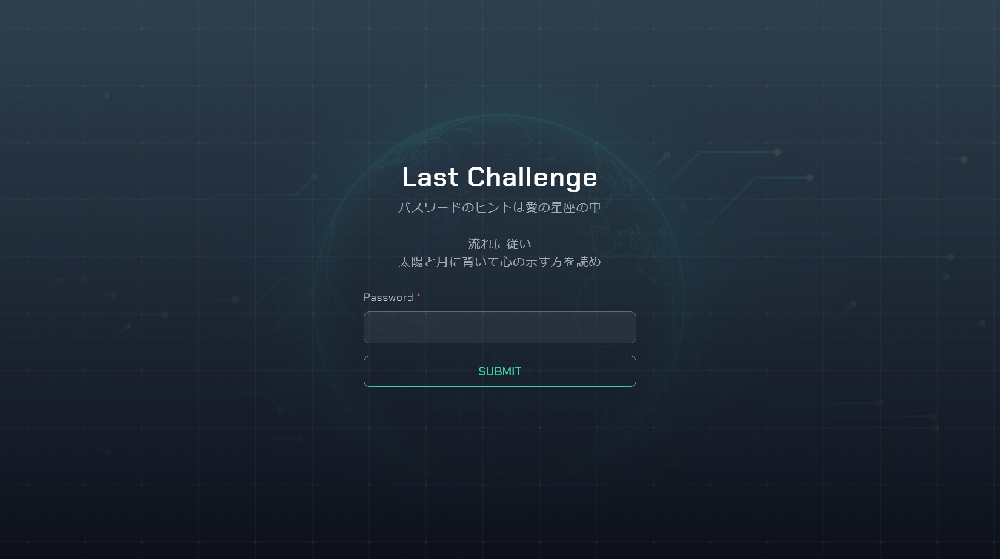
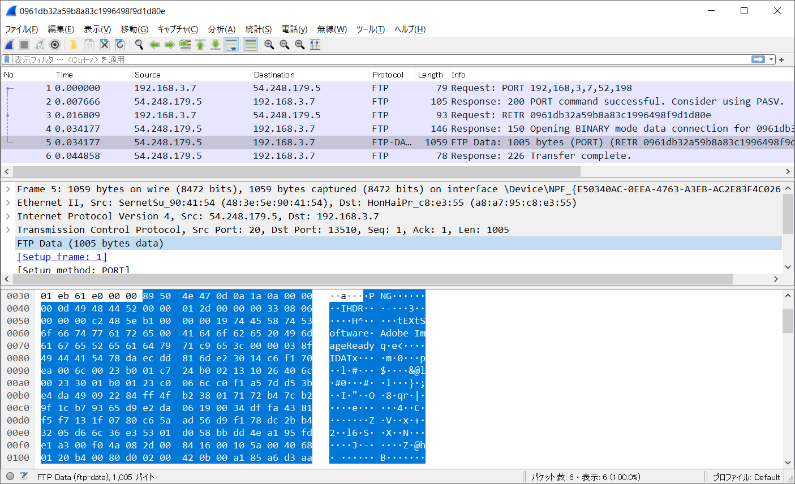
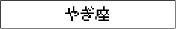
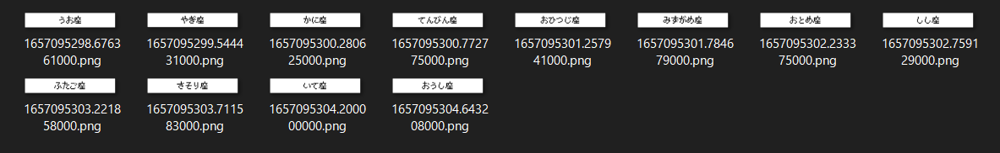
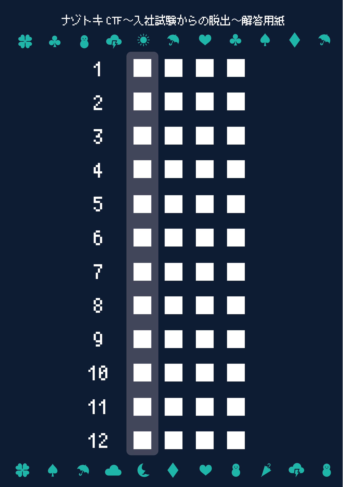
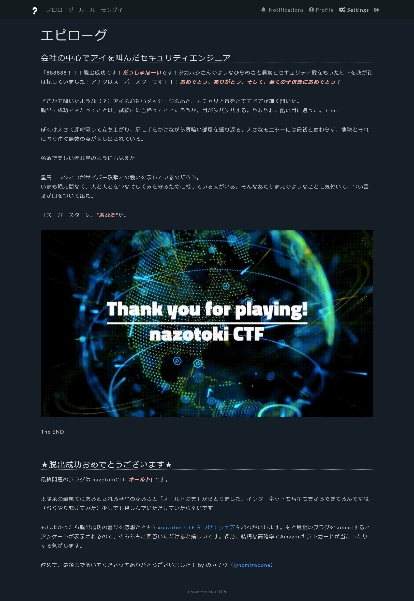

# 最終問題:Last Challenge:200pts
パスワードを解け  
[http://polaris.ctf.nazotoki.tech](http://polaris.ctf.nazotoki.tech/)  

Hint  
ここまで来れたなら、フラグを導くために必要な情報の全ては既にあなたの前に提示されているはずです。  
愛とはもちろん採用担当アイちゃんのことです。アイの星座はなんでしょうか？ 彼女の誕生日がわかれば星座もわかりそうですね。どこかで彼女の誕生日を見ませんでしたか？  
Hint  
アイちゃんの誕生日は7月18日、つまりかに座です（ちなみに彼女が持ってるノートパソコンのマークもかに座です、気がつきました？）  
さて、かに座の問題の仲間外れ以外のデータは何のデータだったでしょうか？その中に順番を示す物はなかったでしょうか？  
Hint  
かに座の問題にはpcapファイルが12個ありました。  
パケットには前のパケットを示す `Sequence number` と後ろのパケットを示す `Acknowledgment number` いう情報が付与されており、それを見るとバラバラの12個はもともとひとつのストリームのなかでつながったパケットであったことがわかります。  
パケット同士の前後関係を確認し、流れに従って並び替えると  
1. うお座  
2. やぎ座  
3. かに座  
4. てんびん座  
5. おひつじ座  
6. みずがめ座  
7. おとめ座  
8. しし座  
9. ふたご座  
10. さそり座  
11. いて座  
12. おうし座
の順番になるようです。

# Solution
URLが与えられるのでアクセスすると、ログインフォームのようだ。  
polaris  
  
`パスワードのヒントは愛の星座の中`とあるので社員のAI(愛)の星座を探す。  
[みずがめ座](../みずがめ座)のSQLiでAIの誕生日がわかる。  
  
7月18日なのでかに座となる。  
ここで、[かに座](../かに座)のzipファイルにpcapが大量に含まれていたが、使用していないことを思い出す。  
試しにwiresharkで開くと、FTPで画像を送信している。  
  
一つ取り出す。  
  
星座のようだがここから何も得られない。  
順番に画像を送信していると予想し、エポックタイム順に並べれば何かわかりそうだ。  
[すべて抽出](images/pcap_img)して並べると以下のようになった。  
  
```
うお座
やぎ座
かに座
てんびん座
おひつじ座
みずがめ座
おとめ座
しし座
ふたご座
さそり座
いて座
おうし座
```
この通りに取得した各問題のフラグを並べる。  
```
ケッパク
タイスウ
イイワケ
クローン
ハンドル
タカハシ
オワスプ
チーター
ナイーブ
カクダイ
イースト
テントウ
```
サイトの`太陽と月に背いて心の示す方を読め`より、解答用紙で太陽と月のマークを見たことを思い出す。  
  
太陽と月のマークの先頭を無視して、心(ハート)の部分を読めばよいと気づく。  
`パスワードハスターダスト`となるので社名の`stardust`となる。  
ログインすると以下のサイトへリダイレクトされる。  
エピローグ  
  
`オールト`がflagのようだ。  

## オールト