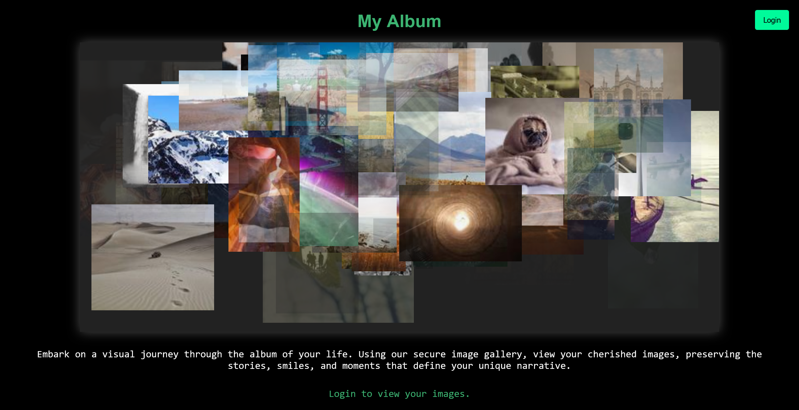
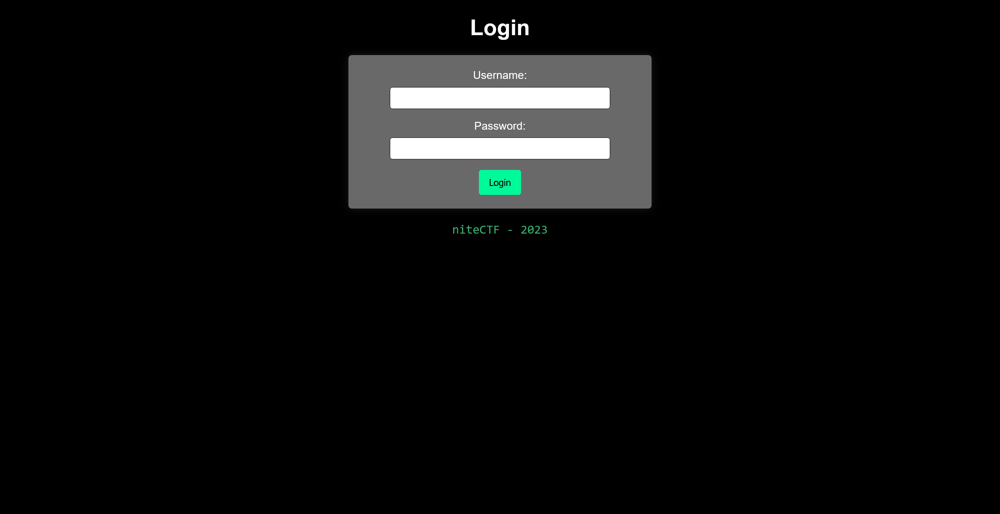
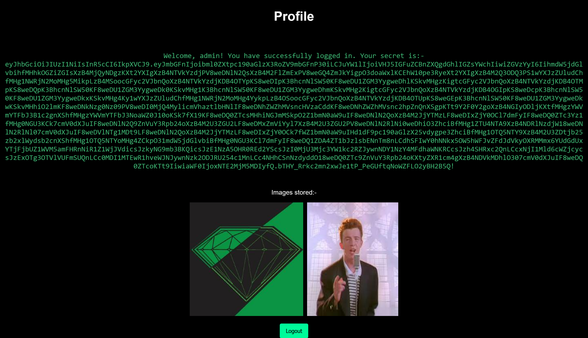
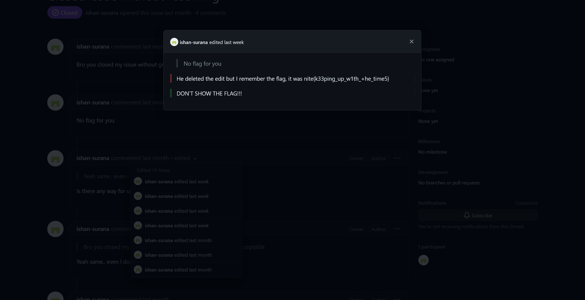

# Image Gallery:web:470pts
View your photo gallery using our super Secure image gallery. we offer free 1 terabyte of storage of high-Quality images, showcased in a personalized custom aLbum.  
[link](https://imgy-gal.nitectf.live/)  
[backup link](https://imgy-galll.nitectf.live/)  

[imagegal.zip](imagegal.zip)  

# Solution
URLとソースコードが渡される。  
アクセスするとギャラリーサイトのようだ。  
  
Login機能もある。  
  
ソースを見るとログイン部分は以下のようであった。  
```python
~~~
@app.route("/login", methods=["POST", "GET"])
def login():
    if "logged_in" in session and session["logged_in"]:
        session.pop("logged_in", None)
        return redirect(url_for("login"))

    if request.method == "POST":
        username = request.form["username"]
        password = request.form["password"]
        loweruser = username.lower()
        lowerpass = password.lower()
        invalid_entries = invalid_entries = [
            "=",
            "<",
            ">",
            "+",
            "//",
            "|",
            ";",
            " ",
            " ",
            "'1",
            " 1",
            " true",
            "'true",
            " or",
            "'or",
            "/or",
            " and",
            "'and",
            "/and",
            "'like",
            " like",
            "/like",
            "'where",
            " where",
            "/where",
            "%00",
            "null",
            "admin'",
        ]
        matching_value = next(
            (
                value
                for value in invalid_entries
                if value in loweruser or value in lowerpass
            ),
            None,
        )
        if matching_value:
            error = (
                f"Invalid entry in username and/or password fields. Please try again."
            )
            return render_template("login.html", error=error)

        conn = sqlite3.connect("chal.db")
        cursor = conn.cursor()

        query = f"SELECT secret FROM login_details WHERE username = '{username}' AND password = '{password}';"

        result = cursor.execute(query)
        user = result.fetchone()

        conn.close()
~~~
```
明らかにSQLiしてくれと言わんばかりの実装である。  
`IS NOT`テクニックはブラックリストにないため使用できるが、スペースが拒否される。  
`/**/`で代用すればよい。  
Username:`admin`、Password:`satoki'/**/IS/**/NOT/**/'s`でログインする。  
  
adminとしてログインすると意味の分からないjwtが与えられるので、jwttoolで見てやる。  
```bash
$ jwttool "eyJhbGciOiJIUzI1NiIsInR5cCI6IkpXVCJ9.eyJmbGFnIjoibml0ZXtpc190aGlzX3RoZV9mbGFnP30iLCJuYW1lIjoiVHJ5IGFuZCBnZXQgdGhlIGZsYWchIiwiZGVzYyI6IihmdW5jdGlvbihfMHhkOGZiZGIsXzB4MjQyNDgzKXt2YXIgXzB4NTVkYzdjPV8weDNlN2QsXzB4M2FlZmExPV8weGQ4ZmJkYigpO3doaWxlKCEhW10pe3RyeXt2YXIgXzB4M2Q3ODQ3PS1wYXJzZUludChfMHg1NWRjN2MoMHg5MikpLzB4MSoocGFyc2VJbnQoXzB4NTVkYzdjKDB4OTYpKS8weDIpK3BhcnNlSW50KF8weDU1ZGM3YygweDhlKSkvMHgzKigtcGFyc2VJbnQoXzB4NTVkYzdjKDB4OTMpKS8weDQpK3BhcnNlSW50KF8weDU1ZGM3YygweDk0KSkvMHg1K3BhcnNlSW50KF8weDU1ZGM3YygweDhmKSkvMHg2KigtcGFyc2VJbnQoXzB4NTVkYzdjKDB4OGIpKS8weDcpK3BhcnNlSW50KF8weDU1ZGM3YygweDkxKSkvMHg4Ky1wYXJzZUludChfMHg1NWRjN2MoMHg4YykpLzB4OSoocGFyc2VJbnQoXzB4NTVkYzdjKDB4OTUpKS8weGEpK3BhcnNlSW50KF8weDU1ZGM3YygweDkwKSkvMHhiO2lmKF8weDNkNzg0Nz09PV8weDI0MjQ4MylicmVhaztlbHNlIF8weDNhZWZhMVsncHVzaCddKF8weDNhZWZhMVsnc2hpZnQnXSgpKTt9Y2F0Y2goXzB4NGIyODljKXtfMHgzYWVmYTFbJ3B1c2gnXShfMHgzYWVmYTFbJ3NoaWZ0J10oKSk7fX19KF8weDQ0ZTcsMHhiNGJmMSkpO2Z1bmN0aW9uIF8weDNlN2QoXzB4M2JjYTMzLF8weDIxZjY0OCl7dmFyIF8weDQ0ZTc3Yz1fMHg0NGU3KCk7cmV0dXJuIF8weDNlN2Q9ZnVuY3Rpb24oXzB4M2U3ZGU2LF8weDMxZmViYyl7XzB4M2U3ZGU2PV8weDNlN2RlNi0weDhiO3ZhciBfMHg1ZTU4NTA9XzB4NDRlNzdjW18weDNlN2RlNl07cmV0dXJuIF8weDVlNTg1MDt9LF8weDNlN2QoXzB4M2JjYTMzLF8weDIxZjY0OCk7fWZ1bmN0aW9uIHd1dF9pc190aGlzX25vdygpe3ZhciBfMHg1OTQ5NTY9XzB4M2U3ZDtjb25zb2xlWydsb2cnXShfMHg1OTQ5NTYoMHg4ZCkpO31mdW5jdGlvbiBfMHg0NGU3KCl7dmFyIF8weDQ1ZDA4ZT1bJzlsbENnTm8nLCdhSFIwY0hNNkx5OW5hWFJvZFdJdVkyOXRMMmx6YUdGdUxYTjFjbUZ1WVM5amFHRnNiR1Z1WjJVdicsJzkyNG9mb3BKQicsJzE1NzA5OHR0REd2YScsJzI0MjU3Mjc3YW1kc2RZJywnNDY1NzY4MFdhaWNKRCcsJzh4SHRxc2QnLCcxNjI1Mld6cWZjcycsJzExOTg3OTVlVUFmSUQnLCc0MDI1MTEwR1hveWJNJywnNzk2ODJRU254c1MnLCc4NHhCSnNzdyddO18weDQ0ZTc9ZnVuY3Rpb24oKXtyZXR1cm4gXzB4NDVkMDhlO307cmV0dXJuIF8weDQ0ZTcoKTt9IiwiaWF0IjoxNTE2MjM5MDIyfQ.bTHY_Rrkc2mn2xwJe1tP_PeGUftqNoWZFLO2yBH2B5Q"

        \   \        \         \          \                    \
   \__   |   |  \     |\__    __| \__    __|                    |
         |   |   \    |      |          |       \         \     |
         |        \   |      |          |    __  \     __  \    |
  \      |      _     |      |          |   |     |   |     |   |
   |     |     / \    |      |          |   |     |   |     |   |
\        |    /   \   |      |          |\        |\        |   |
 \______/ \__/     \__|   \__|      \__| \______/  \______/ \__|
 Version 2.2.6                \______|             @ticarpi

Original JWT:

=====================
Decoded Token Values:
=====================

Token header values:
[+] alg = "HS256"
[+] typ = "JWT"

Token payload values:
[+] flag = "nite{is_this_the_flag?}"
[+] name = "Try and get the flag!"
[+] desc = "(function(_0xd8fbdb,_0x242483){var _0x55dc7c=_0x3e7d,_0x3aefa1=_0xd8fbdb();while(!![]){try{var _0x3d7847=-parseInt(_0x55dc7c(0x92))/0x1*(parseInt(_0x55dc7c(0x96))/0x2)+parseInt(_0x55dc7c(0x8e))/0x3*(-parseInt(_0x55dc7c(0x93))/0x4)+parseInt(_0x55dc7c(0x94))/0x5+parseInt(_0x55dc7c(0x8f))/0x6*(-parseInt(_0x55dc7c(0x8b))/0x7)+parseInt(_0x55dc7c(0x91))/0x8+-parseInt(_0x55dc7c(0x8c))/0x9*(parseInt(_0x55dc7c(0x95))/0xa)+parseInt(_0x55dc7c(0x90))/0xb;if(_0x3d7847===_0x242483)break;else _0x3aefa1['push'](_0x3aefa1['shift']());}catch(_0x4b289c){_0x3aefa1['push'](_0x3aefa1['shift']());}}}(_0x44e7,0xb4bf1));function _0x3e7d(_0x3bca33,_0x21f648){var _0x44e77c=_0x44e7();return _0x3e7d=function(_0x3e7de6,_0x31febc){_0x3e7de6=_0x3e7de6-0x8b;var _0x5e5850=_0x44e77c[_0x3e7de6];return _0x5e5850;},_0x3e7d(_0x3bca33,_0x21f648);}function wut_is_this_now(){var _0x594956=_0x3e7d;console['log'](_0x594956(0x8d));}function _0x44e7(){var _0x45d08e=['9llCgNo','aHR0cHM6Ly9naXRodWIuY29tL2lzaGFuLXN1cmFuYS9jaGFsbGVuZ2Uv','924ofopJB','157098ttDGva','24257277amdsdY','4657680WaicJD','8xHtqsd','16252Wzqfcs','1198795eUAfID','4025110GXoybM','79682QSnxsS','84xBJssw'];_0x44e7=function(){return _0x45d08e;};return _0x44e7();}"
[+] iat = 1516239022    ==> TIMESTAMP = 2018-01-18 10:30:22 (UTC)

----------------------
JWT common timestamps:
iat = IssuedAt
exp = Expires
nbf = NotBefore
----------------------

```
フラグはないが、意味の分からないjsが与えられる。  
`wut_is_this_now()`が見えるので実行してみる。  
```bash
$ node
~~~
> (function(_0xd8fbdb,_0x242483){var _0x55dc7c=_0x3e7d,_0x3aefa1=_0xd8fbdb();while(!![]){try{var _0x3d7847=-parseInt(_0x55dc7c(0x92))/0x1*(parseInt(_0x55dc7c(0x96))/0x2)+parseInt(_0x55dc7c(0x8e))/0x3*(-parseInt(_0x55dc7c(0x93))/0x4)+parseInt(_0x55dc7c(0x94))/0x5+parseInt(_0x55dc7c(0x8f))/0x6*(-parseInt(_0x55dc7c(0x8b))/0x7)+parseInt(_0x55dc7c(0x91))/0x8+-parseInt(_0x55dc7c(0x8c))/0x9*(parseInt(_0x55dc7c(0x95))/0xa)+parseInt(_0x55dc7c(0x90))/0xb;if(_0x3d7847===_0x242483)break;else _0x3aefa1['push'](_0x3aefa1['shift']());}catch(_0x4b289c){_0x3aefa1['push'](_0x3aefa1['shift']());}}}(_0x44e7,0xb4bf1));function _0x3e7d(_0x3bca33,_0x21f648){var _0x44e77c=_0x44e7();return _0x3e7d=function(_0x3e7de6,_0x31febc){_0x3e7de6=_0x3e7de6-0x8b;var _0x5e5850=_0x44e77c[_0x3e7de6];return _0x5e5850;},_0x3e7d(_0x3bca33,_0x21f648);}function wut_is_this_now(){var _0x594956=_0x3e7d;console['log'](_0x594956(0x8d));}function _0x44e7(){var _0x45d08e=['9llCgNo','aHR0cHM6Ly9naXRodWIuY29tL2lzaGFuLXN1cmFuYS9jaGFsbGVuZ2Uv','924ofopJB','157098ttDGva','24257277amdsdY','4657680WaicJD','8xHtqsd','16252Wzqfcs','1198795eUAfID','4025110GXoybM','79682QSnxsS','84xBJssw'];_0x44e7=function(){return _0x45d08e;};return _0x44e7();}
undefined
> wut_is_this_now()
aHR0cHM6Ly9naXRodWIuY29tL2lzaGFuLXN1cmFuYS9jaGFsbGVuZ2Uv
undefined
> atob("aHR0cHM6Ly9naXRodWIuY29tL2lzaGFuLXN1cmFuYS9jaGFsbGVuZ2Uv")
'https://github.com/ishan-surana/challenge/'
```
GitHubのURLが与えられた。  
ここからフラグを探せとのことらしい。  
いろいろと探していると、[クローズされたissue](https://github.com/ishan-surana/challenge/issues/4)のコメント編集履歴にflagがあった。  
  
なんだこれ。

## nite{k33ping_up_w1th_+he_time5}