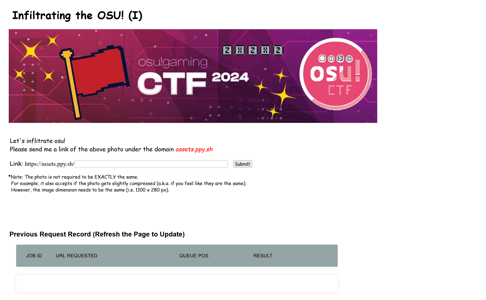
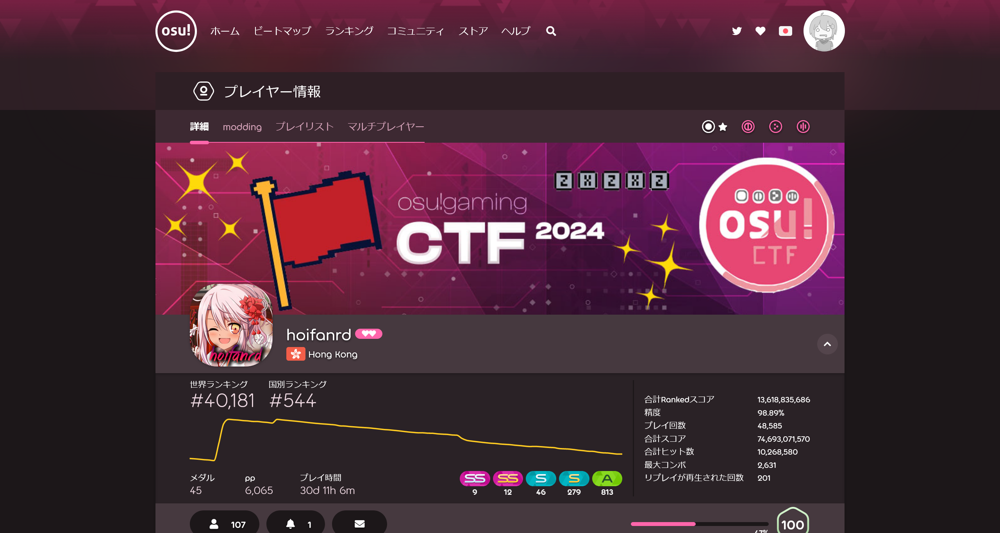
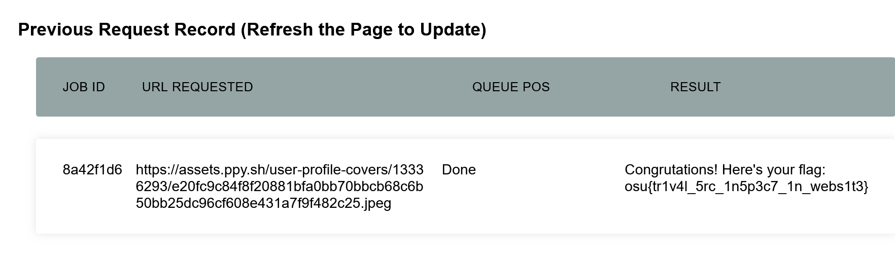

# Infiltrating the OSU! (I):misc:104pts
Let's infiltrate OSU!  
[https://infiltrating-osu-1.web.osugaming.lol/](https://infiltrating-osu-1.web.osugaming.lol/)  
Hint: Maybe you may want to visit the author's osu! [homepage](https://osu.ppy.sh/users/13336293)!  
Note: **As stated in the rules, please do not violate any rules or policies against osu! under any circumstances.**  

# Solution
URLとヒントが渡される。  
アクセスすると、`assets.ppy.sh`ドメイン下で指定された画像が存在するパスを要求される。  
  
`assets.ppy.sh`は自身の管理ドメインではなく、正式なサービスであるため改竄も行えない。  
サービスの基本機能を使って目的を達成する必要がある。  
ヒントのページを見ると、osu!というゲームのプロフィールページであった。  
  
なんとプロフィールのカバー画像が指定されていた画像と一致している。  
カバー画像の場所は`https://assets.ppy.sh/user-profile-covers/13336293/e20fc9c84f8f20881bfa0bb70bbcb68c6b50bb25dc96cf608e431a7f9f482c25.jpeg`であるのでドメインも目的のものだ。  
あとはサイトより、URLのパスを投げてやればよい。  
  
画像の一致が判定され、flagが表示された。  

## osu{tr1v4l_5rc_1n5p3c7_1n_webs1t3}