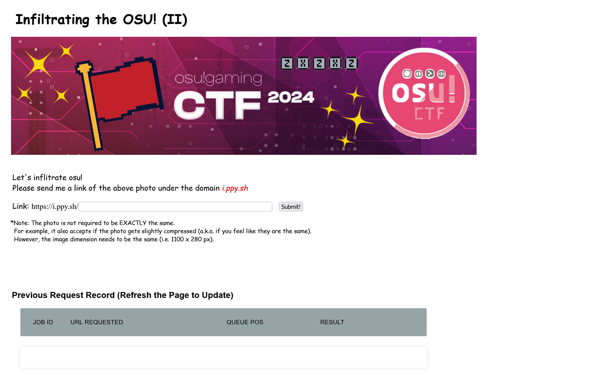
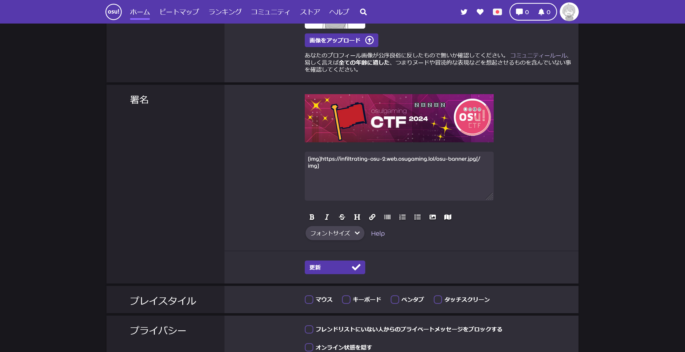
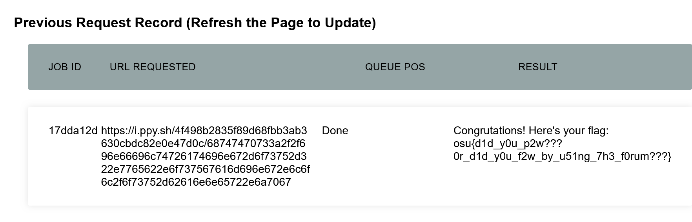

# Infiltrating the OSU! (II):misc:110pts
Let's infiltrate OSU! (You may want to try out the previous challenge `Infiltrating the OSU! (I)` first.)  
[https://infiltrating-osu-2.web.osugaming.lol/](https://infiltrating-osu-2.web.osugaming.lol/)  
Note: **As stated in the rules, please do not violate any rules or policies against osu! under any circumstances.**  

# Solution
[Infiltrating the OSU! (I)](../Infiltrating_the_OSU!_(I))の続き問題のようだ。  
URLが与えられるのでアクセスすると、(I)では`assets.ppy.sh`だったドメインが`i.ppy.sh`に変わっている。  
このドメインに、指定された画像を配置し報告すればフラグが手に入る。  
  
おそらく何らかのドメインに対する画像アップロードを行わなければならないと予想し、[ここ](https://osu.ppy.sh/users/create)よりosu!のアカウントを登録する。  
osu!にログインするとカバー画像は有料アカウントのみ変更できるようだ。  
他に画像アップロード機能を探していると、設定の`署名`なる箇所に画像をURLで設定できるようだ。  
  
問題サイトの上部にある画像URLをタグで入力すると、プレビューが表示された。  
プレビューの画像URLを見ると、`https://i.ppy.sh/4f498b2835f89d68fbb3ab3630cbdc82e0e47d0c/68747470733a2f2f696e66696c74726174696e672d6f73752d322e7765622e6f737567616d696e672e6c6f6c2f6f73752d62616e6e65722e6a7067`となっていた。  
運よく、指定されたドメインである。  
これのパスを問題サイトより報告してやればよい。  
  
画像のチェックの後、flagが表示された。  

## osu{d1d_y0u_p2w???0r_d1d_y0u_f2w_by_u51ng_7h3_f0rum???}