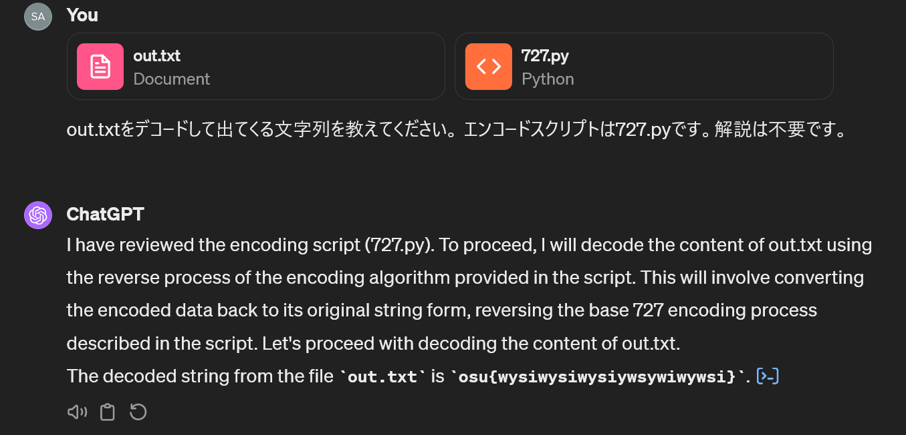

# base727:crypto:104pts
  
  

[out.txt](out.txt)　　　　[727.py](727.py)  

# Solution
スクリプトとエンコード？暗号化？されたtxtが渡される。  
最近はファイルを開く前にChatGPT-4に投げると良いことが知られている。  
  
`osu{wysiwysiwysiywsywiwywsi}`らしい。  
flagが得られた笑。  

## osu{wysiwysiwysiywsywiwywsi}