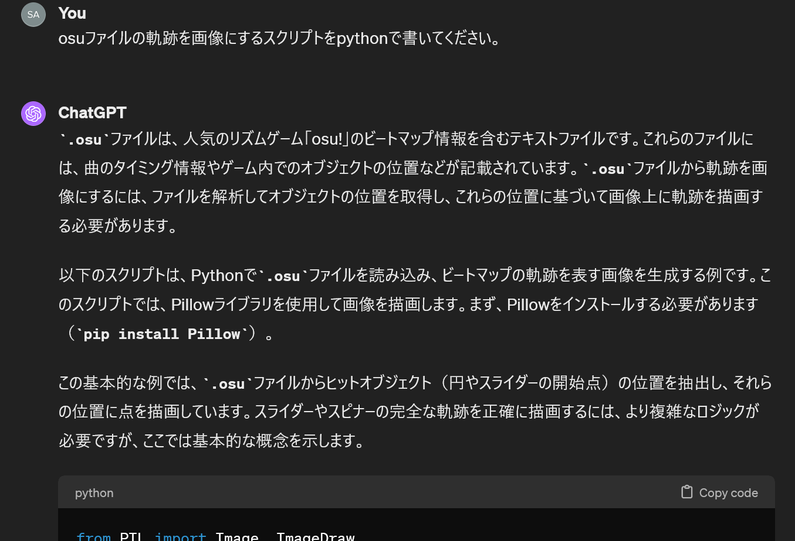
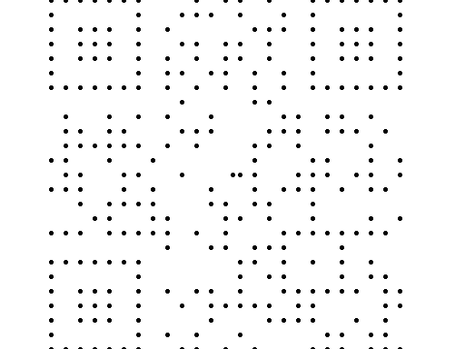

# egg-pain-∞:misc:126pts
I hid a message in my unfinished diff for [ParagonX9 - Chaoz Fantasy](https://osu.ppy.sh/beatmapsets/89799#osu/243946). Could you figure it out?  

[ParagonX9_-_Chaoz_Fantasy_(CTF).osz](ParagonX9_-_Chaoz_Fantasy_(CTF).osz)  

# Solution
oszファイルが配布される。  
調査するとoszはosu!ゲームのビートマップ、いわゆるステージのデータが含まれているファイルだとわかる。  
[ParagonX9 - Chaoz Fantasy](https://osu.ppy.sh/beatmapsets/89799#osu/243946)と呼ばれるビートマップに差分が加えられており、そこにフラグが隠されているようだ。  
まずは[オリジナル](89799 ParagonX9 - Chaoz Fantasy.osz)との差分を調査したい。  
oszはzipとして展開できるようなので、双方を展開しハッシュで比較する。  
```bash
$ sha1sum ./*/*
0c60009bdca46a4cd13c21b42e18c7c985763a6e  ./89799 ParagonX9 - Chaoz Fantasy.osz/Chaoz Fantasy Dragon.jpg
0e202ffd4bcfd051fee136cbb94bdce885668f83  ./89799 ParagonX9 - Chaoz Fantasy.osz/ParagonX9 - Chaoz Fantasy (onlyforyou) [egg pain+++].osu
64a1d289e5476d9b998ade323d4d3af054b0424f  ./89799 ParagonX9 - Chaoz Fantasy.osz/ParagonX9 - Chaoz Fantasy (onlyforyou) [egg pain++].osu
cce3d824c44016720a59faf99019aa75e262b876  ./89799 ParagonX9 - Chaoz Fantasy.osz/ParagonX9 - Chaoz Fantasy (onlyforyou) [egg pain+].osu
2b8dcf14c370dea34c3e4ea1a72d55b62702315a  ./89799 ParagonX9 - Chaoz Fantasy.osz/ParagonX9 - Chaoz Fantasy (onlyforyou) [egg pain].osu
09cca8a9921da830a1b56fc59a7fb7e576dbc6cb  ./89799 ParagonX9 - Chaoz Fantasy.osz/ParagonX9 - Chaoz Fantasy Extended Mix+++.mp3
294fafdbd038da50d51f689cec5e5729c395d283  ./89799 ParagonX9 - Chaoz Fantasy.osz/ParagonX9 - Chaoz Fantasy Extended Mix++.mp3
822f61bda4867e2f783f173808e88d8eb5935c48  ./89799 ParagonX9 - Chaoz Fantasy.osz/ParagonX9 - Chaoz Fantasy Extended Mix+.mp3
76bdaadcd076aa7214c2e9a85b2ab9cce6b83c3a  ./89799 ParagonX9 - Chaoz Fantasy.osz/ParagonX9 - Chaoz Fantasy Extended Mix.mp3
0c60009bdca46a4cd13c21b42e18c7c985763a6e  ./ParagonX9_-_Chaoz_Fantasy_(CTF).osz/Chaoz Fantasy Dragon.jpg
2b8dcf14c370dea34c3e4ea1a72d55b62702315a  ./ParagonX9_-_Chaoz_Fantasy_(CTF).osz/ParagonX9 - Chaoz Fantasy (onlyforyou) [egg pain].osu
bc29859d5e7180ead7c5cfc75745a1e01ec852d5  ./ParagonX9_-_Chaoz_Fantasy_(CTF).osz/ParagonX9 - Chaoz Fantasy (sahuang) [egg pain ∞].osu
76bdaadcd076aa7214c2e9a85b2ab9cce6b83c3a  ./ParagonX9_-_Chaoz_Fantasy_(CTF).osz/ParagonX9 - Chaoz Fantasy Extended Mix.mp3
```
配布されたoszには新たに、`ParagonX9 - Chaoz Fantasy (sahuang) [egg pain ∞].osu`が加わっているようだ。  
ここにフラグが隠されている。  
osu!はマウスを使ったゲームなので、フラグなどを書いていないか軌跡をプロットしたい。  
ChatGPT-4にスクリプトを書いてもらい、適宜変更を加える。  
  
```python
from PIL import Image, ImageDraw


def parse_osu_file(file_path):
    hit_objects = []
    with open(file_path, "r", encoding="utf-8") as file:
        hit_objects_section = False
        for line in file:
            if line.startswith("[HitObjects]"):
                hit_objects_section = True
            elif hit_objects_section:
                if line.strip() == "":
                    break
                parts = line.split(",")
                if len(parts) >= 3:
                    x, y = int(parts[0]), int(parts[1])
                    hit_objects.append((x, y))
    return hit_objects


def draw_beatmap_trace(hit_objects, image_size=(512, 384)):
    img = Image.new("RGB", image_size, "white")
    draw = ImageDraw.Draw(img)

    for x, y in hit_objects:
        draw.ellipse((x - 2, y - 2, x + 2, y + 2), fill="black")

    return img


file_path = "ParagonX9 - Chaoz Fantasy (sahuang) [egg pain ∞].osu"
hit_objects = parse_osu_file(file_path)
img = draw_beatmap_trace(hit_objects)
img.save("beatmap_trace.png")
```
実行すると画像が得られる。  
  
QRコードのようだ。  
画像サイズとスクリプトのプロットサイズを以下の通りうまく調整してやる。  
```python
~~~
def draw_beatmap_trace(hit_objects, image_size=(512, 424)):
    img = Image.new("RGB", image_size, "white")
    draw = ImageDraw.Draw(img)

    for x, y in hit_objects:
        draw.rectangle((x - 8, y - 8 + 15, x + 8, y + 8 + 15), fill="black")

    return img

~~~
img.save("qr.png")
```
  
あとはQRコードを読み取ればよい。  
```bash
$ python
~~~
>>> from pyzbar.pyzbar import decode
>>> from PIL import Image
>>> (decode(Image.open("qr.png"))[0]).data.decode("utf-8")
'osu{qRc0d3_d15Gu153}'
```
flagが得られた。  

## osu{qRc0d3_d15Gu153}