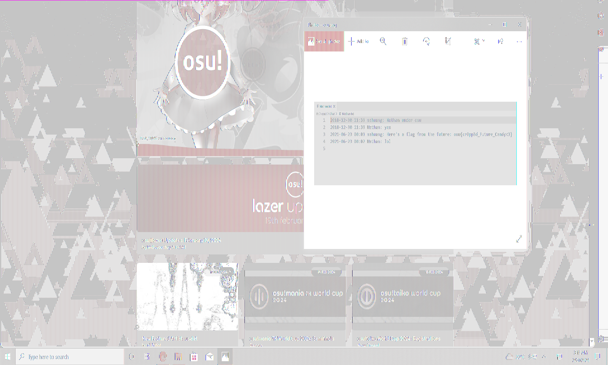

# nathan-on-osu:forensics:117pts
Here's an old screenshot of chat logs between sahuang and Nathan on hollow's Windows machine, but a crucial part of the conversation seems to be *cropped out*... Can you help to recover the flag from the future?  

[nathan_on_osu.zip](nathan_on_osu.zip)  

# Solution
トリミングされた画像が渡される。  
  
Windowsのスクリーンショットらしく、切り取られた箇所を復元する必要がある。  
ここで画像の復元に関する脆弱性であるaCropalypse(CVE 2023-21036)を思い出す。  
```bash
$ strings nathan_on_osu.png | grep IEND
IEND
IEND
```
IENDが複数あり非常に怪しい。  
aCropalypseは[Acropalypse PNG](https://github.com/Absenti/acropalypse_png)を使うことで元のサイズがわからずとも復元できる。  
実行する。  
```bash
$ python acropalypse_png.py restore windows nathan_on_osu.png out.png
Found 773435 trailing bytes!
Extracted 773259 bytes of idat!
Building bitstream...
Reconstructing bit-shifted bytestreams...
Scanning for viable parses...
Found viable parse at bit offset 112840!
len(decompressed) = 4980152
Generating output PNG...
Width > 1050 pixels
Width > 1060 pixels
~~~
Width > 1430 pixels
Width > 1440 pixels
Dimensions found = 1440x865
```
1440でヒットした。  
  
復元した画像をよく見ると、切り取られた範囲外にflagがあった。  

## osu{cr0pp3d_Future_Candy<3}