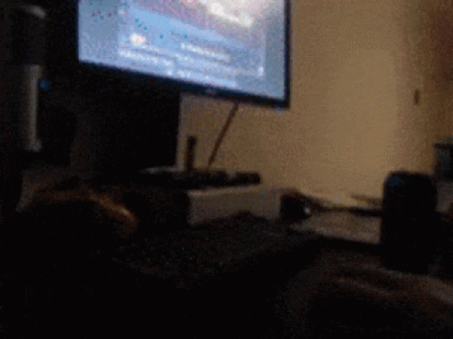
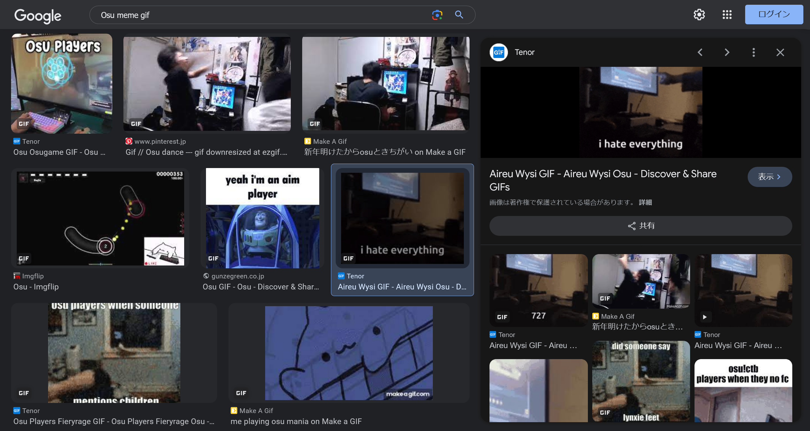
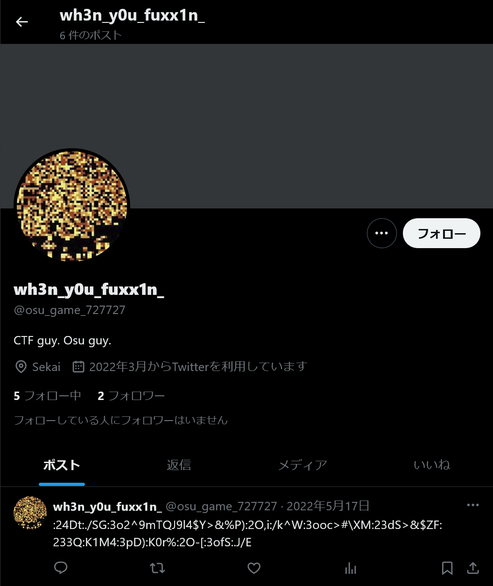
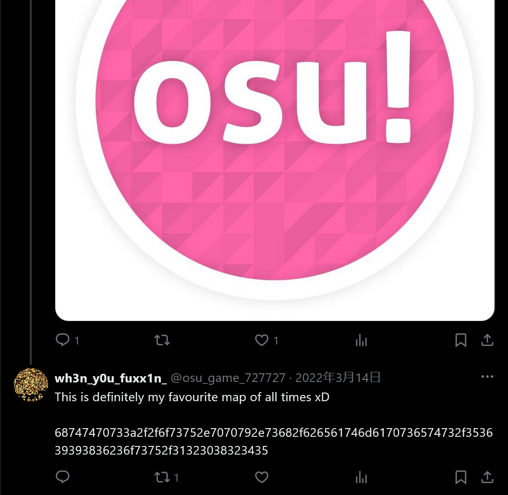
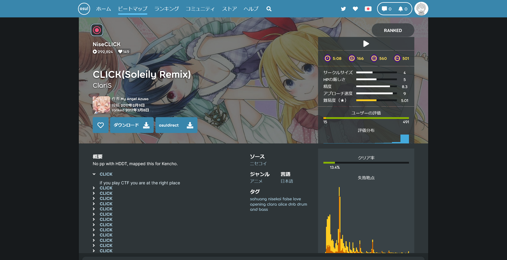

# when-you-see-it:osint:188pts
My friend is so obsessed with osu! that he refused to play any CTF! Today he came to me and sent me this weird GIF, can you understand what he is trying to tell me?  
Hint:  
- He told me this is important at the beginning: "Who is the person in the meme?"  
- Flag has 3 parts, combining them in order gives the full flag.  

[challenge.zip](challenge.zip)  

# Solution
zipとヒントが渡される。  
二番目のヒントによると、フラグは三つに分けられているようだ。  
zipを展開すると、謎のgifが出現する。  
  
一番目のヒントの通りmemeの人物を探す。  
「Osu meme gif」とGoogle画像検索すると、`Aireu Wysi GIF`であることがわかる。  
  
memeの人物は`Aireu`さんらしい。  
これ以上の情報は得られないため、gifの解析に戻る。  
初めにbinwalkをかける。  
```bash
$ binwalk -e challenge.gif

DECIMAL       HEXADECIMAL     DESCRIPTION
--------------------------------------------------------------------------------
0             0x0             GIF image data, version "89a", 498 x 373
3410748       0x340B3C        Zip archive data, at least v1.0 to extract, name: secret/
3410813       0x340B7D        Zip archive data, encrypted at least v2.0 to extract, compressed size: 201, uncompressed size: 230, name: secret/confidential
3411107       0x340CA3        Zip archive data, encrypted at least v2.0 to extract, compressed size: 2821, uncompressed size: 317388, name: secret/secret.wav
3414272       0x341900        End of Zip archive, footer length: 22
```
zipが含まれているらしい。  
展開時にパスワードを聞かれるので、memeで手に入れた情報である`Aireu`を利用する。  
```bash
$ unzip _challenge.gif.extracted/340B3C.zip
Archive:  _challenge.gif.extracted/340B3C.zip
   creating: secret/
[_challenge.gif.extracted/340B3C.zip] secret/confidential password:
  inflating: secret/confidential
  inflating: secret/secret.wav
$ cat secret/confidential
HIGHLY CONFIDENTIAL

<REDACTED>
I have stored extremely important files here and in another place.

Find it at "osu_game_/[0-9]+/".

As a reward, here is the first part of the flag: `osu{@nd_`

Yours,

Team Osu!Gaming
</REDACTED>
```
`confidential`と`secret.wav`が入っており、flagの先頭と思われる`osu{@nd_`が手に入った。  
フラグの残りは別の場所にあるらしく、`osu_game_/[0-9]+/`を探す必要がある。  
wavを聴くとモールス信号のようであった。  
[Morse Decoder](https://morsecode.world/international/decoder/audio-decoder-adaptive.html)にかけると`4E7A49334E7A4933`が得られる。  
[CyberChef](https://gchq.github.io/CyberChef/)にかけると`From_Hex`、`From_Base64`、`From_Hex`が自動で行われ`rw'`となった。  
チームメンバが最後の`From_Hex`をなくすと`727727`となり、`osu_game_/[0-9]+/`の正規表現にも一致することに気づいた。  
つまり`osu_game_727727`を探せばよい。  
何気なくX(Twitter)で探すと[ユーザが存在した](https://twitter.com/osu_game_727727)。
  
名前の`wh3n_y0u_fuxx1n_`がflagの断片になっていそうだ。  
さらにこのアカウントを調査すると、意味の分からないツイートに交じってhexのような返信が存在した。  
  
`68747470733a2f2f6f73752e7070792e73682f626561746d6170736574732f353639393836236f73752f31323038323435`をACIIにすると`https://osu.ppy.sh/beatmapsets/569986#osu/1208245`となる。  
このビートマップページに何か隠されていそうだ。  
  
`概要`に大量のクリッカブルな要素が存在する。  
ページ内にフラグがあると予想し、grepする。  
```bash
$ curl -s 'https://osu.ppy.sh/beatmapsets/569986#osu/1208245' | grep -Po '[0-9A-Za-z_!?]*}'
~~~
0}
cL1ck3d_nd_c_1T!!!}
}
~~~
```
flagの末尾と思われる`cL1ck3d_nd_c_1T!!!}`が得られた。  
これまでに得られた三つの断片を結合するとflagとなった。  

## osu{@nd_wh3n_y0u_fuxx1n_cL1ck3d_nd_c_1T!!!}