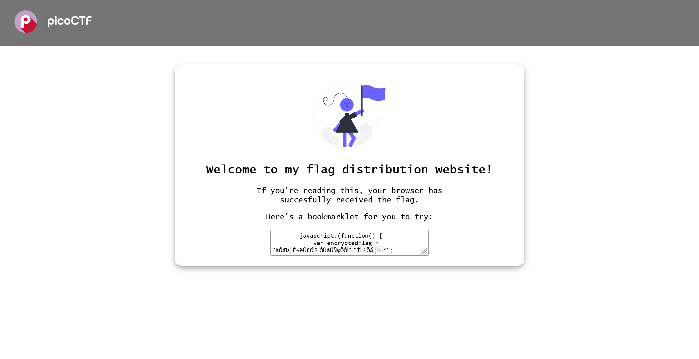

# Bookmarklet:Web Exploitation:50pts
Why search for the flag when I can make a bookmarklet to print it for me?  
Browse [here](http://titan.picoctf.net:57091/), and find the flag!  

Hints  
1  
A bookmarklet is a bookmark that runs JavaScript instead of loading a webpage.  
2  
What happens when you click a bookmarklet?  
3  
Web browsers have other ways to run JavaScript too.  

# Solution
URLが渡される。  
アクセスすると以下のようなサイトであった。  
  
ブックマークレットが渡される。  
内容は以下の通りであった。  
```js
        javascript:(function() {
            var encryptedFlag = "àÒÆަȬë٣֖ÓÚåÛÑ¢Õӗ¨Í•ÕĦ–í";
            var key = "picoctf";
            var decryptedFlag = "";
            for (var i = 0; i < encryptedFlag.length; i++) {
                decryptedFlag += String.fromCharCode((encryptedFlag.charCodeAt(i) - key.charCodeAt(i % key.length) + 256) % 256);
            }
            alert(decryptedFlag);
        })();
```
ブラウザの開発者ツールに貼り付け、実行する(`javascript:`はそのままでもよい)。  
すると`picoCTF{p@g3_turn3r_18d2fa20}`とflagがアラートされた。  

## picoCTF{p@g3_turn3r_18d2fa20}