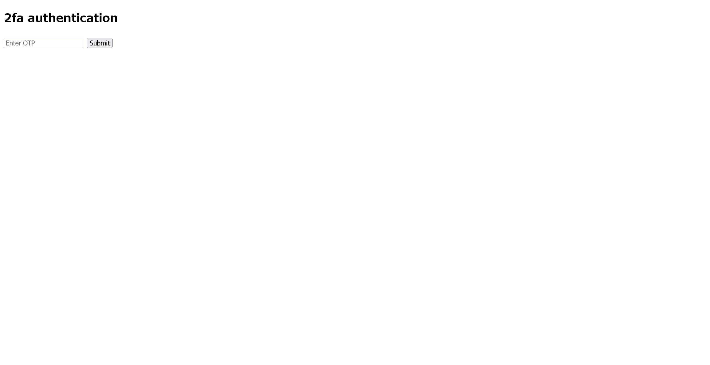

# IntroToBurp:Web Exploitation:100pts
Try [here](http://titan.picoctf.net:58326/) to find the flag  

Hints  
1  
Try using burpsuite to intercept request to capture the flag.  
2  
Try mangling the request, maybe their server-side code doesn't handle malformed requests very well.  

# Solution
URLが渡される。  
アクセスするとRegistrationフォームであった。  
  
入力し送信するとOTPを求められる。  
  
`1`と適当に入力して送信すると、`http://titan.picoctf.net:58326/dashboard`にPOSTで`otp=1`のように送信している。  
ひとまず、これを消してPOSTしてみることを思いつく。  
```bash
$ curl -X POST http://titan.picoctf.net:58326/dashboard -H 'Cookie: session=.eJwtzMsOwiAQBdBfMaxdQBGw_obdk-EVsS00PGIa4787mi7nzL33TWxsO7mRKc97Jmdiawm65dknROkYN8qAsaOSjPIRBDNwlV6pQDkXzDlnKVywF_qy6ASrx9odcCCeptqfEV-5bYiCDVIOeG5Q6ysXh1b_wZ89cvI69dX4gk6RevXl2Dtiny8s1DZQ.Zfm_sQ.rG5nVfmHj-E4HkfVggyivtGpuV0'
Welcome, satoki you sucessfully bypassed the OTP request.
Your Flag: picoCTF{#0TP_Bypvss_SuCc3$S_e1eb16ed}
```
flagが得られた(どこかで見たGuessなCTFを感じる)。  

## picoCTF{#0TP_Bypvss_SuCc3$S_e1eb16ed}