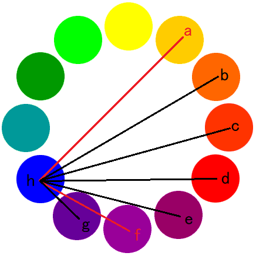
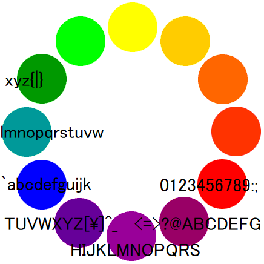

# # <!--XXXXXXXXXX-->
Everyone's favorite guess god Tux just sent me a flag that he somehow encrypted with a color wheel!  
I don't even know where to start, the wheel looks more like a clock than a cipher... can you help me crack the code?  
[ciphertext.jpg](ciphertext.jpg)　　　　[color-wheel.jpg](color-wheel.jpg)  

# Solution
ciphertext.jpgを見ると、二色が複数個並んでいる。  
二色で一文字を表しflag{で始まっているとすると、時計のようにアルファベットが進んでいると考えられる。
fとaから左回りであり、fと{からASCIIの順であることがわかる。  
一色目が青の場合  
  
全体としては以下のように並んでいる。  
  
ciphertext.jpgを一文字ずつ読むと`flag{9u3ss1n9_1s_4n_4rt}`が得られる。  

## flag{9u3ss1n9_1s_4n_4rt}