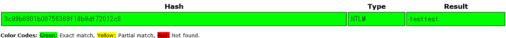

# CSIRT_asks_you_02:Forensics:200pts
組織内のインシデント対応部署から引き続き急ぎ解析してほしいとの依頼を受けています。  
一つ目の解析依頼（CSIRT_asks_you_01）の結果と別の証拠などから、あるアカウントのパスワードが脆弱である可能性が示唆されています。添付されたファイルを解析し、そのパスワードを特定してください。  
フラグはアカウント名とパスワード（平文）をアンダースコアでつないで回答してください。例えばアカウント名が `user` 、パスワードが `pass` の場合は `flag{user_pass}` と回答します。  
[csirt_asks_you_02_efe7331ca21b21725da73405987bc9c9ad0d6787.zip](csirt_asks_you_02_efe7331ca21b21725da73405987bc9c9ad0d6787.zip)  

# Solution
CSIRT_asks_you_01の結果(チームメイトが解いた)から侵害されたアカウントがtestということがわかる。  
配布されたファイルを調査するとWindowsのレジストリファイルのようだ。  
ここからパスワードハッシュを取得し、クラックする流れだと予測がつく。  
```bash
$ samdump2 SYSTEM SAM
*disabled* Administrator:500:aad3b435b51404eeaad3b435b51404ee:31d6cfe0d16ae931b73c59d7e0c089c0:::
*disabled* Guest:501:aad3b435b51404eeaad3b435b51404ee:31d6cfe0d16ae931b73c59d7e0c089c0:::
*disabled* :503:aad3b435b51404eeaad3b435b51404ee:31d6cfe0d16ae931b73c59d7e0c089c0:::
*disabled* :504:aad3b435b51404eeaad3b435b51404ee:31d6cfe0d16ae931b73c59d7e0c089c0:::
stella:1001:aad3b435b51404eeaad3b435b51404ee:31d6cfe0d16ae931b73c59d7e0c089c0:::
:1002:aad3b435b51404eeaad3b435b51404ee:31d6cfe0d16ae931b73c59d7e0c089c0:::
:1003:aad3b435b51404eeaad3b435b51404ee:31d6cfe0d16ae931b73c59d7e0c089c0:::
```
samdump2するとハッシュは得られるが、これは空のパスワードのようだ。  
testというアカウントも読み取れていない。  
Registry Explorerなどで確認すると、秘密の質問によってパスワードが変更されているようだ。  
パスワードは複数回試行されているようなので、ログイン成功までの失敗回数から辞書とパスワードを割り出そうとしたが難しいようだ。  
トランザクションログファイルを解析してもよいが知識がないため、まずは別ツールや使用ファイルを増やしての施行を試みる。  
「windows registry credentials hash dump」とググると[Dumping Windows Credentials - Pure Security](https://pure.security/dumping-windows-credentials/)がヒットした。  
[impacket](https://github.com/SecureAuthCorp/impacket)の中のsecretsdumpというものがあるようだ。  
```bash
$ secretsdump.py -sam SAM -security SECURITY -system SYSTEM LOCAL
Impacket v0.9.24.dev1+20210814.5640.358fc7c6 - Copyright 2021 SecureAuth Corporation

[*] Target system bootKey: 0xc2f71c8a15cee734ce4ab65b3e9da4e1
[*] Dumping local SAM hashes (uid:rid:lmhash:nthash)
Administrator:500:aad3b435b51404eeaad3b435b51404ee:31d6cfe0d16ae931b73c59d7e0c089c0:::
Guest:501:aad3b435b51404eeaad3b435b51404ee:31d6cfe0d16ae931b73c59d7e0c089c0:::
DefaultAccount:503:aad3b435b51404eeaad3b435b51404ee:31d6cfe0d16ae931b73c59d7e0c089c0:::
WDAGUtilityAccount:504:aad3b435b51404eeaad3b435b51404ee:27c3a146aa209b2120f7ecc9db065540:::
stella:1001:aad3b435b51404eeaad3b435b51404ee:2f8ae2e260d0cfe3756ff53e639e3377:::
test:1002:aad3b435b51404eeaad3b435b51404ee:3c99b8901b00758369f18b9df72012c8:::
akari:1003:aad3b435b51404eeaad3b435b51404ee:b66eade488ce2c23ba226427e40fed41:::
[*] Dumping cached domain logon information (domain/username:hash)
[*] Dumping LSA Secrets
[*] DefaultPassword
(Unknown User):_TBAL_{68EDDCF5-0AEB-4C28-A770-AF5302ECA3C9}
[*] DPAPI_SYSTEM
dpapi_machinekey:0xd4a669f9f497412cee7cd70c13c318c1b743c4d7
dpapi_userkey:0xe8a7ce7d52e77f0632f7225fe1cb66bccafb0171
[*] NL$KM
 0000   49 EA 37 D4 AD 86 BC F9  1D C3 70 FD B3 1F 14 5D   I.7.......p....]
 0010   42 AD 20 DB 9F AB C9 30  3F 72 4D 0A 08 63 53 70   B. ....0?rM..cSp
 0020   7F E2 25 F5 57 21 94 D2  98 31 E7 A4 D6 3C D9 37   ..%.W!...1...<.7
 0030   A0 D2 3D ED 49 FD 98 7B  76 34 CF A6 F0 7E 76 B6   ..=.I..{v4...~v.
NL$KM:49ea37d4ad86bcf91dc370fdb31f145d42ad20db9fabc9303f724d0a086353707fe225f5572194d29831e7a4d63cd937a0d23ded49fd987b7634cfa6f07e76b6
[*] Cleaning up...
```
`test:1002:aad3b435b51404eeaad3b435b51404ee:3c99b8901b00758369f18b9df72012c8:::`が得られたので、[CrackStation](https://crackstation.net/)でクラックする。  
  
パスワードがtesttestということが分かったので、指定した形式にするとflagとなった。  

## flag{test_testtest}