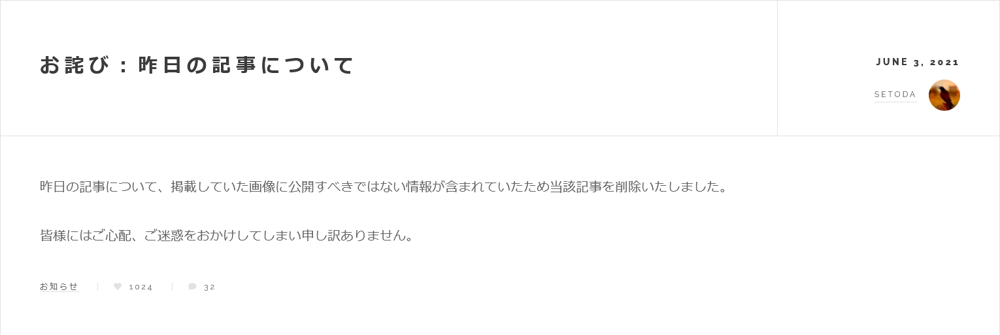
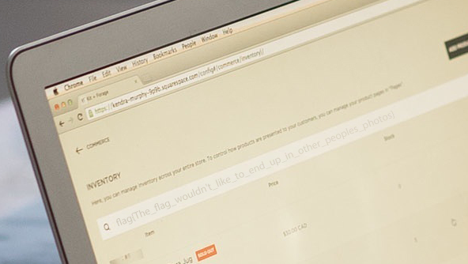

# Estimated:Web:120pts
組織の関連サイトを監視している部署から「どうやら局長ブログで機密情報が漏洩しているようだ」と連絡が入りました。一部SNSで言及されているものの、幸いにしてまだ広まってはいないようです。なんとか穏便にすませたい上司に配慮し、被害を最小にすべくサイトを調査し漏洩している機密情報を特定してください。  
以下のサイトにアクセスしてフラグを得てください。  
[https://ctf.setodanote.net/web006/](https://ctf.setodanote.net/web006/)  

# Solution
アクセスするとブログが出てくる。  
My BLOG.  
[site.png](site/site.png)  
サイト自体に脆弱性はなさそうだが、お詫び記事が見つかる。  
  
2021/06/02の記事になにか画像があったようだ。  
ここで各記事の画像のファイル名をみると、日時に由来するようである。  
2021/08/01投稿の記事の画像は`https://ctf.setodanote.net/web006/images/20210801001b.jpg`であった。  
つまり、ファイルが削除されていないことを祈って`https://ctf.setodanote.net/web006/images/20210602001b.jpg`を見ればよい。  
運よく画像が残っていたようだ。  
  
画像を拡大するとPCの画面にflagが書かれていた。  
  

## flag{The_flag_wouldn't_like_to_end_up_in_other_peoples_photos}