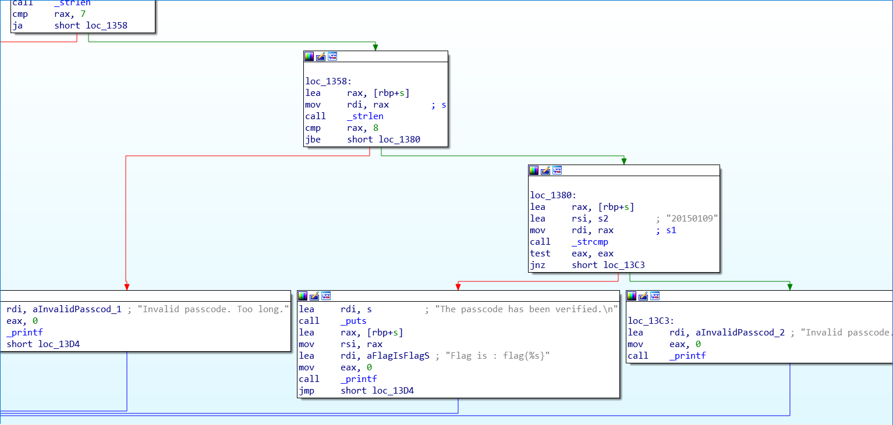

# Passcode:Rev:120pts
その部屋はまぶしいほどの明かりで照らされていた。ここからが本番だ。白衣の人物が書類に目を落としながらつぶやくように話している。結果がすべてという訳ではないが。そばにある端末が起動する。いい結果を期待している。  
添付されたファイルを解析してフラグを得てください。  
[passcode_604f5ee374c653752cebdeccb5c6e8ba77fffb1f.zip](passcode_604f5ee374c653752cebdeccb5c6e8ba77fffb1f.zip)  

# Solution
配布されたファイルはELFのようだ。  
実行するとパスコードを要求される。  
```bash
$ ./passcode
Enter the passcode: flag
Invalid passcode. Too short.
$ ./passcode
Enter the passcode: flagflag
Invalid passcode. Nice try.
```
IDAで見てみる。  
  
`20150109`という怪しい数字が見える。  
```bash
$ ./passcode
Enter the passcode: 20150109
The passcode has been verified.

Flag is : flag{20150109}
```
入力するとflagだったようだ。  

## flag{20150109}