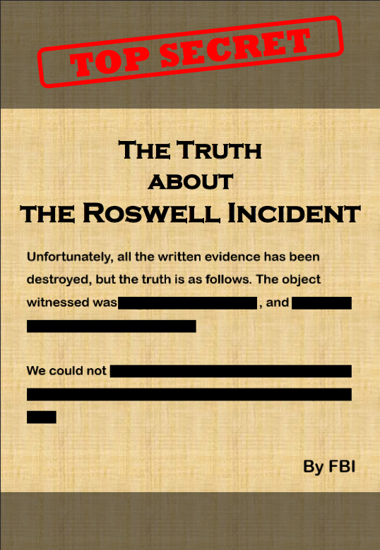
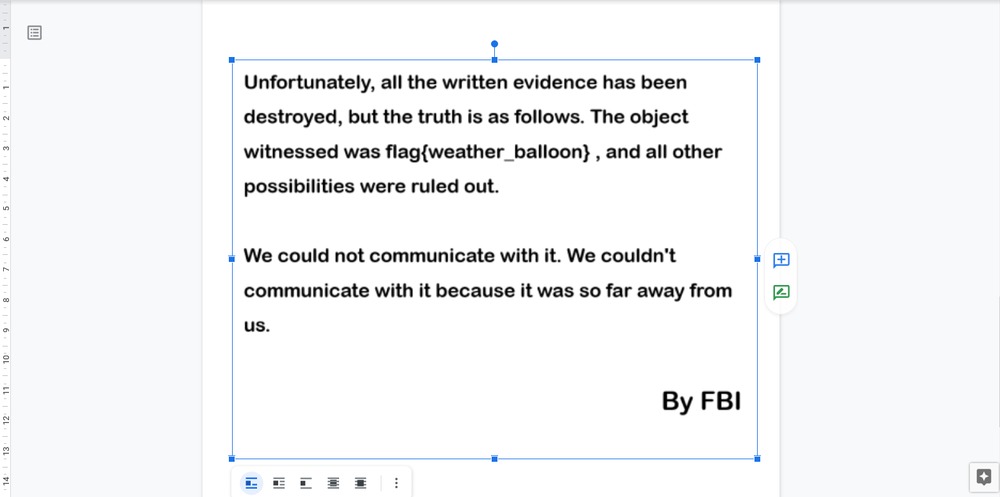

# Redacted:Misc:150pts
あなたの友人のジャーナリストは極秘ファイルの入手に成功しました。ですが重要な部分が黒塗りにされてしまっているようです。このままでは真実が闇に葬り去られてしまいます。あなたは極秘ファイルの解析を依頼されました。  
添付されたファイルを解析し、真実を明らかにしてください。  
[redacted_37857eaa5bedd7b4715965b7db4d53196d60b854.zip](redacted_37857eaa5bedd7b4715965b7db4d53196d60b854.zip)  

# Solution
pdfのようだが黒塗りされている。  
  
この手のpdfはGoogleドキュメントで開くといろいろいじくれる場合が多い。  
  
黒塗りが取れていた。  

## flag{weather_balloon}