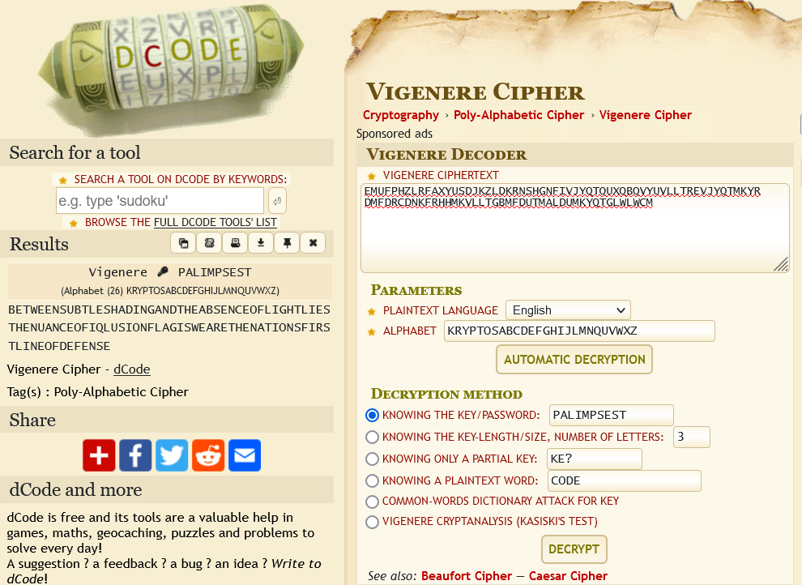

# WEARECIA:Crypto:300pts
家に帰ると黒い封筒が郵便受けに入っていました。封筒の中身は英字が羅列されたメモが一枚。青銅色の紙に白いインクで書かれており右下には同じインクで WEARECIA と記載されています。どうやら暗号文のようです。暗号文を解析してメッセージを受け取る必要がありそうです。  
以下の暗号文を解読し、隠されたメッセージを見つけてください。フラグは得られたメッセージを `flag{}` で囲んで回答してください。  
`EMUFPHZLRFAXYUSDJKZLDKRNSHGNFIVJYQTQUXQBQVYUVLLTREVJYQTMKYRDMFDRCDNKFRHHMKVLLTGBMFDUTMALDUMKYQTGLWLWCM`

# Solution
タイトルからCIAといわれている。  
CIAと暗号と聞いて思い出すのはKryptosだろう。  
与えられた暗号文の先頭部分とkryptosの第一セクションが一致している。  
つまり暗号方式とキーも一緒であると考えられる。  
Palimpsestをキーとしたヴィジュネル暗号であるとわかるので、[Vigenere Cipher](https://www.dcode.fr/vigenere-cipher)で解読する。  
  
以下が得られた。  
```text
BETWEENSUBTLESHADINGANDTHEABSENCEOFLIGHTLIESTHENUANCEOFIQLUSIONFLAGISWEARETHENATIONSFIRSTLINEOFDEFENSE
```
`FLAG IS WEARETHENATIONSFIRSTLINEOFDEFENSE`とあるので指定された形式にするとflagとなった。  

## flag{WEARETHENATIONSFIRSTLINEOFDEFENSE}