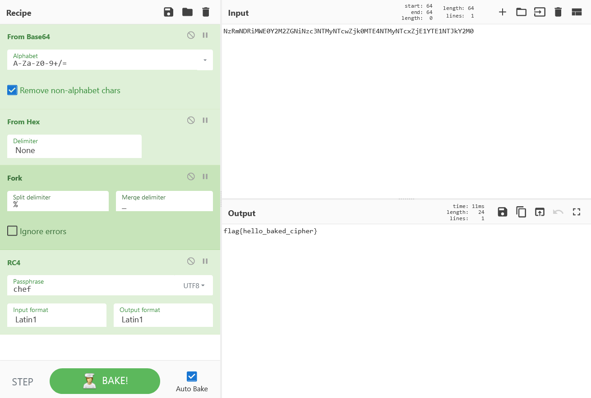

# lets_bake:Crypto:150pts
あなたはシェフ帽の人物からレシピを受け取りました。どうやら組織からの秘密のメッセージのようです。レシピを解読し、秘密のメッセージを入手してください。  
Input:  
`NzRmNDRiMWE0Y2M2ZGNiNzc3NTMyNTcwZjk0MTE4NTMyNTcxZjE1YTE1NTJkY2M0`  
Recipe:  
`RnJvbV9CYXNlNjQoJ0EtWmEtejAtOSsvPScsdHJ1ZSkN]b2[sRnJvbV9IZXgoJ05vbmUnKQ0=]b2[sRm9yaygnJScsJ18nLGZhbHNlKQ0=]b2[sUkM0KHsnb3B0aW9uJzonVVRGOCcsJ3N0cmluZyc6J2NoZWYnfSwnTGF0aW4xJywnTGF0aW4xJyk=`  

# Solution
問題文が明らかにCyberChefを指している。  
Inputをbase64デコードすると謎のHexが出てくるが、それ以上進めない。  
Recipeもbase64されていそうだが、`]b2[s`で区切られているようだ。  
それを取り除き、デコードすると以下のようであった。  
```text
RnJvbV9CYXNlNjQoJ0EtWmEtejAtOSsvPScsdHJ1ZSkN
RnJvbV9IZXgoJ05vbmUnKQ0=
Rm9yaygnJScsJ18nLGZhbHNlKQ0=
UkM0KHsnb3B0aW9uJzonVVRGOCcsJ3N0cmluZyc6J2NoZWYnfSwnTGF0aW4xJywnTGF0aW4xJyk=

From_Base64('A-Za-z0-9+/=',true)
From_Hex('None')
Fork('%','_',false)
RC4({'option':'UTF8','string':'chef'},'Latin1','Latin1')
```
レシピが出てきた。  
これを用いてInputを調理するとflagが得られた。  
  

## flag{hello_baked_cipher}