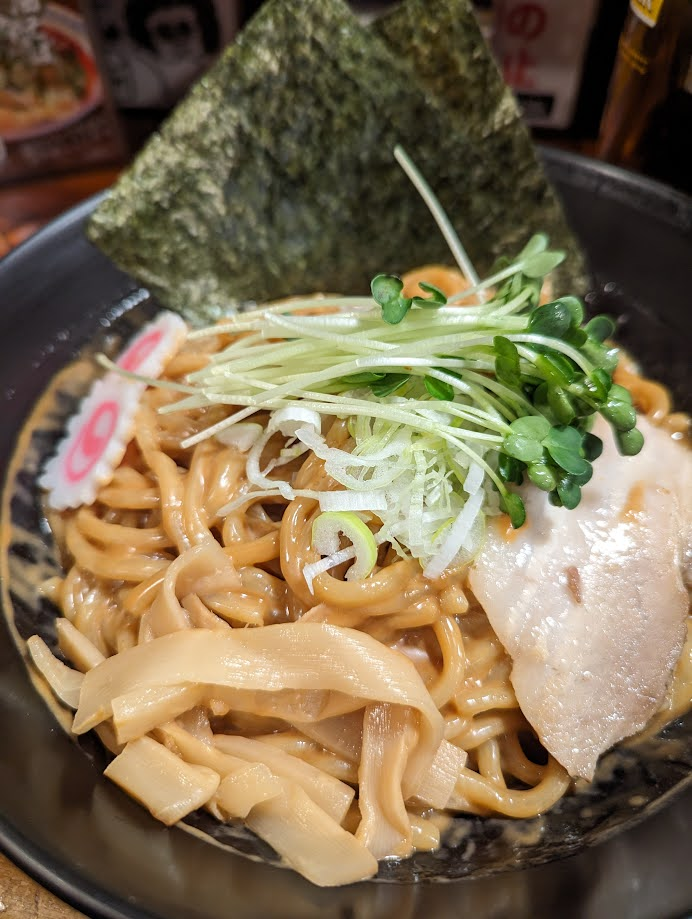
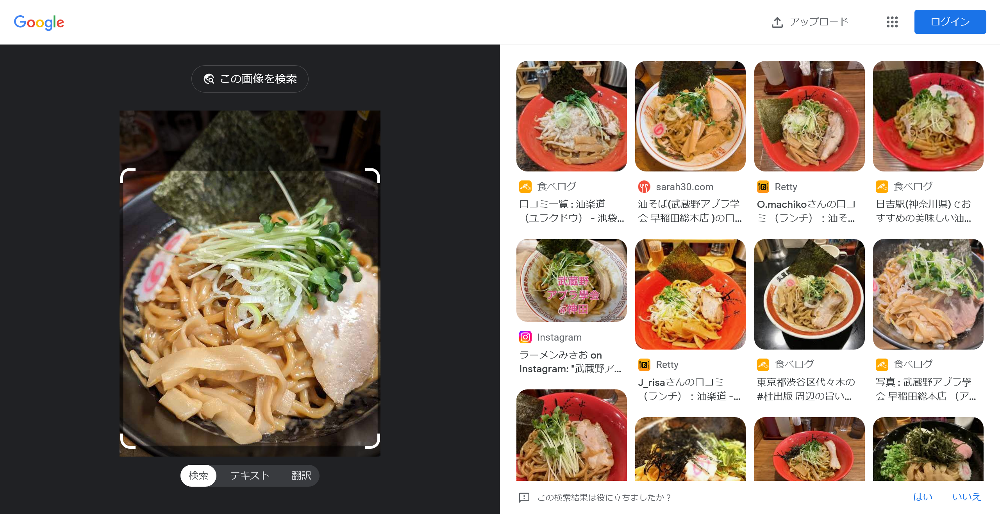
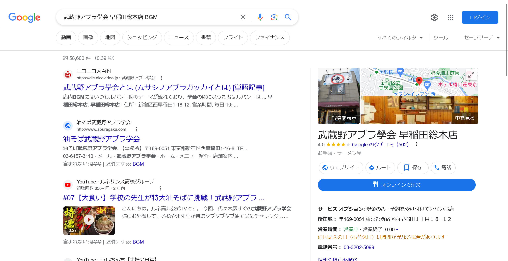

# aburasoba:OSINT:100pts
ある大学生に人気の油そば。  
このお店で流れているBGMはずっと変わっていない。  
その音楽の楽曲名を答えよ。  
例えば、葬送のフリーレンは `shioCTF{勇者}` 等となる。  
[aburasoba.jpg](aburasoba.jpg)  

# Solution
油そばの画像が渡される。  
  
BGMを特定すればよいようだ。  
まずはGoogle画像検索を行う。  
  
すると`武蔵野アブラ學会 早稲田総本店`がヒットし、トッピングなども一致する。  
さらに、CTFの主催者の所属大学にも近いようだ。  
BGMがフラグなので「武蔵野アブラ學会 早稲田総本店 BGM」とGoogle検索する。  
  
`店内BGMにはいつもルパン三世のテーマが流れており`と書かれているページがヒットする。  
曲名を指定された形式に整形するとflagとなった。  

## shioCTF{ルパン三世のテーマ}