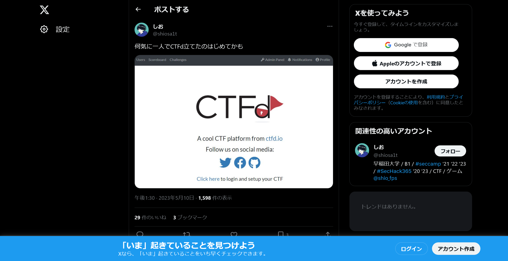
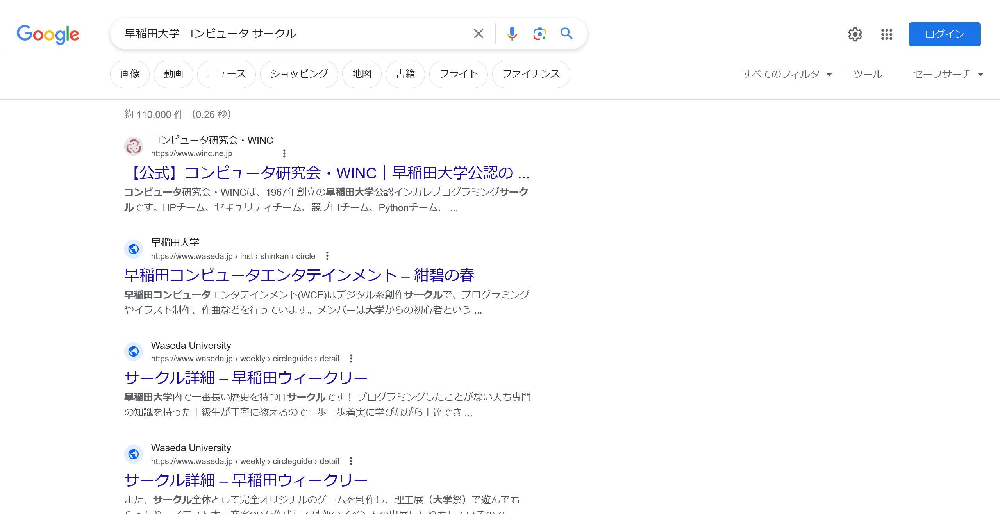

# club:OSINT:100pts
shioは大学のサークルでCTFdを使って、Webアプリをホストしたことがある。  
そのサークル名を答えよ。  
例えば、東京大学のTSGである場合は `shioCTF{TSG}` となる。  
[https://twitter.com/shiosa1t/status/1656154711505108992](https://twitter.com/shiosa1t/status/1656154711505108992)  

Hint  
ただの数字の羅列は良くないです。まさにこの瞬間、その恩恵を受けています。  

# Solution
CTF主催者がCTFdを使って何かをしたようだ。  
  
`早稲田大学`であることがわかり、CTFdを使ってウェーイなことはしないであろうと予測する。  
つまり**オタク系サークル**であることがわかる。  
ちなみに、知っているCTFサークルであるm1z0r3ではなかった。  
「早稲田大学 コンピュータ サークル」をGoogleで検索する。  
  
WINCなるサークルがあるらしく、指定された形式に整形するとflagであった。  

## shioCTF{WINC}