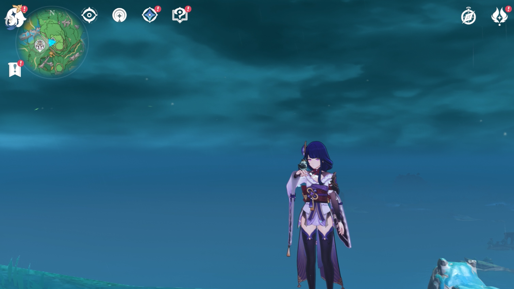
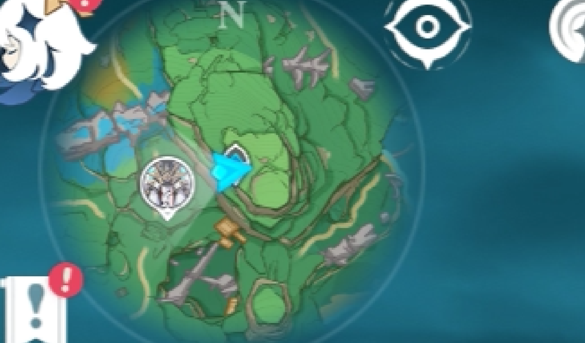
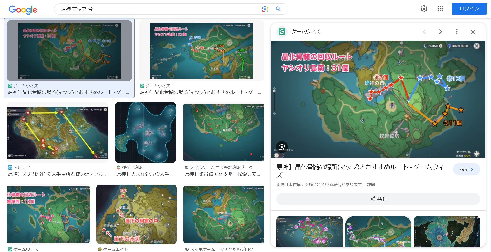
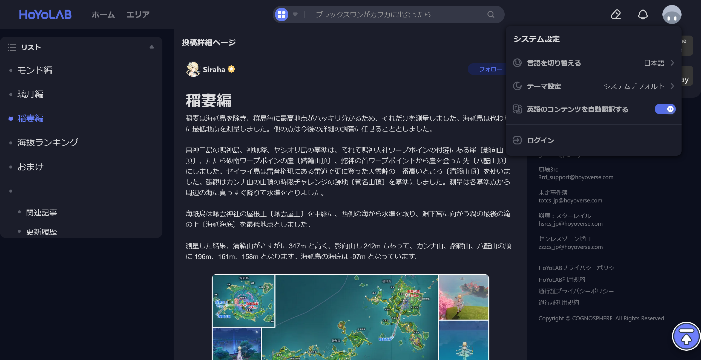
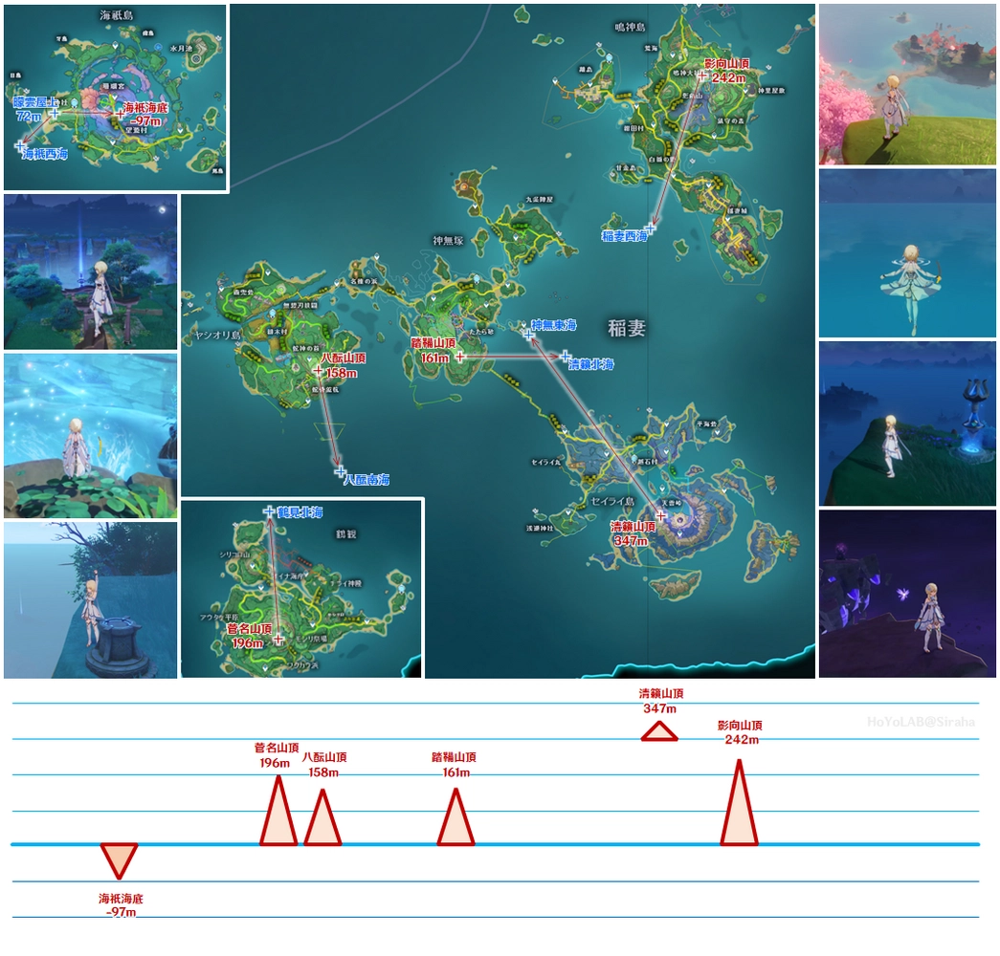

# fictional mountain:Misc:100pts
彼女が立っている山の標高をメートルで答えてください。  
例えば、富士山の場合は `shioCTF{3776}` になります。  
[fictional_mountain.png](fictional_mountain.png)  

Hint  
どの世界にも科学はあるはず  

# Solution
原神のスクリーンショットのようだ。  
  
キャラが立っている山の標高を答えればよいらしい。  
まずは左上のマップに注目する。  
  
恐竜の骨のようなものがマップに見える。  
「原神 マップ 骨」とGoogle画像検索すると同じマップがヒットする。  
  
`ヤシオリ島`の南側の山であるようだ。  
「ヤシオリ島 山 標高」でGoogle検索すると[原神科学：標高ランキング Genshin Impact](https://www.hoyolab.com/article/4598561)なるサイトが見つかる。  
ゲーム内で測量しているようだ。  
  
ヤシオリ島の中にもいくつか山があるようなので、やはり骨を探す。  
  
上記に引用した同サイトの画像によると八酝山なる山で158mらしい。  
指定された形式に整形するとflagとなった。  

## shioCTF{158}