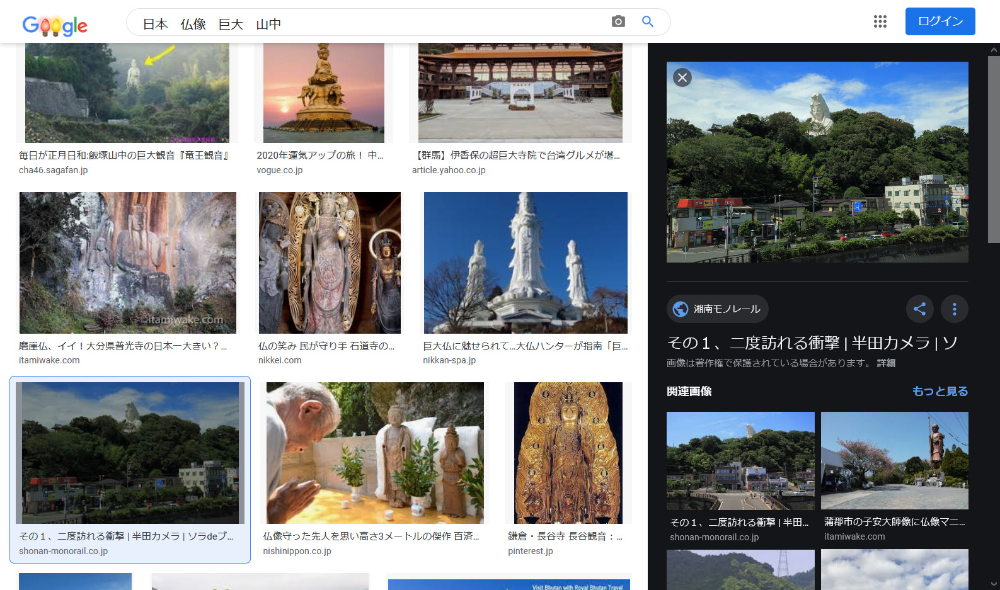

# OSINT 2:Misc:38pts
友人が迷ってよく分からない駅で下車してしまったらしい。 駅前の画像を送ってくれたから, どこの駅前か特定してほしい。 駅名は全て漢字です。  
フラグの形式: `taskctf{駅名}`  
2020-12-06 12:43追記: `駅名`は「駅」という文字までを含みます。  
[osint2.jpg](osint2.jpg)  

# Solution
宗教的な巨大像の写真が配布される。  
写真を撮った場所の駅名を答えれば良いようだ。  
Googleで「日本　仏像　巨大　山中」と画像検索する。  
  
ほぼ一致する写真を発見できる。  
宝くじの看板も写っている。  
[掲載サイト](https://www.shonan-monorail.co.jp/sora_de_bra-n/2018/09/post-156.html)に飛ぶと大船観音というらしい。  
大船観音の最寄り駅を調べると、大船駅だった。  
指定された形式に整形するとflagとなる。  

## taskctf{大船駅}