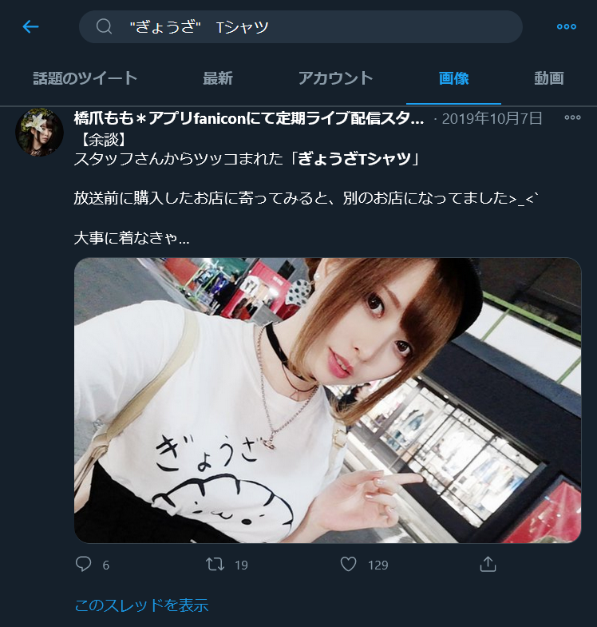
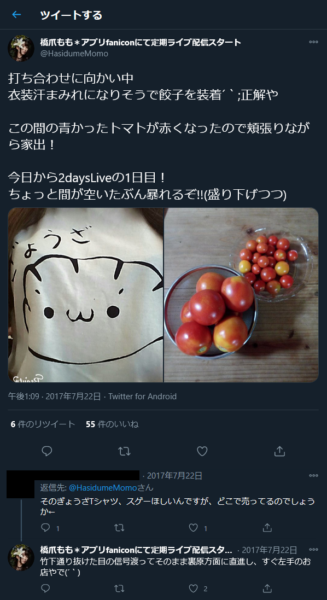
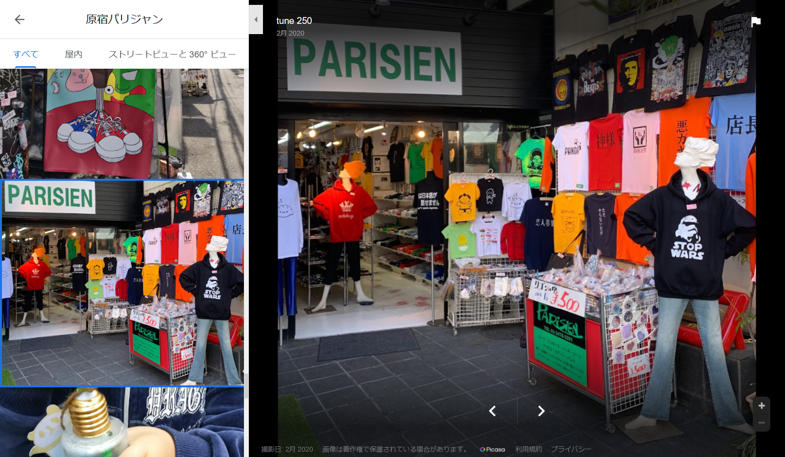

# OSINT 3:Misc:50pts
友人が奇抜なTシャツを着てきた。  
そもそもこれってどこで売られてるんだ......?  
調べて教えて欲しい！  
フラグの形式: `taskctf{ショップ名}`  
2020-12-06 12:00 追記:  
理不尽が過ぎる問題だったので, 画像を1枚追加しました。  
**ショップ名は漢字とカタカナのみで構成されています。**  
2020-12-06 15:48 追記: Max Attemptsを増やしました。  
[osint3-2.jpg](osint3-2.jpg)　　　　[osint3.jpg](osint3.jpg)  

# Solution
ぎょうざのTシャツ画像が配布されている。  
このシャツを購入した店を探すようだ。  
Twitterで「"ぎょうざ"　Tシャツ」と画像検索すると以下のツイートがヒットする。  
  
ぎょうざをよく着ている人のようだ。  
[@HasidumeMomo](https://twitter.com/HasidumeMomo)さんの購入場所を調査する。  
「@HasidumeMomo　餃子」で検索すると、以下のツイートとリプライが発見できる。  
  
これにより店が竹下通り周辺にあることがわかる。  
Googleで「竹下通り　Tシャツ」と検索し、出てきた店を一通り見ていく。  
検索結果の店舗うち、"原宿パリジャン"に以下の画像が上がっている。  
  
店頭にぎょうざTシャツがある。  
指定された形式に整形すればflagとなる。  

## taskctf{原宿パリジャン}