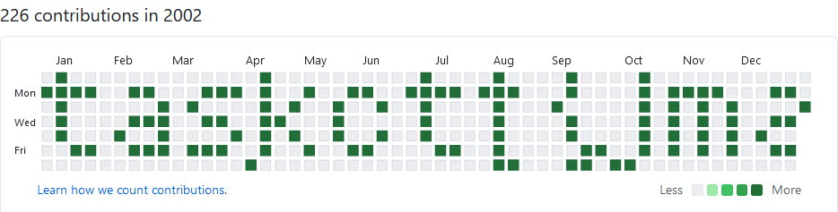

# grass flag:Misc:10pts
interesting contributions  
checksum(sha256): 72c84c2a356c321b76718fca311995b51d3c8155fd2c743172911222a366ec9a  
[grassflag.zip](grassflag.zip)  

# Solution
問題名に草が生えている。  
配布されたgrassflag.zipを解凍すると.gitが出てくる。  
どうやら作問者の.gitで、logを見ると2002~2003年の物のようだ。  
```bash
$ git log
commit 44cfff537a3179886d9df08bf2bb0f30e5c077ec (HEAD -> master, origin/master)
Author: task4233 <tks.m1205@gmail.com>
Date:   Wed Mar 12 03:31:14 2003 +0900

    _

commit 539f3ff8fc6abadd5e7526aca1699757ad8f1919
Author: task4233 <tks.m1205@gmail.com>
Date:   Fri Mar 7 03:31:14 2003 +0900
~~~
commit 9fefe203e06878e094703e2eef96d7e707a3119f
Author: task4233 <tks.m1205@gmail.com>
Date:   Mon Jan 7 03:31:14 2002 +0900

    _

commit db04480133c4dbbfb15ea7144fd43df7c7e740e3
Author: task4233 <tks.m1205@gmail.com>
Date:   Tue Jan 1 03:31:14 2002 +0900

    _
```
作問者の2002~2003年のGitHubの草を見に行く。  
  
  
flagが草として生えていた。  

## taskctf{lmao}