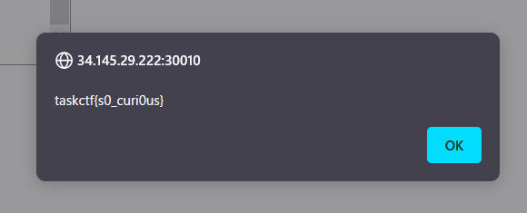

# polyglot:Misc:30pts
同一のコードで複数のプログラミング言語やファイル形式に対応するものをPolyglotと呼びます。 GoとC言語の両方で、Flagを表示するようなPolyglotを作ってみてください。  
[http://34.145.29.222:30010](http://34.145.29.222:30010/)  
※この問題はpolygolfの下位互換になります。そのため、この問題はpolygolfのflagでもポイントが獲得できます。  
[dist.zip](dist.zip)  

# Solution
URLにアクセスするとコードを送信できるサイトのようだ。  
Polyglot  
[site.png](site/site.png)  
GoとCのPolyglotを記述せよとのことらしい。  
「Go C Polyglot」でググると[A Go/C Polyglot - Made of Bugs](https://blog.nelhage.com/post/a-go-c-polyglot/)がヒットした。  
以下のコメントアウトコードで達成できるようだ。  
```
//\
/*
(C code goes here)
#if 0
//*/
(Go code goes here)
//\
/*
#endif
//*/
```
指定された通りGoとCで`flag`を読み取って表示するコードを書く。  
```
//\
/*
#include <stdio.h>
#include <stdlib.h>

int main(void) {
    FILE *fp;
    int chr;
    fp = fopen("flag", "r");
    while((chr = fgetc(fp)) != EOF) {
        putchar(chr);
    }
    fclose(fp);
    return 0;
}
#if 0
//*/
package main
import(
    "fmt"
    "os"
)
func main(){
    f, _ := os.Open("flag")
    defer f.Close()
    buf := make([]byte, 1024)
    for {
        n, _ := f.Read(buf)
        if n == 0{
            break
        }
        fmt.Print(string(buf[:n]))
    }
}
//\
/*
#endif
//*/
```
送信するとflagが得られた。  
  

## taskctf{s0_curi0us}